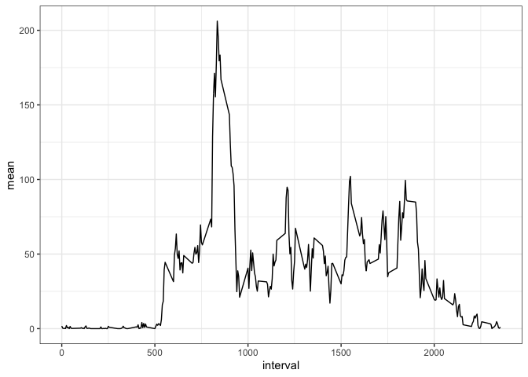

## Loading and preprocessing the data

```r
library(dplyr); library(ggplot2)
```


```r
data <- read.csv("./data/activity.csv")
```


```r
head(data)
```

```
##   steps       date interval
## 1    NA 2012-10-01        0
## 2    NA 2012-10-01        5
## 3    NA 2012-10-01       10
## 4    NA 2012-10-01       15
## 5    NA 2012-10-01       20
## 6    NA 2012-10-01       25
```

## What is mean total number of steps taken per day?

```r
head(data %>% group_by(date) %>% summarise(total_steps = sum(steps)))
```

```
## # A tibble: 6 x 2
##   date       total_steps
##   <fct>            <int>
## 1 2012-10-01          NA
## 2 2012-10-02         126
## 3 2012-10-03       11352
## 4 2012-10-04       12116
## 5 2012-10-05       13294
## 6 2012-10-06       15420
```


```r
data %>% 
    group_by(date) %>% 
    summarise(total_steps = sum(steps)) %>% 
    ggplot(mapping = aes(total_steps)) + 
    geom_histogram() + 
    theme_bw()
```

<!-- -->


```r
data %>% 
    group_by(date) %>% 
    summarise(total_steps = sum(steps)) %>% 
    summarise(mean = mean(total_steps, na.rm = T),
              median = median(total_steps, na.rm = T))
```

```
## # A tibble: 1 x 2
##     mean median
##    <dbl>  <int>
## 1 10766.  10765
```

## What is the average daily activity pattern?

```r
data %>% 
    group_by(interval) %>% 
    summarise(mean = mean(steps, na.rm = T)) %>% 
    ggplot(mapping = aes(x = interval, y = mean)) + 
    geom_line() +
    theme_bw()
```

<!-- -->


```r
data2 <- 
    data %>% 
    group_by(interval) %>% 
    summarise(mean = mean(steps, na.rm = T))

data2$interval[which.max(data2$mean)]
```

```
## [1] 835
```

## Imputing missing values

```r
colSums(is.na(data))
```

```
##    steps     date interval 
##     2304        0        0
```


```r
stepsInterval <- aggregate(steps ~ interval, data = data, mean, na.rm = TRUE)

interval2steps <- function(interval) {
    stepsInterval[stepsInterval$interval == interval, ]$steps
}

activityFilled <- data  # Make a new dataset with the original data
count = 0  # Count the number of data filled in
for (i in 1:nrow(activityFilled)) {
    if (is.na(activityFilled[i, ]$steps)) {
        activityFilled[i, ]$steps <- interval2steps(activityFilled[i, ]$interval)
        count = count + 1
    }
}
```

<!--

```r
for (j in 1:length(data[is.na(data), 1])) {
    
    if (is.na(data)[, 1]) {
        
        for (k in 1:nrow(data2)) {
            
            if (data[is.na(data), 3][j] == data2$interval[k]) {
                
                data[is.na(data), 1][j] <- mean(data2$mean[k])
             
                }
            }
        }
}
```

```
## Warning in if (is.na(data)[, 1]) {: the condition has length > 1 and only
## the first element will be used

## Warning in if (is.na(data)[, 1]) {: the condition has length > 1 and only
## the first element will be used

## Warning in if (is.na(data)[, 1]) {: the condition has length > 1 and only
## the first element will be used

## Warning in if (is.na(data)[, 1]) {: the condition has length > 1 and only
## the first element will be used

## Warning in if (is.na(data)[, 1]) {: the condition has length > 1 and only
## the first element will be used

## Warning in if (is.na(data)[, 1]) {: the condition has length > 1 and only
## the first element will be used

## Warning in if (is.na(data)[, 1]) {: the condition has length > 1 and only
## the first element will be used

## Warning in if (is.na(data)[, 1]) {: the condition has length > 1 and only
## the first element will be used

## Warning in if (is.na(data)[, 1]) {: the condition has length > 1 and only
## the first element will be used

## Warning in if (is.na(data)[, 1]) {: the condition has length > 1 and only
## the first element will be used

## Warning in if (is.na(data)[, 1]) {: the condition has length > 1 and only
## the first element will be used

## Warning in if (is.na(data)[, 1]) {: the condition has length > 1 and only
## the first element will be used

## Warning in if (is.na(data)[, 1]) {: the condition has length > 1 and only
## the first element will be used

## Warning in if (is.na(data)[, 1]) {: the condition has length > 1 and only
## the first element will be used

## Warning in if (is.na(data)[, 1]) {: the condition has length > 1 and only
## the first element will be used

## Warning in if (is.na(data)[, 1]) {: the condition has length > 1 and only
## the first element will be used

## Warning in if (is.na(data)[, 1]) {: the condition has length > 1 and only
## the first element will be used

## Warning in if (is.na(data)[, 1]) {: the condition has length > 1 and only
## the first element will be used

## Warning in if (is.na(data)[, 1]) {: the condition has length > 1 and only
## the first element will be used

## Warning in if (is.na(data)[, 1]) {: the condition has length > 1 and only
## the first element will be used

## Warning in if (is.na(data)[, 1]) {: the condition has length > 1 and only
## the first element will be used

## Warning in if (is.na(data)[, 1]) {: the condition has length > 1 and only
## the first element will be used

## Warning in if (is.na(data)[, 1]) {: the condition has length > 1 and only
## the first element will be used

## Warning in if (is.na(data)[, 1]) {: the condition has length > 1 and only
## the first element will be used

## Warning in if (is.na(data)[, 1]) {: the condition has length > 1 and only
## the first element will be used

## Warning in if (is.na(data)[, 1]) {: the condition has length > 1 and only
## the first element will be used

## Warning in if (is.na(data)[, 1]) {: the condition has length > 1 and only
## the first element will be used

## Warning in if (is.na(data)[, 1]) {: the condition has length > 1 and only
## the first element will be used

## Warning in if (is.na(data)[, 1]) {: the condition has length > 1 and only
## the first element will be used

## Warning in if (is.na(data)[, 1]) {: the condition has length > 1 and only
## the first element will be used

## Warning in if (is.na(data)[, 1]) {: the condition has length > 1 and only
## the first element will be used

## Warning in if (is.na(data)[, 1]) {: the condition has length > 1 and only
## the first element will be used

## Warning in if (is.na(data)[, 1]) {: the condition has length > 1 and only
## the first element will be used

## Warning in if (is.na(data)[, 1]) {: the condition has length > 1 and only
## the first element will be used

## Warning in if (is.na(data)[, 1]) {: the condition has length > 1 and only
## the first element will be used

## Warning in if (is.na(data)[, 1]) {: the condition has length > 1 and only
## the first element will be used

## Warning in if (is.na(data)[, 1]) {: the condition has length > 1 and only
## the first element will be used

## Warning in if (is.na(data)[, 1]) {: the condition has length > 1 and only
## the first element will be used

## Warning in if (is.na(data)[, 1]) {: the condition has length > 1 and only
## the first element will be used

## Warning in if (is.na(data)[, 1]) {: the condition has length > 1 and only
## the first element will be used

## Warning in if (is.na(data)[, 1]) {: the condition has length > 1 and only
## the first element will be used

## Warning in if (is.na(data)[, 1]) {: the condition has length > 1 and only
## the first element will be used

## Warning in if (is.na(data)[, 1]) {: the condition has length > 1 and only
## the first element will be used

## Warning in if (is.na(data)[, 1]) {: the condition has length > 1 and only
## the first element will be used

## Warning in if (is.na(data)[, 1]) {: the condition has length > 1 and only
## the first element will be used

## Warning in if (is.na(data)[, 1]) {: the condition has length > 1 and only
## the first element will be used

## Warning in if (is.na(data)[, 1]) {: the condition has length > 1 and only
## the first element will be used

## Warning in if (is.na(data)[, 1]) {: the condition has length > 1 and only
## the first element will be used

## Warning in if (is.na(data)[, 1]) {: the condition has length > 1 and only
## the first element will be used

## Warning in if (is.na(data)[, 1]) {: the condition has length > 1 and only
## the first element will be used

## Warning in if (is.na(data)[, 1]) {: the condition has length > 1 and only
## the first element will be used

## Warning in if (is.na(data)[, 1]) {: the condition has length > 1 and only
## the first element will be used

## Warning in if (is.na(data)[, 1]) {: the condition has length > 1 and only
## the first element will be used

## Warning in if (is.na(data)[, 1]) {: the condition has length > 1 and only
## the first element will be used

## Warning in if (is.na(data)[, 1]) {: the condition has length > 1 and only
## the first element will be used

## Warning in if (is.na(data)[, 1]) {: the condition has length > 1 and only
## the first element will be used

## Warning in if (is.na(data)[, 1]) {: the condition has length > 1 and only
## the first element will be used

## Warning in if (is.na(data)[, 1]) {: the condition has length > 1 and only
## the first element will be used

## Warning in if (is.na(data)[, 1]) {: the condition has length > 1 and only
## the first element will be used

## Warning in if (is.na(data)[, 1]) {: the condition has length > 1 and only
## the first element will be used

## Warning in if (is.na(data)[, 1]) {: the condition has length > 1 and only
## the first element will be used

## Warning in if (is.na(data)[, 1]) {: the condition has length > 1 and only
## the first element will be used

## Warning in if (is.na(data)[, 1]) {: the condition has length > 1 and only
## the first element will be used

## Warning in if (is.na(data)[, 1]) {: the condition has length > 1 and only
## the first element will be used

## Warning in if (is.na(data)[, 1]) {: the condition has length > 1 and only
## the first element will be used

## Warning in if (is.na(data)[, 1]) {: the condition has length > 1 and only
## the first element will be used

## Warning in if (is.na(data)[, 1]) {: the condition has length > 1 and only
## the first element will be used

## Warning in if (is.na(data)[, 1]) {: the condition has length > 1 and only
## the first element will be used

## Warning in if (is.na(data)[, 1]) {: the condition has length > 1 and only
## the first element will be used

## Warning in if (is.na(data)[, 1]) {: the condition has length > 1 and only
## the first element will be used

## Warning in if (is.na(data)[, 1]) {: the condition has length > 1 and only
## the first element will be used

## Warning in if (is.na(data)[, 1]) {: the condition has length > 1 and only
## the first element will be used

## Warning in if (is.na(data)[, 1]) {: the condition has length > 1 and only
## the first element will be used

## Warning in if (is.na(data)[, 1]) {: the condition has length > 1 and only
## the first element will be used

## Warning in if (is.na(data)[, 1]) {: the condition has length > 1 and only
## the first element will be used

## Warning in if (is.na(data)[, 1]) {: the condition has length > 1 and only
## the first element will be used

## Warning in if (is.na(data)[, 1]) {: the condition has length > 1 and only
## the first element will be used

## Warning in if (is.na(data)[, 1]) {: the condition has length > 1 and only
## the first element will be used

## Warning in if (is.na(data)[, 1]) {: the condition has length > 1 and only
## the first element will be used

## Warning in if (is.na(data)[, 1]) {: the condition has length > 1 and only
## the first element will be used

## Warning in if (is.na(data)[, 1]) {: the condition has length > 1 and only
## the first element will be used

## Warning in if (is.na(data)[, 1]) {: the condition has length > 1 and only
## the first element will be used

## Warning in if (is.na(data)[, 1]) {: the condition has length > 1 and only
## the first element will be used

## Warning in if (is.na(data)[, 1]) {: the condition has length > 1 and only
## the first element will be used

## Warning in if (is.na(data)[, 1]) {: the condition has length > 1 and only
## the first element will be used

## Warning in if (is.na(data)[, 1]) {: the condition has length > 1 and only
## the first element will be used

## Warning in if (is.na(data)[, 1]) {: the condition has length > 1 and only
## the first element will be used

## Warning in if (is.na(data)[, 1]) {: the condition has length > 1 and only
## the first element will be used

## Warning in if (is.na(data)[, 1]) {: the condition has length > 1 and only
## the first element will be used

## Warning in if (is.na(data)[, 1]) {: the condition has length > 1 and only
## the first element will be used

## Warning in if (is.na(data)[, 1]) {: the condition has length > 1 and only
## the first element will be used

## Warning in if (is.na(data)[, 1]) {: the condition has length > 1 and only
## the first element will be used

## Warning in if (is.na(data)[, 1]) {: the condition has length > 1 and only
## the first element will be used

## Warning in if (is.na(data)[, 1]) {: the condition has length > 1 and only
## the first element will be used

## Warning in if (is.na(data)[, 1]) {: the condition has length > 1 and only
## the first element will be used

## Warning in if (is.na(data)[, 1]) {: the condition has length > 1 and only
## the first element will be used

## Warning in if (is.na(data)[, 1]) {: the condition has length > 1 and only
## the first element will be used

## Warning in if (is.na(data)[, 1]) {: the condition has length > 1 and only
## the first element will be used

## Warning in if (is.na(data)[, 1]) {: the condition has length > 1 and only
## the first element will be used

## Warning in if (is.na(data)[, 1]) {: the condition has length > 1 and only
## the first element will be used

## Warning in if (is.na(data)[, 1]) {: the condition has length > 1 and only
## the first element will be used

## Warning in if (is.na(data)[, 1]) {: the condition has length > 1 and only
## the first element will be used

## Warning in if (is.na(data)[, 1]) {: the condition has length > 1 and only
## the first element will be used

## Warning in if (is.na(data)[, 1]) {: the condition has length > 1 and only
## the first element will be used

## Warning in if (is.na(data)[, 1]) {: the condition has length > 1 and only
## the first element will be used

## Warning in if (is.na(data)[, 1]) {: the condition has length > 1 and only
## the first element will be used

## Warning in if (is.na(data)[, 1]) {: the condition has length > 1 and only
## the first element will be used

## Warning in if (is.na(data)[, 1]) {: the condition has length > 1 and only
## the first element will be used

## Warning in if (is.na(data)[, 1]) {: the condition has length > 1 and only
## the first element will be used

## Warning in if (is.na(data)[, 1]) {: the condition has length > 1 and only
## the first element will be used

## Warning in if (is.na(data)[, 1]) {: the condition has length > 1 and only
## the first element will be used

## Warning in if (is.na(data)[, 1]) {: the condition has length > 1 and only
## the first element will be used

## Warning in if (is.na(data)[, 1]) {: the condition has length > 1 and only
## the first element will be used

## Warning in if (is.na(data)[, 1]) {: the condition has length > 1 and only
## the first element will be used

## Warning in if (is.na(data)[, 1]) {: the condition has length > 1 and only
## the first element will be used

## Warning in if (is.na(data)[, 1]) {: the condition has length > 1 and only
## the first element will be used

## Warning in if (is.na(data)[, 1]) {: the condition has length > 1 and only
## the first element will be used

## Warning in if (is.na(data)[, 1]) {: the condition has length > 1 and only
## the first element will be used

## Warning in if (is.na(data)[, 1]) {: the condition has length > 1 and only
## the first element will be used

## Warning in if (is.na(data)[, 1]) {: the condition has length > 1 and only
## the first element will be used

## Warning in if (is.na(data)[, 1]) {: the condition has length > 1 and only
## the first element will be used

## Warning in if (is.na(data)[, 1]) {: the condition has length > 1 and only
## the first element will be used

## Warning in if (is.na(data)[, 1]) {: the condition has length > 1 and only
## the first element will be used

## Warning in if (is.na(data)[, 1]) {: the condition has length > 1 and only
## the first element will be used

## Warning in if (is.na(data)[, 1]) {: the condition has length > 1 and only
## the first element will be used

## Warning in if (is.na(data)[, 1]) {: the condition has length > 1 and only
## the first element will be used

## Warning in if (is.na(data)[, 1]) {: the condition has length > 1 and only
## the first element will be used

## Warning in if (is.na(data)[, 1]) {: the condition has length > 1 and only
## the first element will be used

## Warning in if (is.na(data)[, 1]) {: the condition has length > 1 and only
## the first element will be used

## Warning in if (is.na(data)[, 1]) {: the condition has length > 1 and only
## the first element will be used

## Warning in if (is.na(data)[, 1]) {: the condition has length > 1 and only
## the first element will be used

## Warning in if (is.na(data)[, 1]) {: the condition has length > 1 and only
## the first element will be used

## Warning in if (is.na(data)[, 1]) {: the condition has length > 1 and only
## the first element will be used

## Warning in if (is.na(data)[, 1]) {: the condition has length > 1 and only
## the first element will be used

## Warning in if (is.na(data)[, 1]) {: the condition has length > 1 and only
## the first element will be used

## Warning in if (is.na(data)[, 1]) {: the condition has length > 1 and only
## the first element will be used

## Warning in if (is.na(data)[, 1]) {: the condition has length > 1 and only
## the first element will be used

## Warning in if (is.na(data)[, 1]) {: the condition has length > 1 and only
## the first element will be used

## Warning in if (is.na(data)[, 1]) {: the condition has length > 1 and only
## the first element will be used

## Warning in if (is.na(data)[, 1]) {: the condition has length > 1 and only
## the first element will be used

## Warning in if (is.na(data)[, 1]) {: the condition has length > 1 and only
## the first element will be used

## Warning in if (is.na(data)[, 1]) {: the condition has length > 1 and only
## the first element will be used

## Warning in if (is.na(data)[, 1]) {: the condition has length > 1 and only
## the first element will be used

## Warning in if (is.na(data)[, 1]) {: the condition has length > 1 and only
## the first element will be used

## Warning in if (is.na(data)[, 1]) {: the condition has length > 1 and only
## the first element will be used

## Warning in if (is.na(data)[, 1]) {: the condition has length > 1 and only
## the first element will be used

## Warning in if (is.na(data)[, 1]) {: the condition has length > 1 and only
## the first element will be used

## Warning in if (is.na(data)[, 1]) {: the condition has length > 1 and only
## the first element will be used

## Warning in if (is.na(data)[, 1]) {: the condition has length > 1 and only
## the first element will be used

## Warning in if (is.na(data)[, 1]) {: the condition has length > 1 and only
## the first element will be used

## Warning in if (is.na(data)[, 1]) {: the condition has length > 1 and only
## the first element will be used

## Warning in if (is.na(data)[, 1]) {: the condition has length > 1 and only
## the first element will be used

## Warning in if (is.na(data)[, 1]) {: the condition has length > 1 and only
## the first element will be used

## Warning in if (is.na(data)[, 1]) {: the condition has length > 1 and only
## the first element will be used

## Warning in if (is.na(data)[, 1]) {: the condition has length > 1 and only
## the first element will be used

## Warning in if (is.na(data)[, 1]) {: the condition has length > 1 and only
## the first element will be used

## Warning in if (is.na(data)[, 1]) {: the condition has length > 1 and only
## the first element will be used

## Warning in if (is.na(data)[, 1]) {: the condition has length > 1 and only
## the first element will be used

## Warning in if (is.na(data)[, 1]) {: the condition has length > 1 and only
## the first element will be used

## Warning in if (is.na(data)[, 1]) {: the condition has length > 1 and only
## the first element will be used

## Warning in if (is.na(data)[, 1]) {: the condition has length > 1 and only
## the first element will be used

## Warning in if (is.na(data)[, 1]) {: the condition has length > 1 and only
## the first element will be used

## Warning in if (is.na(data)[, 1]) {: the condition has length > 1 and only
## the first element will be used

## Warning in if (is.na(data)[, 1]) {: the condition has length > 1 and only
## the first element will be used

## Warning in if (is.na(data)[, 1]) {: the condition has length > 1 and only
## the first element will be used

## Warning in if (is.na(data)[, 1]) {: the condition has length > 1 and only
## the first element will be used

## Warning in if (is.na(data)[, 1]) {: the condition has length > 1 and only
## the first element will be used

## Warning in if (is.na(data)[, 1]) {: the condition has length > 1 and only
## the first element will be used

## Warning in if (is.na(data)[, 1]) {: the condition has length > 1 and only
## the first element will be used

## Warning in if (is.na(data)[, 1]) {: the condition has length > 1 and only
## the first element will be used

## Warning in if (is.na(data)[, 1]) {: the condition has length > 1 and only
## the first element will be used

## Warning in if (is.na(data)[, 1]) {: the condition has length > 1 and only
## the first element will be used

## Warning in if (is.na(data)[, 1]) {: the condition has length > 1 and only
## the first element will be used

## Warning in if (is.na(data)[, 1]) {: the condition has length > 1 and only
## the first element will be used

## Warning in if (is.na(data)[, 1]) {: the condition has length > 1 and only
## the first element will be used

## Warning in if (is.na(data)[, 1]) {: the condition has length > 1 and only
## the first element will be used

## Warning in if (is.na(data)[, 1]) {: the condition has length > 1 and only
## the first element will be used

## Warning in if (is.na(data)[, 1]) {: the condition has length > 1 and only
## the first element will be used

## Warning in if (is.na(data)[, 1]) {: the condition has length > 1 and only
## the first element will be used

## Warning in if (is.na(data)[, 1]) {: the condition has length > 1 and only
## the first element will be used

## Warning in if (is.na(data)[, 1]) {: the condition has length > 1 and only
## the first element will be used

## Warning in if (is.na(data)[, 1]) {: the condition has length > 1 and only
## the first element will be used

## Warning in if (is.na(data)[, 1]) {: the condition has length > 1 and only
## the first element will be used

## Warning in if (is.na(data)[, 1]) {: the condition has length > 1 and only
## the first element will be used

## Warning in if (is.na(data)[, 1]) {: the condition has length > 1 and only
## the first element will be used

## Warning in if (is.na(data)[, 1]) {: the condition has length > 1 and only
## the first element will be used

## Warning in if (is.na(data)[, 1]) {: the condition has length > 1 and only
## the first element will be used

## Warning in if (is.na(data)[, 1]) {: the condition has length > 1 and only
## the first element will be used

## Warning in if (is.na(data)[, 1]) {: the condition has length > 1 and only
## the first element will be used

## Warning in if (is.na(data)[, 1]) {: the condition has length > 1 and only
## the first element will be used

## Warning in if (is.na(data)[, 1]) {: the condition has length > 1 and only
## the first element will be used

## Warning in if (is.na(data)[, 1]) {: the condition has length > 1 and only
## the first element will be used

## Warning in if (is.na(data)[, 1]) {: the condition has length > 1 and only
## the first element will be used

## Warning in if (is.na(data)[, 1]) {: the condition has length > 1 and only
## the first element will be used

## Warning in if (is.na(data)[, 1]) {: the condition has length > 1 and only
## the first element will be used

## Warning in if (is.na(data)[, 1]) {: the condition has length > 1 and only
## the first element will be used

## Warning in if (is.na(data)[, 1]) {: the condition has length > 1 and only
## the first element will be used

## Warning in if (is.na(data)[, 1]) {: the condition has length > 1 and only
## the first element will be used

## Warning in if (is.na(data)[, 1]) {: the condition has length > 1 and only
## the first element will be used

## Warning in if (is.na(data)[, 1]) {: the condition has length > 1 and only
## the first element will be used

## Warning in if (is.na(data)[, 1]) {: the condition has length > 1 and only
## the first element will be used

## Warning in if (is.na(data)[, 1]) {: the condition has length > 1 and only
## the first element will be used

## Warning in if (is.na(data)[, 1]) {: the condition has length > 1 and only
## the first element will be used

## Warning in if (is.na(data)[, 1]) {: the condition has length > 1 and only
## the first element will be used

## Warning in if (is.na(data)[, 1]) {: the condition has length > 1 and only
## the first element will be used

## Warning in if (is.na(data)[, 1]) {: the condition has length > 1 and only
## the first element will be used

## Warning in if (is.na(data)[, 1]) {: the condition has length > 1 and only
## the first element will be used

## Warning in if (is.na(data)[, 1]) {: the condition has length > 1 and only
## the first element will be used

## Warning in if (is.na(data)[, 1]) {: the condition has length > 1 and only
## the first element will be used

## Warning in if (is.na(data)[, 1]) {: the condition has length > 1 and only
## the first element will be used

## Warning in if (is.na(data)[, 1]) {: the condition has length > 1 and only
## the first element will be used

## Warning in if (is.na(data)[, 1]) {: the condition has length > 1 and only
## the first element will be used

## Warning in if (is.na(data)[, 1]) {: the condition has length > 1 and only
## the first element will be used

## Warning in if (is.na(data)[, 1]) {: the condition has length > 1 and only
## the first element will be used

## Warning in if (is.na(data)[, 1]) {: the condition has length > 1 and only
## the first element will be used

## Warning in if (is.na(data)[, 1]) {: the condition has length > 1 and only
## the first element will be used

## Warning in if (is.na(data)[, 1]) {: the condition has length > 1 and only
## the first element will be used

## Warning in if (is.na(data)[, 1]) {: the condition has length > 1 and only
## the first element will be used

## Warning in if (is.na(data)[, 1]) {: the condition has length > 1 and only
## the first element will be used

## Warning in if (is.na(data)[, 1]) {: the condition has length > 1 and only
## the first element will be used

## Warning in if (is.na(data)[, 1]) {: the condition has length > 1 and only
## the first element will be used

## Warning in if (is.na(data)[, 1]) {: the condition has length > 1 and only
## the first element will be used

## Warning in if (is.na(data)[, 1]) {: the condition has length > 1 and only
## the first element will be used

## Warning in if (is.na(data)[, 1]) {: the condition has length > 1 and only
## the first element will be used

## Warning in if (is.na(data)[, 1]) {: the condition has length > 1 and only
## the first element will be used

## Warning in if (is.na(data)[, 1]) {: the condition has length > 1 and only
## the first element will be used

## Warning in if (is.na(data)[, 1]) {: the condition has length > 1 and only
## the first element will be used

## Warning in if (is.na(data)[, 1]) {: the condition has length > 1 and only
## the first element will be used

## Warning in if (is.na(data)[, 1]) {: the condition has length > 1 and only
## the first element will be used

## Warning in if (is.na(data)[, 1]) {: the condition has length > 1 and only
## the first element will be used

## Warning in if (is.na(data)[, 1]) {: the condition has length > 1 and only
## the first element will be used

## Warning in if (is.na(data)[, 1]) {: the condition has length > 1 and only
## the first element will be used

## Warning in if (is.na(data)[, 1]) {: the condition has length > 1 and only
## the first element will be used

## Warning in if (is.na(data)[, 1]) {: the condition has length > 1 and only
## the first element will be used

## Warning in if (is.na(data)[, 1]) {: the condition has length > 1 and only
## the first element will be used

## Warning in if (is.na(data)[, 1]) {: the condition has length > 1 and only
## the first element will be used

## Warning in if (is.na(data)[, 1]) {: the condition has length > 1 and only
## the first element will be used

## Warning in if (is.na(data)[, 1]) {: the condition has length > 1 and only
## the first element will be used

## Warning in if (is.na(data)[, 1]) {: the condition has length > 1 and only
## the first element will be used

## Warning in if (is.na(data)[, 1]) {: the condition has length > 1 and only
## the first element will be used

## Warning in if (is.na(data)[, 1]) {: the condition has length > 1 and only
## the first element will be used

## Warning in if (is.na(data)[, 1]) {: the condition has length > 1 and only
## the first element will be used

## Warning in if (is.na(data)[, 1]) {: the condition has length > 1 and only
## the first element will be used

## Warning in if (is.na(data)[, 1]) {: the condition has length > 1 and only
## the first element will be used

## Warning in if (is.na(data)[, 1]) {: the condition has length > 1 and only
## the first element will be used

## Warning in if (is.na(data)[, 1]) {: the condition has length > 1 and only
## the first element will be used

## Warning in if (is.na(data)[, 1]) {: the condition has length > 1 and only
## the first element will be used

## Warning in if (is.na(data)[, 1]) {: the condition has length > 1 and only
## the first element will be used

## Warning in if (is.na(data)[, 1]) {: the condition has length > 1 and only
## the first element will be used

## Warning in if (is.na(data)[, 1]) {: the condition has length > 1 and only
## the first element will be used

## Warning in if (is.na(data)[, 1]) {: the condition has length > 1 and only
## the first element will be used

## Warning in if (is.na(data)[, 1]) {: the condition has length > 1 and only
## the first element will be used

## Warning in if (is.na(data)[, 1]) {: the condition has length > 1 and only
## the first element will be used

## Warning in if (is.na(data)[, 1]) {: the condition has length > 1 and only
## the first element will be used

## Warning in if (is.na(data)[, 1]) {: the condition has length > 1 and only
## the first element will be used

## Warning in if (is.na(data)[, 1]) {: the condition has length > 1 and only
## the first element will be used

## Warning in if (is.na(data)[, 1]) {: the condition has length > 1 and only
## the first element will be used

## Warning in if (is.na(data)[, 1]) {: the condition has length > 1 and only
## the first element will be used

## Warning in if (is.na(data)[, 1]) {: the condition has length > 1 and only
## the first element will be used

## Warning in if (is.na(data)[, 1]) {: the condition has length > 1 and only
## the first element will be used

## Warning in if (is.na(data)[, 1]) {: the condition has length > 1 and only
## the first element will be used

## Warning in if (is.na(data)[, 1]) {: the condition has length > 1 and only
## the first element will be used

## Warning in if (is.na(data)[, 1]) {: the condition has length > 1 and only
## the first element will be used

## Warning in if (is.na(data)[, 1]) {: the condition has length > 1 and only
## the first element will be used

## Warning in if (is.na(data)[, 1]) {: the condition has length > 1 and only
## the first element will be used

## Warning in if (is.na(data)[, 1]) {: the condition has length > 1 and only
## the first element will be used

## Warning in if (is.na(data)[, 1]) {: the condition has length > 1 and only
## the first element will be used

## Warning in if (is.na(data)[, 1]) {: the condition has length > 1 and only
## the first element will be used

## Warning in if (is.na(data)[, 1]) {: the condition has length > 1 and only
## the first element will be used

## Warning in if (is.na(data)[, 1]) {: the condition has length > 1 and only
## the first element will be used

## Warning in if (is.na(data)[, 1]) {: the condition has length > 1 and only
## the first element will be used

## Warning in if (is.na(data)[, 1]) {: the condition has length > 1 and only
## the first element will be used

## Warning in if (is.na(data)[, 1]) {: the condition has length > 1 and only
## the first element will be used

## Warning in if (is.na(data)[, 1]) {: the condition has length > 1 and only
## the first element will be used

## Warning in if (is.na(data)[, 1]) {: the condition has length > 1 and only
## the first element will be used

## Warning in if (is.na(data)[, 1]) {: the condition has length > 1 and only
## the first element will be used

## Warning in if (is.na(data)[, 1]) {: the condition has length > 1 and only
## the first element will be used

## Warning in if (is.na(data)[, 1]) {: the condition has length > 1 and only
## the first element will be used

## Warning in if (is.na(data)[, 1]) {: the condition has length > 1 and only
## the first element will be used

## Warning in if (is.na(data)[, 1]) {: the condition has length > 1 and only
## the first element will be used

## Warning in if (is.na(data)[, 1]) {: the condition has length > 1 and only
## the first element will be used

## Warning in if (is.na(data)[, 1]) {: the condition has length > 1 and only
## the first element will be used

## Warning in if (is.na(data)[, 1]) {: the condition has length > 1 and only
## the first element will be used

## Warning in if (is.na(data)[, 1]) {: the condition has length > 1 and only
## the first element will be used

## Warning in if (is.na(data)[, 1]) {: the condition has length > 1 and only
## the first element will be used

## Warning in if (is.na(data)[, 1]) {: the condition has length > 1 and only
## the first element will be used

## Warning in if (is.na(data)[, 1]) {: the condition has length > 1 and only
## the first element will be used

## Warning in if (is.na(data)[, 1]) {: the condition has length > 1 and only
## the first element will be used

## Warning in if (is.na(data)[, 1]) {: the condition has length > 1 and only
## the first element will be used

## Warning in if (is.na(data)[, 1]) {: the condition has length > 1 and only
## the first element will be used

## Warning in if (is.na(data)[, 1]) {: the condition has length > 1 and only
## the first element will be used

## Warning in if (is.na(data)[, 1]) {: the condition has length > 1 and only
## the first element will be used

## Warning in if (is.na(data)[, 1]) {: the condition has length > 1 and only
## the first element will be used

## Warning in if (is.na(data)[, 1]) {: the condition has length > 1 and only
## the first element will be used

## Warning in if (is.na(data)[, 1]) {: the condition has length > 1 and only
## the first element will be used

## Warning in if (is.na(data)[, 1]) {: the condition has length > 1 and only
## the first element will be used

## Warning in if (is.na(data)[, 1]) {: the condition has length > 1 and only
## the first element will be used

## Warning in if (is.na(data)[, 1]) {: the condition has length > 1 and only
## the first element will be used

## Warning in if (is.na(data)[, 1]) {: the condition has length > 1 and only
## the first element will be used

## Warning in if (is.na(data)[, 1]) {: the condition has length > 1 and only
## the first element will be used

## Warning in if (is.na(data)[, 1]) {: the condition has length > 1 and only
## the first element will be used

## Warning in if (is.na(data)[, 1]) {: the condition has length > 1 and only
## the first element will be used

## Warning in if (is.na(data)[, 1]) {: the condition has length > 1 and only
## the first element will be used

## Warning in if (is.na(data)[, 1]) {: the condition has length > 1 and only
## the first element will be used

## Warning in if (is.na(data)[, 1]) {: the condition has length > 1 and only
## the first element will be used

## Warning in if (is.na(data)[, 1]) {: the condition has length > 1 and only
## the first element will be used

## Warning in if (is.na(data)[, 1]) {: the condition has length > 1 and only
## the first element will be used

## Warning in if (is.na(data)[, 1]) {: the condition has length > 1 and only
## the first element will be used

## Warning in if (is.na(data)[, 1]) {: the condition has length > 1 and only
## the first element will be used

## Warning in if (is.na(data)[, 1]) {: the condition has length > 1 and only
## the first element will be used

## Warning in if (is.na(data)[, 1]) {: the condition has length > 1 and only
## the first element will be used

## Warning in if (is.na(data)[, 1]) {: the condition has length > 1 and only
## the first element will be used

## Warning in if (is.na(data)[, 1]) {: the condition has length > 1 and only
## the first element will be used

## Warning in if (is.na(data)[, 1]) {: the condition has length > 1 and only
## the first element will be used

## Warning in if (is.na(data)[, 1]) {: the condition has length > 1 and only
## the first element will be used

## Warning in if (is.na(data)[, 1]) {: the condition has length > 1 and only
## the first element will be used

## Warning in if (is.na(data)[, 1]) {: the condition has length > 1 and only
## the first element will be used

## Warning in if (is.na(data)[, 1]) {: the condition has length > 1 and only
## the first element will be used

## Warning in if (is.na(data)[, 1]) {: the condition has length > 1 and only
## the first element will be used

## Warning in if (is.na(data)[, 1]) {: the condition has length > 1 and only
## the first element will be used

## Warning in if (is.na(data)[, 1]) {: the condition has length > 1 and only
## the first element will be used

## Warning in if (is.na(data)[, 1]) {: the condition has length > 1 and only
## the first element will be used

## Warning in if (is.na(data)[, 1]) {: the condition has length > 1 and only
## the first element will be used

## Warning in if (is.na(data)[, 1]) {: the condition has length > 1 and only
## the first element will be used

## Warning in if (is.na(data)[, 1]) {: the condition has length > 1 and only
## the first element will be used

## Warning in if (is.na(data)[, 1]) {: the condition has length > 1 and only
## the first element will be used

## Warning in if (is.na(data)[, 1]) {: the condition has length > 1 and only
## the first element will be used

## Warning in if (is.na(data)[, 1]) {: the condition has length > 1 and only
## the first element will be used

## Warning in if (is.na(data)[, 1]) {: the condition has length > 1 and only
## the first element will be used

## Warning in if (is.na(data)[, 1]) {: the condition has length > 1 and only
## the first element will be used

## Warning in if (is.na(data)[, 1]) {: the condition has length > 1 and only
## the first element will be used

## Warning in if (is.na(data)[, 1]) {: the condition has length > 1 and only
## the first element will be used

## Warning in if (is.na(data)[, 1]) {: the condition has length > 1 and only
## the first element will be used

## Warning in if (is.na(data)[, 1]) {: the condition has length > 1 and only
## the first element will be used

## Warning in if (is.na(data)[, 1]) {: the condition has length > 1 and only
## the first element will be used

## Warning in if (is.na(data)[, 1]) {: the condition has length > 1 and only
## the first element will be used

## Warning in if (is.na(data)[, 1]) {: the condition has length > 1 and only
## the first element will be used

## Warning in if (is.na(data)[, 1]) {: the condition has length > 1 and only
## the first element will be used

## Warning in if (is.na(data)[, 1]) {: the condition has length > 1 and only
## the first element will be used

## Warning in if (is.na(data)[, 1]) {: the condition has length > 1 and only
## the first element will be used

## Warning in if (is.na(data)[, 1]) {: the condition has length > 1 and only
## the first element will be used

## Warning in if (is.na(data)[, 1]) {: the condition has length > 1 and only
## the first element will be used

## Warning in if (is.na(data)[, 1]) {: the condition has length > 1 and only
## the first element will be used

## Warning in if (is.na(data)[, 1]) {: the condition has length > 1 and only
## the first element will be used

## Warning in if (is.na(data)[, 1]) {: the condition has length > 1 and only
## the first element will be used

## Warning in if (is.na(data)[, 1]) {: the condition has length > 1 and only
## the first element will be used

## Warning in if (is.na(data)[, 1]) {: the condition has length > 1 and only
## the first element will be used

## Warning in if (is.na(data)[, 1]) {: the condition has length > 1 and only
## the first element will be used

## Warning in if (is.na(data)[, 1]) {: the condition has length > 1 and only
## the first element will be used

## Warning in if (is.na(data)[, 1]) {: the condition has length > 1 and only
## the first element will be used

## Warning in if (is.na(data)[, 1]) {: the condition has length > 1 and only
## the first element will be used

## Warning in if (is.na(data)[, 1]) {: the condition has length > 1 and only
## the first element will be used

## Warning in if (is.na(data)[, 1]) {: the condition has length > 1 and only
## the first element will be used

## Warning in if (is.na(data)[, 1]) {: the condition has length > 1 and only
## the first element will be used

## Warning in if (is.na(data)[, 1]) {: the condition has length > 1 and only
## the first element will be used

## Warning in if (is.na(data)[, 1]) {: the condition has length > 1 and only
## the first element will be used

## Warning in if (is.na(data)[, 1]) {: the condition has length > 1 and only
## the first element will be used

## Warning in if (is.na(data)[, 1]) {: the condition has length > 1 and only
## the first element will be used

## Warning in if (is.na(data)[, 1]) {: the condition has length > 1 and only
## the first element will be used

## Warning in if (is.na(data)[, 1]) {: the condition has length > 1 and only
## the first element will be used

## Warning in if (is.na(data)[, 1]) {: the condition has length > 1 and only
## the first element will be used

## Warning in if (is.na(data)[, 1]) {: the condition has length > 1 and only
## the first element will be used

## Warning in if (is.na(data)[, 1]) {: the condition has length > 1 and only
## the first element will be used

## Warning in if (is.na(data)[, 1]) {: the condition has length > 1 and only
## the first element will be used

## Warning in if (is.na(data)[, 1]) {: the condition has length > 1 and only
## the first element will be used

## Warning in if (is.na(data)[, 1]) {: the condition has length > 1 and only
## the first element will be used

## Warning in if (is.na(data)[, 1]) {: the condition has length > 1 and only
## the first element will be used

## Warning in if (is.na(data)[, 1]) {: the condition has length > 1 and only
## the first element will be used

## Warning in if (is.na(data)[, 1]) {: the condition has length > 1 and only
## the first element will be used

## Warning in if (is.na(data)[, 1]) {: the condition has length > 1 and only
## the first element will be used

## Warning in if (is.na(data)[, 1]) {: the condition has length > 1 and only
## the first element will be used

## Warning in if (is.na(data)[, 1]) {: the condition has length > 1 and only
## the first element will be used

## Warning in if (is.na(data)[, 1]) {: the condition has length > 1 and only
## the first element will be used

## Warning in if (is.na(data)[, 1]) {: the condition has length > 1 and only
## the first element will be used

## Warning in if (is.na(data)[, 1]) {: the condition has length > 1 and only
## the first element will be used

## Warning in if (is.na(data)[, 1]) {: the condition has length > 1 and only
## the first element will be used

## Warning in if (is.na(data)[, 1]) {: the condition has length > 1 and only
## the first element will be used

## Warning in if (is.na(data)[, 1]) {: the condition has length > 1 and only
## the first element will be used

## Warning in if (is.na(data)[, 1]) {: the condition has length > 1 and only
## the first element will be used

## Warning in if (is.na(data)[, 1]) {: the condition has length > 1 and only
## the first element will be used

## Warning in if (is.na(data)[, 1]) {: the condition has length > 1 and only
## the first element will be used

## Warning in if (is.na(data)[, 1]) {: the condition has length > 1 and only
## the first element will be used

## Warning in if (is.na(data)[, 1]) {: the condition has length > 1 and only
## the first element will be used

## Warning in if (is.na(data)[, 1]) {: the condition has length > 1 and only
## the first element will be used

## Warning in if (is.na(data)[, 1]) {: the condition has length > 1 and only
## the first element will be used

## Warning in if (is.na(data)[, 1]) {: the condition has length > 1 and only
## the first element will be used

## Warning in if (is.na(data)[, 1]) {: the condition has length > 1 and only
## the first element will be used

## Warning in if (is.na(data)[, 1]) {: the condition has length > 1 and only
## the first element will be used

## Warning in if (is.na(data)[, 1]) {: the condition has length > 1 and only
## the first element will be used

## Warning in if (is.na(data)[, 1]) {: the condition has length > 1 and only
## the first element will be used

## Warning in if (is.na(data)[, 1]) {: the condition has length > 1 and only
## the first element will be used

## Warning in if (is.na(data)[, 1]) {: the condition has length > 1 and only
## the first element will be used

## Warning in if (is.na(data)[, 1]) {: the condition has length > 1 and only
## the first element will be used

## Warning in if (is.na(data)[, 1]) {: the condition has length > 1 and only
## the first element will be used

## Warning in if (is.na(data)[, 1]) {: the condition has length > 1 and only
## the first element will be used

## Warning in if (is.na(data)[, 1]) {: the condition has length > 1 and only
## the first element will be used

## Warning in if (is.na(data)[, 1]) {: the condition has length > 1 and only
## the first element will be used

## Warning in if (is.na(data)[, 1]) {: the condition has length > 1 and only
## the first element will be used

## Warning in if (is.na(data)[, 1]) {: the condition has length > 1 and only
## the first element will be used

## Warning in if (is.na(data)[, 1]) {: the condition has length > 1 and only
## the first element will be used

## Warning in if (is.na(data)[, 1]) {: the condition has length > 1 and only
## the first element will be used

## Warning in if (is.na(data)[, 1]) {: the condition has length > 1 and only
## the first element will be used

## Warning in if (is.na(data)[, 1]) {: the condition has length > 1 and only
## the first element will be used

## Warning in if (is.na(data)[, 1]) {: the condition has length > 1 and only
## the first element will be used

## Warning in if (is.na(data)[, 1]) {: the condition has length > 1 and only
## the first element will be used

## Warning in if (is.na(data)[, 1]) {: the condition has length > 1 and only
## the first element will be used

## Warning in if (is.na(data)[, 1]) {: the condition has length > 1 and only
## the first element will be used

## Warning in if (is.na(data)[, 1]) {: the condition has length > 1 and only
## the first element will be used

## Warning in if (is.na(data)[, 1]) {: the condition has length > 1 and only
## the first element will be used

## Warning in if (is.na(data)[, 1]) {: the condition has length > 1 and only
## the first element will be used

## Warning in if (is.na(data)[, 1]) {: the condition has length > 1 and only
## the first element will be used

## Warning in if (is.na(data)[, 1]) {: the condition has length > 1 and only
## the first element will be used

## Warning in if (is.na(data)[, 1]) {: the condition has length > 1 and only
## the first element will be used

## Warning in if (is.na(data)[, 1]) {: the condition has length > 1 and only
## the first element will be used

## Warning in if (is.na(data)[, 1]) {: the condition has length > 1 and only
## the first element will be used

## Warning in if (is.na(data)[, 1]) {: the condition has length > 1 and only
## the first element will be used

## Warning in if (is.na(data)[, 1]) {: the condition has length > 1 and only
## the first element will be used

## Warning in if (is.na(data)[, 1]) {: the condition has length > 1 and only
## the first element will be used

## Warning in if (is.na(data)[, 1]) {: the condition has length > 1 and only
## the first element will be used

## Warning in if (is.na(data)[, 1]) {: the condition has length > 1 and only
## the first element will be used

## Warning in if (is.na(data)[, 1]) {: the condition has length > 1 and only
## the first element will be used

## Warning in if (is.na(data)[, 1]) {: the condition has length > 1 and only
## the first element will be used

## Warning in if (is.na(data)[, 1]) {: the condition has length > 1 and only
## the first element will be used

## Warning in if (is.na(data)[, 1]) {: the condition has length > 1 and only
## the first element will be used

## Warning in if (is.na(data)[, 1]) {: the condition has length > 1 and only
## the first element will be used

## Warning in if (is.na(data)[, 1]) {: the condition has length > 1 and only
## the first element will be used

## Warning in if (is.na(data)[, 1]) {: the condition has length > 1 and only
## the first element will be used

## Warning in if (is.na(data)[, 1]) {: the condition has length > 1 and only
## the first element will be used

## Warning in if (is.na(data)[, 1]) {: the condition has length > 1 and only
## the first element will be used

## Warning in if (is.na(data)[, 1]) {: the condition has length > 1 and only
## the first element will be used

## Warning in if (is.na(data)[, 1]) {: the condition has length > 1 and only
## the first element will be used

## Warning in if (is.na(data)[, 1]) {: the condition has length > 1 and only
## the first element will be used

## Warning in if (is.na(data)[, 1]) {: the condition has length > 1 and only
## the first element will be used

## Warning in if (is.na(data)[, 1]) {: the condition has length > 1 and only
## the first element will be used

## Warning in if (is.na(data)[, 1]) {: the condition has length > 1 and only
## the first element will be used

## Warning in if (is.na(data)[, 1]) {: the condition has length > 1 and only
## the first element will be used

## Warning in if (is.na(data)[, 1]) {: the condition has length > 1 and only
## the first element will be used

## Warning in if (is.na(data)[, 1]) {: the condition has length > 1 and only
## the first element will be used

## Warning in if (is.na(data)[, 1]) {: the condition has length > 1 and only
## the first element will be used

## Warning in if (is.na(data)[, 1]) {: the condition has length > 1 and only
## the first element will be used

## Warning in if (is.na(data)[, 1]) {: the condition has length > 1 and only
## the first element will be used

## Warning in if (is.na(data)[, 1]) {: the condition has length > 1 and only
## the first element will be used

## Warning in if (is.na(data)[, 1]) {: the condition has length > 1 and only
## the first element will be used

## Warning in if (is.na(data)[, 1]) {: the condition has length > 1 and only
## the first element will be used

## Warning in if (is.na(data)[, 1]) {: the condition has length > 1 and only
## the first element will be used

## Warning in if (is.na(data)[, 1]) {: the condition has length > 1 and only
## the first element will be used

## Warning in if (is.na(data)[, 1]) {: the condition has length > 1 and only
## the first element will be used

## Warning in if (is.na(data)[, 1]) {: the condition has length > 1 and only
## the first element will be used

## Warning in if (is.na(data)[, 1]) {: the condition has length > 1 and only
## the first element will be used

## Warning in if (is.na(data)[, 1]) {: the condition has length > 1 and only
## the first element will be used

## Warning in if (is.na(data)[, 1]) {: the condition has length > 1 and only
## the first element will be used

## Warning in if (is.na(data)[, 1]) {: the condition has length > 1 and only
## the first element will be used

## Warning in if (is.na(data)[, 1]) {: the condition has length > 1 and only
## the first element will be used

## Warning in if (is.na(data)[, 1]) {: the condition has length > 1 and only
## the first element will be used

## Warning in if (is.na(data)[, 1]) {: the condition has length > 1 and only
## the first element will be used

## Warning in if (is.na(data)[, 1]) {: the condition has length > 1 and only
## the first element will be used

## Warning in if (is.na(data)[, 1]) {: the condition has length > 1 and only
## the first element will be used

## Warning in if (is.na(data)[, 1]) {: the condition has length > 1 and only
## the first element will be used

## Warning in if (is.na(data)[, 1]) {: the condition has length > 1 and only
## the first element will be used

## Warning in if (is.na(data)[, 1]) {: the condition has length > 1 and only
## the first element will be used

## Warning in if (is.na(data)[, 1]) {: the condition has length > 1 and only
## the first element will be used

## Warning in if (is.na(data)[, 1]) {: the condition has length > 1 and only
## the first element will be used

## Warning in if (is.na(data)[, 1]) {: the condition has length > 1 and only
## the first element will be used

## Warning in if (is.na(data)[, 1]) {: the condition has length > 1 and only
## the first element will be used

## Warning in if (is.na(data)[, 1]) {: the condition has length > 1 and only
## the first element will be used

## Warning in if (is.na(data)[, 1]) {: the condition has length > 1 and only
## the first element will be used

## Warning in if (is.na(data)[, 1]) {: the condition has length > 1 and only
## the first element will be used

## Warning in if (is.na(data)[, 1]) {: the condition has length > 1 and only
## the first element will be used

## Warning in if (is.na(data)[, 1]) {: the condition has length > 1 and only
## the first element will be used

## Warning in if (is.na(data)[, 1]) {: the condition has length > 1 and only
## the first element will be used

## Warning in if (is.na(data)[, 1]) {: the condition has length > 1 and only
## the first element will be used

## Warning in if (is.na(data)[, 1]) {: the condition has length > 1 and only
## the first element will be used

## Warning in if (is.na(data)[, 1]) {: the condition has length > 1 and only
## the first element will be used

## Warning in if (is.na(data)[, 1]) {: the condition has length > 1 and only
## the first element will be used

## Warning in if (is.na(data)[, 1]) {: the condition has length > 1 and only
## the first element will be used

## Warning in if (is.na(data)[, 1]) {: the condition has length > 1 and only
## the first element will be used

## Warning in if (is.na(data)[, 1]) {: the condition has length > 1 and only
## the first element will be used

## Warning in if (is.na(data)[, 1]) {: the condition has length > 1 and only
## the first element will be used

## Warning in if (is.na(data)[, 1]) {: the condition has length > 1 and only
## the first element will be used

## Warning in if (is.na(data)[, 1]) {: the condition has length > 1 and only
## the first element will be used

## Warning in if (is.na(data)[, 1]) {: the condition has length > 1 and only
## the first element will be used

## Warning in if (is.na(data)[, 1]) {: the condition has length > 1 and only
## the first element will be used

## Warning in if (is.na(data)[, 1]) {: the condition has length > 1 and only
## the first element will be used

## Warning in if (is.na(data)[, 1]) {: the condition has length > 1 and only
## the first element will be used

## Warning in if (is.na(data)[, 1]) {: the condition has length > 1 and only
## the first element will be used

## Warning in if (is.na(data)[, 1]) {: the condition has length > 1 and only
## the first element will be used

## Warning in if (is.na(data)[, 1]) {: the condition has length > 1 and only
## the first element will be used

## Warning in if (is.na(data)[, 1]) {: the condition has length > 1 and only
## the first element will be used

## Warning in if (is.na(data)[, 1]) {: the condition has length > 1 and only
## the first element will be used

## Warning in if (is.na(data)[, 1]) {: the condition has length > 1 and only
## the first element will be used

## Warning in if (is.na(data)[, 1]) {: the condition has length > 1 and only
## the first element will be used

## Warning in if (is.na(data)[, 1]) {: the condition has length > 1 and only
## the first element will be used

## Warning in if (is.na(data)[, 1]) {: the condition has length > 1 and only
## the first element will be used

## Warning in if (is.na(data)[, 1]) {: the condition has length > 1 and only
## the first element will be used

## Warning in if (is.na(data)[, 1]) {: the condition has length > 1 and only
## the first element will be used

## Warning in if (is.na(data)[, 1]) {: the condition has length > 1 and only
## the first element will be used

## Warning in if (is.na(data)[, 1]) {: the condition has length > 1 and only
## the first element will be used

## Warning in if (is.na(data)[, 1]) {: the condition has length > 1 and only
## the first element will be used

## Warning in if (is.na(data)[, 1]) {: the condition has length > 1 and only
## the first element will be used

## Warning in if (is.na(data)[, 1]) {: the condition has length > 1 and only
## the first element will be used

## Warning in if (is.na(data)[, 1]) {: the condition has length > 1 and only
## the first element will be used

## Warning in if (is.na(data)[, 1]) {: the condition has length > 1 and only
## the first element will be used

## Warning in if (is.na(data)[, 1]) {: the condition has length > 1 and only
## the first element will be used

## Warning in if (is.na(data)[, 1]) {: the condition has length > 1 and only
## the first element will be used

## Warning in if (is.na(data)[, 1]) {: the condition has length > 1 and only
## the first element will be used

## Warning in if (is.na(data)[, 1]) {: the condition has length > 1 and only
## the first element will be used

## Warning in if (is.na(data)[, 1]) {: the condition has length > 1 and only
## the first element will be used

## Warning in if (is.na(data)[, 1]) {: the condition has length > 1 and only
## the first element will be used

## Warning in if (is.na(data)[, 1]) {: the condition has length > 1 and only
## the first element will be used

## Warning in if (is.na(data)[, 1]) {: the condition has length > 1 and only
## the first element will be used

## Warning in if (is.na(data)[, 1]) {: the condition has length > 1 and only
## the first element will be used

## Warning in if (is.na(data)[, 1]) {: the condition has length > 1 and only
## the first element will be used

## Warning in if (is.na(data)[, 1]) {: the condition has length > 1 and only
## the first element will be used

## Warning in if (is.na(data)[, 1]) {: the condition has length > 1 and only
## the first element will be used

## Warning in if (is.na(data)[, 1]) {: the condition has length > 1 and only
## the first element will be used

## Warning in if (is.na(data)[, 1]) {: the condition has length > 1 and only
## the first element will be used

## Warning in if (is.na(data)[, 1]) {: the condition has length > 1 and only
## the first element will be used

## Warning in if (is.na(data)[, 1]) {: the condition has length > 1 and only
## the first element will be used

## Warning in if (is.na(data)[, 1]) {: the condition has length > 1 and only
## the first element will be used

## Warning in if (is.na(data)[, 1]) {: the condition has length > 1 and only
## the first element will be used

## Warning in if (is.na(data)[, 1]) {: the condition has length > 1 and only
## the first element will be used

## Warning in if (is.na(data)[, 1]) {: the condition has length > 1 and only
## the first element will be used

## Warning in if (is.na(data)[, 1]) {: the condition has length > 1 and only
## the first element will be used

## Warning in if (is.na(data)[, 1]) {: the condition has length > 1 and only
## the first element will be used

## Warning in if (is.na(data)[, 1]) {: the condition has length > 1 and only
## the first element will be used

## Warning in if (is.na(data)[, 1]) {: the condition has length > 1 and only
## the first element will be used

## Warning in if (is.na(data)[, 1]) {: the condition has length > 1 and only
## the first element will be used

## Warning in if (is.na(data)[, 1]) {: the condition has length > 1 and only
## the first element will be used

## Warning in if (is.na(data)[, 1]) {: the condition has length > 1 and only
## the first element will be used

## Warning in if (is.na(data)[, 1]) {: the condition has length > 1 and only
## the first element will be used

## Warning in if (is.na(data)[, 1]) {: the condition has length > 1 and only
## the first element will be used

## Warning in if (is.na(data)[, 1]) {: the condition has length > 1 and only
## the first element will be used

## Warning in if (is.na(data)[, 1]) {: the condition has length > 1 and only
## the first element will be used

## Warning in if (is.na(data)[, 1]) {: the condition has length > 1 and only
## the first element will be used

## Warning in if (is.na(data)[, 1]) {: the condition has length > 1 and only
## the first element will be used

## Warning in if (is.na(data)[, 1]) {: the condition has length > 1 and only
## the first element will be used

## Warning in if (is.na(data)[, 1]) {: the condition has length > 1 and only
## the first element will be used

## Warning in if (is.na(data)[, 1]) {: the condition has length > 1 and only
## the first element will be used

## Warning in if (is.na(data)[, 1]) {: the condition has length > 1 and only
## the first element will be used

## Warning in if (is.na(data)[, 1]) {: the condition has length > 1 and only
## the first element will be used

## Warning in if (is.na(data)[, 1]) {: the condition has length > 1 and only
## the first element will be used

## Warning in if (is.na(data)[, 1]) {: the condition has length > 1 and only
## the first element will be used

## Warning in if (is.na(data)[, 1]) {: the condition has length > 1 and only
## the first element will be used

## Warning in if (is.na(data)[, 1]) {: the condition has length > 1 and only
## the first element will be used

## Warning in if (is.na(data)[, 1]) {: the condition has length > 1 and only
## the first element will be used

## Warning in if (is.na(data)[, 1]) {: the condition has length > 1 and only
## the first element will be used

## Warning in if (is.na(data)[, 1]) {: the condition has length > 1 and only
## the first element will be used

## Warning in if (is.na(data)[, 1]) {: the condition has length > 1 and only
## the first element will be used

## Warning in if (is.na(data)[, 1]) {: the condition has length > 1 and only
## the first element will be used

## Warning in if (is.na(data)[, 1]) {: the condition has length > 1 and only
## the first element will be used

## Warning in if (is.na(data)[, 1]) {: the condition has length > 1 and only
## the first element will be used

## Warning in if (is.na(data)[, 1]) {: the condition has length > 1 and only
## the first element will be used

## Warning in if (is.na(data)[, 1]) {: the condition has length > 1 and only
## the first element will be used

## Warning in if (is.na(data)[, 1]) {: the condition has length > 1 and only
## the first element will be used

## Warning in if (is.na(data)[, 1]) {: the condition has length > 1 and only
## the first element will be used

## Warning in if (is.na(data)[, 1]) {: the condition has length > 1 and only
## the first element will be used

## Warning in if (is.na(data)[, 1]) {: the condition has length > 1 and only
## the first element will be used

## Warning in if (is.na(data)[, 1]) {: the condition has length > 1 and only
## the first element will be used

## Warning in if (is.na(data)[, 1]) {: the condition has length > 1 and only
## the first element will be used

## Warning in if (is.na(data)[, 1]) {: the condition has length > 1 and only
## the first element will be used

## Warning in if (is.na(data)[, 1]) {: the condition has length > 1 and only
## the first element will be used

## Warning in if (is.na(data)[, 1]) {: the condition has length > 1 and only
## the first element will be used

## Warning in if (is.na(data)[, 1]) {: the condition has length > 1 and only
## the first element will be used

## Warning in if (is.na(data)[, 1]) {: the condition has length > 1 and only
## the first element will be used

## Warning in if (is.na(data)[, 1]) {: the condition has length > 1 and only
## the first element will be used

## Warning in if (is.na(data)[, 1]) {: the condition has length > 1 and only
## the first element will be used

## Warning in if (is.na(data)[, 1]) {: the condition has length > 1 and only
## the first element will be used

## Warning in if (is.na(data)[, 1]) {: the condition has length > 1 and only
## the first element will be used

## Warning in if (is.na(data)[, 1]) {: the condition has length > 1 and only
## the first element will be used

## Warning in if (is.na(data)[, 1]) {: the condition has length > 1 and only
## the first element will be used

## Warning in if (is.na(data)[, 1]) {: the condition has length > 1 and only
## the first element will be used

## Warning in if (is.na(data)[, 1]) {: the condition has length > 1 and only
## the first element will be used

## Warning in if (is.na(data)[, 1]) {: the condition has length > 1 and only
## the first element will be used

## Warning in if (is.na(data)[, 1]) {: the condition has length > 1 and only
## the first element will be used

## Warning in if (is.na(data)[, 1]) {: the condition has length > 1 and only
## the first element will be used

## Warning in if (is.na(data)[, 1]) {: the condition has length > 1 and only
## the first element will be used

## Warning in if (is.na(data)[, 1]) {: the condition has length > 1 and only
## the first element will be used

## Warning in if (is.na(data)[, 1]) {: the condition has length > 1 and only
## the first element will be used

## Warning in if (is.na(data)[, 1]) {: the condition has length > 1 and only
## the first element will be used

## Warning in if (is.na(data)[, 1]) {: the condition has length > 1 and only
## the first element will be used

## Warning in if (is.na(data)[, 1]) {: the condition has length > 1 and only
## the first element will be used

## Warning in if (is.na(data)[, 1]) {: the condition has length > 1 and only
## the first element will be used

## Warning in if (is.na(data)[, 1]) {: the condition has length > 1 and only
## the first element will be used

## Warning in if (is.na(data)[, 1]) {: the condition has length > 1 and only
## the first element will be used

## Warning in if (is.na(data)[, 1]) {: the condition has length > 1 and only
## the first element will be used

## Warning in if (is.na(data)[, 1]) {: the condition has length > 1 and only
## the first element will be used

## Warning in if (is.na(data)[, 1]) {: the condition has length > 1 and only
## the first element will be used

## Warning in if (is.na(data)[, 1]) {: the condition has length > 1 and only
## the first element will be used

## Warning in if (is.na(data)[, 1]) {: the condition has length > 1 and only
## the first element will be used

## Warning in if (is.na(data)[, 1]) {: the condition has length > 1 and only
## the first element will be used

## Warning in if (is.na(data)[, 1]) {: the condition has length > 1 and only
## the first element will be used

## Warning in if (is.na(data)[, 1]) {: the condition has length > 1 and only
## the first element will be used

## Warning in if (is.na(data)[, 1]) {: the condition has length > 1 and only
## the first element will be used

## Warning in if (is.na(data)[, 1]) {: the condition has length > 1 and only
## the first element will be used

## Warning in if (is.na(data)[, 1]) {: the condition has length > 1 and only
## the first element will be used

## Warning in if (is.na(data)[, 1]) {: the condition has length > 1 and only
## the first element will be used

## Warning in if (is.na(data)[, 1]) {: the condition has length > 1 and only
## the first element will be used

## Warning in if (is.na(data)[, 1]) {: the condition has length > 1 and only
## the first element will be used

## Warning in if (is.na(data)[, 1]) {: the condition has length > 1 and only
## the first element will be used

## Warning in if (is.na(data)[, 1]) {: the condition has length > 1 and only
## the first element will be used

## Warning in if (is.na(data)[, 1]) {: the condition has length > 1 and only
## the first element will be used

## Warning in if (is.na(data)[, 1]) {: the condition has length > 1 and only
## the first element will be used

## Warning in if (is.na(data)[, 1]) {: the condition has length > 1 and only
## the first element will be used

## Warning in if (is.na(data)[, 1]) {: the condition has length > 1 and only
## the first element will be used

## Warning in if (is.na(data)[, 1]) {: the condition has length > 1 and only
## the first element will be used

## Warning in if (is.na(data)[, 1]) {: the condition has length > 1 and only
## the first element will be used

## Warning in if (is.na(data)[, 1]) {: the condition has length > 1 and only
## the first element will be used

## Warning in if (is.na(data)[, 1]) {: the condition has length > 1 and only
## the first element will be used

## Warning in if (is.na(data)[, 1]) {: the condition has length > 1 and only
## the first element will be used

## Warning in if (is.na(data)[, 1]) {: the condition has length > 1 and only
## the first element will be used

## Warning in if (is.na(data)[, 1]) {: the condition has length > 1 and only
## the first element will be used

## Warning in if (is.na(data)[, 1]) {: the condition has length > 1 and only
## the first element will be used

## Warning in if (is.na(data)[, 1]) {: the condition has length > 1 and only
## the first element will be used

## Warning in if (is.na(data)[, 1]) {: the condition has length > 1 and only
## the first element will be used

## Warning in if (is.na(data)[, 1]) {: the condition has length > 1 and only
## the first element will be used

## Warning in if (is.na(data)[, 1]) {: the condition has length > 1 and only
## the first element will be used

## Warning in if (is.na(data)[, 1]) {: the condition has length > 1 and only
## the first element will be used

## Warning in if (is.na(data)[, 1]) {: the condition has length > 1 and only
## the first element will be used

## Warning in if (is.na(data)[, 1]) {: the condition has length > 1 and only
## the first element will be used

## Warning in if (is.na(data)[, 1]) {: the condition has length > 1 and only
## the first element will be used

## Warning in if (is.na(data)[, 1]) {: the condition has length > 1 and only
## the first element will be used

## Warning in if (is.na(data)[, 1]) {: the condition has length > 1 and only
## the first element will be used

## Warning in if (is.na(data)[, 1]) {: the condition has length > 1 and only
## the first element will be used

## Warning in if (is.na(data)[, 1]) {: the condition has length > 1 and only
## the first element will be used

## Warning in if (is.na(data)[, 1]) {: the condition has length > 1 and only
## the first element will be used

## Warning in if (is.na(data)[, 1]) {: the condition has length > 1 and only
## the first element will be used

## Warning in if (is.na(data)[, 1]) {: the condition has length > 1 and only
## the first element will be used

## Warning in if (is.na(data)[, 1]) {: the condition has length > 1 and only
## the first element will be used

## Warning in if (is.na(data)[, 1]) {: the condition has length > 1 and only
## the first element will be used

## Warning in if (is.na(data)[, 1]) {: the condition has length > 1 and only
## the first element will be used

## Warning in if (is.na(data)[, 1]) {: the condition has length > 1 and only
## the first element will be used

## Warning in if (is.na(data)[, 1]) {: the condition has length > 1 and only
## the first element will be used

## Warning in if (is.na(data)[, 1]) {: the condition has length > 1 and only
## the first element will be used

## Warning in if (is.na(data)[, 1]) {: the condition has length > 1 and only
## the first element will be used

## Warning in if (is.na(data)[, 1]) {: the condition has length > 1 and only
## the first element will be used

## Warning in if (is.na(data)[, 1]) {: the condition has length > 1 and only
## the first element will be used

## Warning in if (is.na(data)[, 1]) {: the condition has length > 1 and only
## the first element will be used

## Warning in if (is.na(data)[, 1]) {: the condition has length > 1 and only
## the first element will be used

## Warning in if (is.na(data)[, 1]) {: the condition has length > 1 and only
## the first element will be used

## Warning in if (is.na(data)[, 1]) {: the condition has length > 1 and only
## the first element will be used

## Warning in if (is.na(data)[, 1]) {: the condition has length > 1 and only
## the first element will be used

## Warning in if (is.na(data)[, 1]) {: the condition has length > 1 and only
## the first element will be used

## Warning in if (is.na(data)[, 1]) {: the condition has length > 1 and only
## the first element will be used

## Warning in if (is.na(data)[, 1]) {: the condition has length > 1 and only
## the first element will be used

## Warning in if (is.na(data)[, 1]) {: the condition has length > 1 and only
## the first element will be used

## Warning in if (is.na(data)[, 1]) {: the condition has length > 1 and only
## the first element will be used

## Warning in if (is.na(data)[, 1]) {: the condition has length > 1 and only
## the first element will be used

## Warning in if (is.na(data)[, 1]) {: the condition has length > 1 and only
## the first element will be used

## Warning in if (is.na(data)[, 1]) {: the condition has length > 1 and only
## the first element will be used

## Warning in if (is.na(data)[, 1]) {: the condition has length > 1 and only
## the first element will be used

## Warning in if (is.na(data)[, 1]) {: the condition has length > 1 and only
## the first element will be used

## Warning in if (is.na(data)[, 1]) {: the condition has length > 1 and only
## the first element will be used

## Warning in if (is.na(data)[, 1]) {: the condition has length > 1 and only
## the first element will be used

## Warning in if (is.na(data)[, 1]) {: the condition has length > 1 and only
## the first element will be used

## Warning in if (is.na(data)[, 1]) {: the condition has length > 1 and only
## the first element will be used

## Warning in if (is.na(data)[, 1]) {: the condition has length > 1 and only
## the first element will be used

## Warning in if (is.na(data)[, 1]) {: the condition has length > 1 and only
## the first element will be used

## Warning in if (is.na(data)[, 1]) {: the condition has length > 1 and only
## the first element will be used

## Warning in if (is.na(data)[, 1]) {: the condition has length > 1 and only
## the first element will be used

## Warning in if (is.na(data)[, 1]) {: the condition has length > 1 and only
## the first element will be used

## Warning in if (is.na(data)[, 1]) {: the condition has length > 1 and only
## the first element will be used

## Warning in if (is.na(data)[, 1]) {: the condition has length > 1 and only
## the first element will be used

## Warning in if (is.na(data)[, 1]) {: the condition has length > 1 and only
## the first element will be used

## Warning in if (is.na(data)[, 1]) {: the condition has length > 1 and only
## the first element will be used

## Warning in if (is.na(data)[, 1]) {: the condition has length > 1 and only
## the first element will be used

## Warning in if (is.na(data)[, 1]) {: the condition has length > 1 and only
## the first element will be used

## Warning in if (is.na(data)[, 1]) {: the condition has length > 1 and only
## the first element will be used

## Warning in if (is.na(data)[, 1]) {: the condition has length > 1 and only
## the first element will be used

## Warning in if (is.na(data)[, 1]) {: the condition has length > 1 and only
## the first element will be used

## Warning in if (is.na(data)[, 1]) {: the condition has length > 1 and only
## the first element will be used

## Warning in if (is.na(data)[, 1]) {: the condition has length > 1 and only
## the first element will be used

## Warning in if (is.na(data)[, 1]) {: the condition has length > 1 and only
## the first element will be used

## Warning in if (is.na(data)[, 1]) {: the condition has length > 1 and only
## the first element will be used

## Warning in if (is.na(data)[, 1]) {: the condition has length > 1 and only
## the first element will be used

## Warning in if (is.na(data)[, 1]) {: the condition has length > 1 and only
## the first element will be used

## Warning in if (is.na(data)[, 1]) {: the condition has length > 1 and only
## the first element will be used

## Warning in if (is.na(data)[, 1]) {: the condition has length > 1 and only
## the first element will be used

## Warning in if (is.na(data)[, 1]) {: the condition has length > 1 and only
## the first element will be used

## Warning in if (is.na(data)[, 1]) {: the condition has length > 1 and only
## the first element will be used

## Warning in if (is.na(data)[, 1]) {: the condition has length > 1 and only
## the first element will be used

## Warning in if (is.na(data)[, 1]) {: the condition has length > 1 and only
## the first element will be used

## Warning in if (is.na(data)[, 1]) {: the condition has length > 1 and only
## the first element will be used

## Warning in if (is.na(data)[, 1]) {: the condition has length > 1 and only
## the first element will be used

## Warning in if (is.na(data)[, 1]) {: the condition has length > 1 and only
## the first element will be used

## Warning in if (is.na(data)[, 1]) {: the condition has length > 1 and only
## the first element will be used

## Warning in if (is.na(data)[, 1]) {: the condition has length > 1 and only
## the first element will be used

## Warning in if (is.na(data)[, 1]) {: the condition has length > 1 and only
## the first element will be used

## Warning in if (is.na(data)[, 1]) {: the condition has length > 1 and only
## the first element will be used

## Warning in if (is.na(data)[, 1]) {: the condition has length > 1 and only
## the first element will be used

## Warning in if (is.na(data)[, 1]) {: the condition has length > 1 and only
## the first element will be used

## Warning in if (is.na(data)[, 1]) {: the condition has length > 1 and only
## the first element will be used

## Warning in if (is.na(data)[, 1]) {: the condition has length > 1 and only
## the first element will be used

## Warning in if (is.na(data)[, 1]) {: the condition has length > 1 and only
## the first element will be used

## Warning in if (is.na(data)[, 1]) {: the condition has length > 1 and only
## the first element will be used

## Warning in if (is.na(data)[, 1]) {: the condition has length > 1 and only
## the first element will be used

## Warning in if (is.na(data)[, 1]) {: the condition has length > 1 and only
## the first element will be used

## Warning in if (is.na(data)[, 1]) {: the condition has length > 1 and only
## the first element will be used

## Warning in if (is.na(data)[, 1]) {: the condition has length > 1 and only
## the first element will be used

## Warning in if (is.na(data)[, 1]) {: the condition has length > 1 and only
## the first element will be used

## Warning in if (is.na(data)[, 1]) {: the condition has length > 1 and only
## the first element will be used

## Warning in if (is.na(data)[, 1]) {: the condition has length > 1 and only
## the first element will be used

## Warning in if (is.na(data)[, 1]) {: the condition has length > 1 and only
## the first element will be used

## Warning in if (is.na(data)[, 1]) {: the condition has length > 1 and only
## the first element will be used

## Warning in if (is.na(data)[, 1]) {: the condition has length > 1 and only
## the first element will be used

## Warning in if (is.na(data)[, 1]) {: the condition has length > 1 and only
## the first element will be used

## Warning in if (is.na(data)[, 1]) {: the condition has length > 1 and only
## the first element will be used

## Warning in if (is.na(data)[, 1]) {: the condition has length > 1 and only
## the first element will be used

## Warning in if (is.na(data)[, 1]) {: the condition has length > 1 and only
## the first element will be used

## Warning in if (is.na(data)[, 1]) {: the condition has length > 1 and only
## the first element will be used

## Warning in if (is.na(data)[, 1]) {: the condition has length > 1 and only
## the first element will be used

## Warning in if (is.na(data)[, 1]) {: the condition has length > 1 and only
## the first element will be used

## Warning in if (is.na(data)[, 1]) {: the condition has length > 1 and only
## the first element will be used

## Warning in if (is.na(data)[, 1]) {: the condition has length > 1 and only
## the first element will be used

## Warning in if (is.na(data)[, 1]) {: the condition has length > 1 and only
## the first element will be used

## Warning in if (is.na(data)[, 1]) {: the condition has length > 1 and only
## the first element will be used

## Warning in if (is.na(data)[, 1]) {: the condition has length > 1 and only
## the first element will be used

## Warning in if (is.na(data)[, 1]) {: the condition has length > 1 and only
## the first element will be used

## Warning in if (is.na(data)[, 1]) {: the condition has length > 1 and only
## the first element will be used

## Warning in if (is.na(data)[, 1]) {: the condition has length > 1 and only
## the first element will be used

## Warning in if (is.na(data)[, 1]) {: the condition has length > 1 and only
## the first element will be used

## Warning in if (is.na(data)[, 1]) {: the condition has length > 1 and only
## the first element will be used

## Warning in if (is.na(data)[, 1]) {: the condition has length > 1 and only
## the first element will be used

## Warning in if (is.na(data)[, 1]) {: the condition has length > 1 and only
## the first element will be used

## Warning in if (is.na(data)[, 1]) {: the condition has length > 1 and only
## the first element will be used

## Warning in if (is.na(data)[, 1]) {: the condition has length > 1 and only
## the first element will be used

## Warning in if (is.na(data)[, 1]) {: the condition has length > 1 and only
## the first element will be used

## Warning in if (is.na(data)[, 1]) {: the condition has length > 1 and only
## the first element will be used

## Warning in if (is.na(data)[, 1]) {: the condition has length > 1 and only
## the first element will be used

## Warning in if (is.na(data)[, 1]) {: the condition has length > 1 and only
## the first element will be used

## Warning in if (is.na(data)[, 1]) {: the condition has length > 1 and only
## the first element will be used

## Warning in if (is.na(data)[, 1]) {: the condition has length > 1 and only
## the first element will be used

## Warning in if (is.na(data)[, 1]) {: the condition has length > 1 and only
## the first element will be used

## Warning in if (is.na(data)[, 1]) {: the condition has length > 1 and only
## the first element will be used

## Warning in if (is.na(data)[, 1]) {: the condition has length > 1 and only
## the first element will be used

## Warning in if (is.na(data)[, 1]) {: the condition has length > 1 and only
## the first element will be used

## Warning in if (is.na(data)[, 1]) {: the condition has length > 1 and only
## the first element will be used

## Warning in if (is.na(data)[, 1]) {: the condition has length > 1 and only
## the first element will be used

## Warning in if (is.na(data)[, 1]) {: the condition has length > 1 and only
## the first element will be used

## Warning in if (is.na(data)[, 1]) {: the condition has length > 1 and only
## the first element will be used

## Warning in if (is.na(data)[, 1]) {: the condition has length > 1 and only
## the first element will be used

## Warning in if (is.na(data)[, 1]) {: the condition has length > 1 and only
## the first element will be used

## Warning in if (is.na(data)[, 1]) {: the condition has length > 1 and only
## the first element will be used

## Warning in if (is.na(data)[, 1]) {: the condition has length > 1 and only
## the first element will be used

## Warning in if (is.na(data)[, 1]) {: the condition has length > 1 and only
## the first element will be used

## Warning in if (is.na(data)[, 1]) {: the condition has length > 1 and only
## the first element will be used

## Warning in if (is.na(data)[, 1]) {: the condition has length > 1 and only
## the first element will be used

## Warning in if (is.na(data)[, 1]) {: the condition has length > 1 and only
## the first element will be used

## Warning in if (is.na(data)[, 1]) {: the condition has length > 1 and only
## the first element will be used

## Warning in if (is.na(data)[, 1]) {: the condition has length > 1 and only
## the first element will be used

## Warning in if (is.na(data)[, 1]) {: the condition has length > 1 and only
## the first element will be used

## Warning in if (is.na(data)[, 1]) {: the condition has length > 1 and only
## the first element will be used

## Warning in if (is.na(data)[, 1]) {: the condition has length > 1 and only
## the first element will be used

## Warning in if (is.na(data)[, 1]) {: the condition has length > 1 and only
## the first element will be used

## Warning in if (is.na(data)[, 1]) {: the condition has length > 1 and only
## the first element will be used

## Warning in if (is.na(data)[, 1]) {: the condition has length > 1 and only
## the first element will be used

## Warning in if (is.na(data)[, 1]) {: the condition has length > 1 and only
## the first element will be used

## Warning in if (is.na(data)[, 1]) {: the condition has length > 1 and only
## the first element will be used

## Warning in if (is.na(data)[, 1]) {: the condition has length > 1 and only
## the first element will be used

## Warning in if (is.na(data)[, 1]) {: the condition has length > 1 and only
## the first element will be used

## Warning in if (is.na(data)[, 1]) {: the condition has length > 1 and only
## the first element will be used

## Warning in if (is.na(data)[, 1]) {: the condition has length > 1 and only
## the first element will be used

## Warning in if (is.na(data)[, 1]) {: the condition has length > 1 and only
## the first element will be used

## Warning in if (is.na(data)[, 1]) {: the condition has length > 1 and only
## the first element will be used

## Warning in if (is.na(data)[, 1]) {: the condition has length > 1 and only
## the first element will be used

## Warning in if (is.na(data)[, 1]) {: the condition has length > 1 and only
## the first element will be used

## Warning in if (is.na(data)[, 1]) {: the condition has length > 1 and only
## the first element will be used

## Warning in if (is.na(data)[, 1]) {: the condition has length > 1 and only
## the first element will be used

## Warning in if (is.na(data)[, 1]) {: the condition has length > 1 and only
## the first element will be used

## Warning in if (is.na(data)[, 1]) {: the condition has length > 1 and only
## the first element will be used

## Warning in if (is.na(data)[, 1]) {: the condition has length > 1 and only
## the first element will be used

## Warning in if (is.na(data)[, 1]) {: the condition has length > 1 and only
## the first element will be used

## Warning in if (is.na(data)[, 1]) {: the condition has length > 1 and only
## the first element will be used

## Warning in if (is.na(data)[, 1]) {: the condition has length > 1 and only
## the first element will be used

## Warning in if (is.na(data)[, 1]) {: the condition has length > 1 and only
## the first element will be used

## Warning in if (is.na(data)[, 1]) {: the condition has length > 1 and only
## the first element will be used

## Warning in if (is.na(data)[, 1]) {: the condition has length > 1 and only
## the first element will be used

## Warning in if (is.na(data)[, 1]) {: the condition has length > 1 and only
## the first element will be used

## Warning in if (is.na(data)[, 1]) {: the condition has length > 1 and only
## the first element will be used

## Warning in if (is.na(data)[, 1]) {: the condition has length > 1 and only
## the first element will be used

## Warning in if (is.na(data)[, 1]) {: the condition has length > 1 and only
## the first element will be used

## Warning in if (is.na(data)[, 1]) {: the condition has length > 1 and only
## the first element will be used

## Warning in if (is.na(data)[, 1]) {: the condition has length > 1 and only
## the first element will be used

## Warning in if (is.na(data)[, 1]) {: the condition has length > 1 and only
## the first element will be used

## Warning in if (is.na(data)[, 1]) {: the condition has length > 1 and only
## the first element will be used

## Warning in if (is.na(data)[, 1]) {: the condition has length > 1 and only
## the first element will be used

## Warning in if (is.na(data)[, 1]) {: the condition has length > 1 and only
## the first element will be used

## Warning in if (is.na(data)[, 1]) {: the condition has length > 1 and only
## the first element will be used

## Warning in if (is.na(data)[, 1]) {: the condition has length > 1 and only
## the first element will be used

## Warning in if (is.na(data)[, 1]) {: the condition has length > 1 and only
## the first element will be used

## Warning in if (is.na(data)[, 1]) {: the condition has length > 1 and only
## the first element will be used

## Warning in if (is.na(data)[, 1]) {: the condition has length > 1 and only
## the first element will be used

## Warning in if (is.na(data)[, 1]) {: the condition has length > 1 and only
## the first element will be used

## Warning in if (is.na(data)[, 1]) {: the condition has length > 1 and only
## the first element will be used

## Warning in if (is.na(data)[, 1]) {: the condition has length > 1 and only
## the first element will be used

## Warning in if (is.na(data)[, 1]) {: the condition has length > 1 and only
## the first element will be used

## Warning in if (is.na(data)[, 1]) {: the condition has length > 1 and only
## the first element will be used

## Warning in if (is.na(data)[, 1]) {: the condition has length > 1 and only
## the first element will be used

## Warning in if (is.na(data)[, 1]) {: the condition has length > 1 and only
## the first element will be used

## Warning in if (is.na(data)[, 1]) {: the condition has length > 1 and only
## the first element will be used

## Warning in if (is.na(data)[, 1]) {: the condition has length > 1 and only
## the first element will be used

## Warning in if (is.na(data)[, 1]) {: the condition has length > 1 and only
## the first element will be used

## Warning in if (is.na(data)[, 1]) {: the condition has length > 1 and only
## the first element will be used

## Warning in if (is.na(data)[, 1]) {: the condition has length > 1 and only
## the first element will be used

## Warning in if (is.na(data)[, 1]) {: the condition has length > 1 and only
## the first element will be used

## Warning in if (is.na(data)[, 1]) {: the condition has length > 1 and only
## the first element will be used

## Warning in if (is.na(data)[, 1]) {: the condition has length > 1 and only
## the first element will be used

## Warning in if (is.na(data)[, 1]) {: the condition has length > 1 and only
## the first element will be used

## Warning in if (is.na(data)[, 1]) {: the condition has length > 1 and only
## the first element will be used

## Warning in if (is.na(data)[, 1]) {: the condition has length > 1 and only
## the first element will be used

## Warning in if (is.na(data)[, 1]) {: the condition has length > 1 and only
## the first element will be used

## Warning in if (is.na(data)[, 1]) {: the condition has length > 1 and only
## the first element will be used

## Warning in if (is.na(data)[, 1]) {: the condition has length > 1 and only
## the first element will be used

## Warning in if (is.na(data)[, 1]) {: the condition has length > 1 and only
## the first element will be used

## Warning in if (is.na(data)[, 1]) {: the condition has length > 1 and only
## the first element will be used

## Warning in if (is.na(data)[, 1]) {: the condition has length > 1 and only
## the first element will be used

## Warning in if (is.na(data)[, 1]) {: the condition has length > 1 and only
## the first element will be used

## Warning in if (is.na(data)[, 1]) {: the condition has length > 1 and only
## the first element will be used

## Warning in if (is.na(data)[, 1]) {: the condition has length > 1 and only
## the first element will be used

## Warning in if (is.na(data)[, 1]) {: the condition has length > 1 and only
## the first element will be used

## Warning in if (is.na(data)[, 1]) {: the condition has length > 1 and only
## the first element will be used

## Warning in if (is.na(data)[, 1]) {: the condition has length > 1 and only
## the first element will be used

## Warning in if (is.na(data)[, 1]) {: the condition has length > 1 and only
## the first element will be used

## Warning in if (is.na(data)[, 1]) {: the condition has length > 1 and only
## the first element will be used

## Warning in if (is.na(data)[, 1]) {: the condition has length > 1 and only
## the first element will be used

## Warning in if (is.na(data)[, 1]) {: the condition has length > 1 and only
## the first element will be used

## Warning in if (is.na(data)[, 1]) {: the condition has length > 1 and only
## the first element will be used

## Warning in if (is.na(data)[, 1]) {: the condition has length > 1 and only
## the first element will be used

## Warning in if (is.na(data)[, 1]) {: the condition has length > 1 and only
## the first element will be used

## Warning in if (is.na(data)[, 1]) {: the condition has length > 1 and only
## the first element will be used

## Warning in if (is.na(data)[, 1]) {: the condition has length > 1 and only
## the first element will be used

## Warning in if (is.na(data)[, 1]) {: the condition has length > 1 and only
## the first element will be used

## Warning in if (is.na(data)[, 1]) {: the condition has length > 1 and only
## the first element will be used

## Warning in if (is.na(data)[, 1]) {: the condition has length > 1 and only
## the first element will be used

## Warning in if (is.na(data)[, 1]) {: the condition has length > 1 and only
## the first element will be used

## Warning in if (is.na(data)[, 1]) {: the condition has length > 1 and only
## the first element will be used

## Warning in if (is.na(data)[, 1]) {: the condition has length > 1 and only
## the first element will be used

## Warning in if (is.na(data)[, 1]) {: the condition has length > 1 and only
## the first element will be used

## Warning in if (is.na(data)[, 1]) {: the condition has length > 1 and only
## the first element will be used

## Warning in if (is.na(data)[, 1]) {: the condition has length > 1 and only
## the first element will be used

## Warning in if (is.na(data)[, 1]) {: the condition has length > 1 and only
## the first element will be used

## Warning in if (is.na(data)[, 1]) {: the condition has length > 1 and only
## the first element will be used

## Warning in if (is.na(data)[, 1]) {: the condition has length > 1 and only
## the first element will be used

## Warning in if (is.na(data)[, 1]) {: the condition has length > 1 and only
## the first element will be used

## Warning in if (is.na(data)[, 1]) {: the condition has length > 1 and only
## the first element will be used

## Warning in if (is.na(data)[, 1]) {: the condition has length > 1 and only
## the first element will be used

## Warning in if (is.na(data)[, 1]) {: the condition has length > 1 and only
## the first element will be used

## Warning in if (is.na(data)[, 1]) {: the condition has length > 1 and only
## the first element will be used

## Warning in if (is.na(data)[, 1]) {: the condition has length > 1 and only
## the first element will be used

## Warning in if (is.na(data)[, 1]) {: the condition has length > 1 and only
## the first element will be used

## Warning in if (is.na(data)[, 1]) {: the condition has length > 1 and only
## the first element will be used

## Warning in if (is.na(data)[, 1]) {: the condition has length > 1 and only
## the first element will be used

## Warning in if (is.na(data)[, 1]) {: the condition has length > 1 and only
## the first element will be used

## Warning in if (is.na(data)[, 1]) {: the condition has length > 1 and only
## the first element will be used

## Warning in if (is.na(data)[, 1]) {: the condition has length > 1 and only
## the first element will be used

## Warning in if (is.na(data)[, 1]) {: the condition has length > 1 and only
## the first element will be used

## Warning in if (is.na(data)[, 1]) {: the condition has length > 1 and only
## the first element will be used

## Warning in if (is.na(data)[, 1]) {: the condition has length > 1 and only
## the first element will be used

## Warning in if (is.na(data)[, 1]) {: the condition has length > 1 and only
## the first element will be used

## Warning in if (is.na(data)[, 1]) {: the condition has length > 1 and only
## the first element will be used

## Warning in if (is.na(data)[, 1]) {: the condition has length > 1 and only
## the first element will be used

## Warning in if (is.na(data)[, 1]) {: the condition has length > 1 and only
## the first element will be used

## Warning in if (is.na(data)[, 1]) {: the condition has length > 1 and only
## the first element will be used

## Warning in if (is.na(data)[, 1]) {: the condition has length > 1 and only
## the first element will be used

## Warning in if (is.na(data)[, 1]) {: the condition has length > 1 and only
## the first element will be used

## Warning in if (is.na(data)[, 1]) {: the condition has length > 1 and only
## the first element will be used

## Warning in if (is.na(data)[, 1]) {: the condition has length > 1 and only
## the first element will be used

## Warning in if (is.na(data)[, 1]) {: the condition has length > 1 and only
## the first element will be used

## Warning in if (is.na(data)[, 1]) {: the condition has length > 1 and only
## the first element will be used

## Warning in if (is.na(data)[, 1]) {: the condition has length > 1 and only
## the first element will be used

## Warning in if (is.na(data)[, 1]) {: the condition has length > 1 and only
## the first element will be used

## Warning in if (is.na(data)[, 1]) {: the condition has length > 1 and only
## the first element will be used

## Warning in if (is.na(data)[, 1]) {: the condition has length > 1 and only
## the first element will be used

## Warning in if (is.na(data)[, 1]) {: the condition has length > 1 and only
## the first element will be used

## Warning in if (is.na(data)[, 1]) {: the condition has length > 1 and only
## the first element will be used

## Warning in if (is.na(data)[, 1]) {: the condition has length > 1 and only
## the first element will be used

## Warning in if (is.na(data)[, 1]) {: the condition has length > 1 and only
## the first element will be used

## Warning in if (is.na(data)[, 1]) {: the condition has length > 1 and only
## the first element will be used

## Warning in if (is.na(data)[, 1]) {: the condition has length > 1 and only
## the first element will be used

## Warning in if (is.na(data)[, 1]) {: the condition has length > 1 and only
## the first element will be used

## Warning in if (is.na(data)[, 1]) {: the condition has length > 1 and only
## the first element will be used

## Warning in if (is.na(data)[, 1]) {: the condition has length > 1 and only
## the first element will be used

## Warning in if (is.na(data)[, 1]) {: the condition has length > 1 and only
## the first element will be used

## Warning in if (is.na(data)[, 1]) {: the condition has length > 1 and only
## the first element will be used

## Warning in if (is.na(data)[, 1]) {: the condition has length > 1 and only
## the first element will be used

## Warning in if (is.na(data)[, 1]) {: the condition has length > 1 and only
## the first element will be used

## Warning in if (is.na(data)[, 1]) {: the condition has length > 1 and only
## the first element will be used

## Warning in if (is.na(data)[, 1]) {: the condition has length > 1 and only
## the first element will be used

## Warning in if (is.na(data)[, 1]) {: the condition has length > 1 and only
## the first element will be used

## Warning in if (is.na(data)[, 1]) {: the condition has length > 1 and only
## the first element will be used

## Warning in if (is.na(data)[, 1]) {: the condition has length > 1 and only
## the first element will be used

## Warning in if (is.na(data)[, 1]) {: the condition has length > 1 and only
## the first element will be used

## Warning in if (is.na(data)[, 1]) {: the condition has length > 1 and only
## the first element will be used

## Warning in if (is.na(data)[, 1]) {: the condition has length > 1 and only
## the first element will be used

## Warning in if (is.na(data)[, 1]) {: the condition has length > 1 and only
## the first element will be used

## Warning in if (is.na(data)[, 1]) {: the condition has length > 1 and only
## the first element will be used

## Warning in if (is.na(data)[, 1]) {: the condition has length > 1 and only
## the first element will be used

## Warning in if (is.na(data)[, 1]) {: the condition has length > 1 and only
## the first element will be used

## Warning in if (is.na(data)[, 1]) {: the condition has length > 1 and only
## the first element will be used

## Warning in if (is.na(data)[, 1]) {: the condition has length > 1 and only
## the first element will be used

## Warning in if (is.na(data)[, 1]) {: the condition has length > 1 and only
## the first element will be used

## Warning in if (is.na(data)[, 1]) {: the condition has length > 1 and only
## the first element will be used

## Warning in if (is.na(data)[, 1]) {: the condition has length > 1 and only
## the first element will be used

## Warning in if (is.na(data)[, 1]) {: the condition has length > 1 and only
## the first element will be used

## Warning in if (is.na(data)[, 1]) {: the condition has length > 1 and only
## the first element will be used

## Warning in if (is.na(data)[, 1]) {: the condition has length > 1 and only
## the first element will be used

## Warning in if (is.na(data)[, 1]) {: the condition has length > 1 and only
## the first element will be used

## Warning in if (is.na(data)[, 1]) {: the condition has length > 1 and only
## the first element will be used

## Warning in if (is.na(data)[, 1]) {: the condition has length > 1 and only
## the first element will be used

## Warning in if (is.na(data)[, 1]) {: the condition has length > 1 and only
## the first element will be used

## Warning in if (is.na(data)[, 1]) {: the condition has length > 1 and only
## the first element will be used

## Warning in if (is.na(data)[, 1]) {: the condition has length > 1 and only
## the first element will be used

## Warning in if (is.na(data)[, 1]) {: the condition has length > 1 and only
## the first element will be used

## Warning in if (is.na(data)[, 1]) {: the condition has length > 1 and only
## the first element will be used

## Warning in if (is.na(data)[, 1]) {: the condition has length > 1 and only
## the first element will be used

## Warning in if (is.na(data)[, 1]) {: the condition has length > 1 and only
## the first element will be used

## Warning in if (is.na(data)[, 1]) {: the condition has length > 1 and only
## the first element will be used

## Warning in if (is.na(data)[, 1]) {: the condition has length > 1 and only
## the first element will be used

## Warning in if (is.na(data)[, 1]) {: the condition has length > 1 and only
## the first element will be used

## Warning in if (is.na(data)[, 1]) {: the condition has length > 1 and only
## the first element will be used

## Warning in if (is.na(data)[, 1]) {: the condition has length > 1 and only
## the first element will be used

## Warning in if (is.na(data)[, 1]) {: the condition has length > 1 and only
## the first element will be used

## Warning in if (is.na(data)[, 1]) {: the condition has length > 1 and only
## the first element will be used

## Warning in if (is.na(data)[, 1]) {: the condition has length > 1 and only
## the first element will be used

## Warning in if (is.na(data)[, 1]) {: the condition has length > 1 and only
## the first element will be used

## Warning in if (is.na(data)[, 1]) {: the condition has length > 1 and only
## the first element will be used

## Warning in if (is.na(data)[, 1]) {: the condition has length > 1 and only
## the first element will be used

## Warning in if (is.na(data)[, 1]) {: the condition has length > 1 and only
## the first element will be used

## Warning in if (is.na(data)[, 1]) {: the condition has length > 1 and only
## the first element will be used

## Warning in if (is.na(data)[, 1]) {: the condition has length > 1 and only
## the first element will be used

## Warning in if (is.na(data)[, 1]) {: the condition has length > 1 and only
## the first element will be used

## Warning in if (is.na(data)[, 1]) {: the condition has length > 1 and only
## the first element will be used

## Warning in if (is.na(data)[, 1]) {: the condition has length > 1 and only
## the first element will be used

## Warning in if (is.na(data)[, 1]) {: the condition has length > 1 and only
## the first element will be used

## Warning in if (is.na(data)[, 1]) {: the condition has length > 1 and only
## the first element will be used

## Warning in if (is.na(data)[, 1]) {: the condition has length > 1 and only
## the first element will be used

## Warning in if (is.na(data)[, 1]) {: the condition has length > 1 and only
## the first element will be used

## Warning in if (is.na(data)[, 1]) {: the condition has length > 1 and only
## the first element will be used

## Warning in if (is.na(data)[, 1]) {: the condition has length > 1 and only
## the first element will be used

## Warning in if (is.na(data)[, 1]) {: the condition has length > 1 and only
## the first element will be used

## Warning in if (is.na(data)[, 1]) {: the condition has length > 1 and only
## the first element will be used

## Warning in if (is.na(data)[, 1]) {: the condition has length > 1 and only
## the first element will be used

## Warning in if (is.na(data)[, 1]) {: the condition has length > 1 and only
## the first element will be used

## Warning in if (is.na(data)[, 1]) {: the condition has length > 1 and only
## the first element will be used

## Warning in if (is.na(data)[, 1]) {: the condition has length > 1 and only
## the first element will be used

## Warning in if (is.na(data)[, 1]) {: the condition has length > 1 and only
## the first element will be used

## Warning in if (is.na(data)[, 1]) {: the condition has length > 1 and only
## the first element will be used

## Warning in if (is.na(data)[, 1]) {: the condition has length > 1 and only
## the first element will be used

## Warning in if (is.na(data)[, 1]) {: the condition has length > 1 and only
## the first element will be used

## Warning in if (is.na(data)[, 1]) {: the condition has length > 1 and only
## the first element will be used

## Warning in if (is.na(data)[, 1]) {: the condition has length > 1 and only
## the first element will be used

## Warning in if (is.na(data)[, 1]) {: the condition has length > 1 and only
## the first element will be used

## Warning in if (is.na(data)[, 1]) {: the condition has length > 1 and only
## the first element will be used

## Warning in if (is.na(data)[, 1]) {: the condition has length > 1 and only
## the first element will be used

## Warning in if (is.na(data)[, 1]) {: the condition has length > 1 and only
## the first element will be used

## Warning in if (is.na(data)[, 1]) {: the condition has length > 1 and only
## the first element will be used

## Warning in if (is.na(data)[, 1]) {: the condition has length > 1 and only
## the first element will be used

## Warning in if (is.na(data)[, 1]) {: the condition has length > 1 and only
## the first element will be used

## Warning in if (is.na(data)[, 1]) {: the condition has length > 1 and only
## the first element will be used

## Warning in if (is.na(data)[, 1]) {: the condition has length > 1 and only
## the first element will be used

## Warning in if (is.na(data)[, 1]) {: the condition has length > 1 and only
## the first element will be used

## Warning in if (is.na(data)[, 1]) {: the condition has length > 1 and only
## the first element will be used

## Warning in if (is.na(data)[, 1]) {: the condition has length > 1 and only
## the first element will be used

## Warning in if (is.na(data)[, 1]) {: the condition has length > 1 and only
## the first element will be used

## Warning in if (is.na(data)[, 1]) {: the condition has length > 1 and only
## the first element will be used

## Warning in if (is.na(data)[, 1]) {: the condition has length > 1 and only
## the first element will be used

## Warning in if (is.na(data)[, 1]) {: the condition has length > 1 and only
## the first element will be used

## Warning in if (is.na(data)[, 1]) {: the condition has length > 1 and only
## the first element will be used

## Warning in if (is.na(data)[, 1]) {: the condition has length > 1 and only
## the first element will be used

## Warning in if (is.na(data)[, 1]) {: the condition has length > 1 and only
## the first element will be used

## Warning in if (is.na(data)[, 1]) {: the condition has length > 1 and only
## the first element will be used

## Warning in if (is.na(data)[, 1]) {: the condition has length > 1 and only
## the first element will be used

## Warning in if (is.na(data)[, 1]) {: the condition has length > 1 and only
## the first element will be used

## Warning in if (is.na(data)[, 1]) {: the condition has length > 1 and only
## the first element will be used

## Warning in if (is.na(data)[, 1]) {: the condition has length > 1 and only
## the first element will be used

## Warning in if (is.na(data)[, 1]) {: the condition has length > 1 and only
## the first element will be used

## Warning in if (is.na(data)[, 1]) {: the condition has length > 1 and only
## the first element will be used

## Warning in if (is.na(data)[, 1]) {: the condition has length > 1 and only
## the first element will be used

## Warning in if (is.na(data)[, 1]) {: the condition has length > 1 and only
## the first element will be used

## Warning in if (is.na(data)[, 1]) {: the condition has length > 1 and only
## the first element will be used

## Warning in if (is.na(data)[, 1]) {: the condition has length > 1 and only
## the first element will be used

## Warning in if (is.na(data)[, 1]) {: the condition has length > 1 and only
## the first element will be used

## Warning in if (is.na(data)[, 1]) {: the condition has length > 1 and only
## the first element will be used

## Warning in if (is.na(data)[, 1]) {: the condition has length > 1 and only
## the first element will be used

## Warning in if (is.na(data)[, 1]) {: the condition has length > 1 and only
## the first element will be used

## Warning in if (is.na(data)[, 1]) {: the condition has length > 1 and only
## the first element will be used

## Warning in if (is.na(data)[, 1]) {: the condition has length > 1 and only
## the first element will be used

## Warning in if (is.na(data)[, 1]) {: the condition has length > 1 and only
## the first element will be used

## Warning in if (is.na(data)[, 1]) {: the condition has length > 1 and only
## the first element will be used

## Warning in if (is.na(data)[, 1]) {: the condition has length > 1 and only
## the first element will be used

## Warning in if (is.na(data)[, 1]) {: the condition has length > 1 and only
## the first element will be used

## Warning in if (is.na(data)[, 1]) {: the condition has length > 1 and only
## the first element will be used

## Warning in if (is.na(data)[, 1]) {: the condition has length > 1 and only
## the first element will be used

## Warning in if (is.na(data)[, 1]) {: the condition has length > 1 and only
## the first element will be used

## Warning in if (is.na(data)[, 1]) {: the condition has length > 1 and only
## the first element will be used

## Warning in if (is.na(data)[, 1]) {: the condition has length > 1 and only
## the first element will be used

## Warning in if (is.na(data)[, 1]) {: the condition has length > 1 and only
## the first element will be used

## Warning in if (is.na(data)[, 1]) {: the condition has length > 1 and only
## the first element will be used

## Warning in if (is.na(data)[, 1]) {: the condition has length > 1 and only
## the first element will be used

## Warning in if (is.na(data)[, 1]) {: the condition has length > 1 and only
## the first element will be used

## Warning in if (is.na(data)[, 1]) {: the condition has length > 1 and only
## the first element will be used

## Warning in if (is.na(data)[, 1]) {: the condition has length > 1 and only
## the first element will be used

## Warning in if (is.na(data)[, 1]) {: the condition has length > 1 and only
## the first element will be used

## Warning in if (is.na(data)[, 1]) {: the condition has length > 1 and only
## the first element will be used

## Warning in if (is.na(data)[, 1]) {: the condition has length > 1 and only
## the first element will be used

## Warning in if (is.na(data)[, 1]) {: the condition has length > 1 and only
## the first element will be used

## Warning in if (is.na(data)[, 1]) {: the condition has length > 1 and only
## the first element will be used

## Warning in if (is.na(data)[, 1]) {: the condition has length > 1 and only
## the first element will be used

## Warning in if (is.na(data)[, 1]) {: the condition has length > 1 and only
## the first element will be used

## Warning in if (is.na(data)[, 1]) {: the condition has length > 1 and only
## the first element will be used

## Warning in if (is.na(data)[, 1]) {: the condition has length > 1 and only
## the first element will be used

## Warning in if (is.na(data)[, 1]) {: the condition has length > 1 and only
## the first element will be used

## Warning in if (is.na(data)[, 1]) {: the condition has length > 1 and only
## the first element will be used

## Warning in if (is.na(data)[, 1]) {: the condition has length > 1 and only
## the first element will be used

## Warning in if (is.na(data)[, 1]) {: the condition has length > 1 and only
## the first element will be used

## Warning in if (is.na(data)[, 1]) {: the condition has length > 1 and only
## the first element will be used

## Warning in if (is.na(data)[, 1]) {: the condition has length > 1 and only
## the first element will be used

## Warning in if (is.na(data)[, 1]) {: the condition has length > 1 and only
## the first element will be used

## Warning in if (is.na(data)[, 1]) {: the condition has length > 1 and only
## the first element will be used

## Warning in if (is.na(data)[, 1]) {: the condition has length > 1 and only
## the first element will be used

## Warning in if (is.na(data)[, 1]) {: the condition has length > 1 and only
## the first element will be used

## Warning in if (is.na(data)[, 1]) {: the condition has length > 1 and only
## the first element will be used

## Warning in if (is.na(data)[, 1]) {: the condition has length > 1 and only
## the first element will be used

## Warning in if (is.na(data)[, 1]) {: the condition has length > 1 and only
## the first element will be used

## Warning in if (is.na(data)[, 1]) {: the condition has length > 1 and only
## the first element will be used

## Warning in if (is.na(data)[, 1]) {: the condition has length > 1 and only
## the first element will be used

## Warning in if (is.na(data)[, 1]) {: the condition has length > 1 and only
## the first element will be used

## Warning in if (is.na(data)[, 1]) {: the condition has length > 1 and only
## the first element will be used

## Warning in if (is.na(data)[, 1]) {: the condition has length > 1 and only
## the first element will be used

## Warning in if (is.na(data)[, 1]) {: the condition has length > 1 and only
## the first element will be used

## Warning in if (is.na(data)[, 1]) {: the condition has length > 1 and only
## the first element will be used

## Warning in if (is.na(data)[, 1]) {: the condition has length > 1 and only
## the first element will be used

## Warning in if (is.na(data)[, 1]) {: the condition has length > 1 and only
## the first element will be used

## Warning in if (is.na(data)[, 1]) {: the condition has length > 1 and only
## the first element will be used

## Warning in if (is.na(data)[, 1]) {: the condition has length > 1 and only
## the first element will be used

## Warning in if (is.na(data)[, 1]) {: the condition has length > 1 and only
## the first element will be used

## Warning in if (is.na(data)[, 1]) {: the condition has length > 1 and only
## the first element will be used

## Warning in if (is.na(data)[, 1]) {: the condition has length > 1 and only
## the first element will be used

## Warning in if (is.na(data)[, 1]) {: the condition has length > 1 and only
## the first element will be used

## Warning in if (is.na(data)[, 1]) {: the condition has length > 1 and only
## the first element will be used

## Warning in if (is.na(data)[, 1]) {: the condition has length > 1 and only
## the first element will be used

## Warning in if (is.na(data)[, 1]) {: the condition has length > 1 and only
## the first element will be used

## Warning in if (is.na(data)[, 1]) {: the condition has length > 1 and only
## the first element will be used

## Warning in if (is.na(data)[, 1]) {: the condition has length > 1 and only
## the first element will be used

## Warning in if (is.na(data)[, 1]) {: the condition has length > 1 and only
## the first element will be used

## Warning in if (is.na(data)[, 1]) {: the condition has length > 1 and only
## the first element will be used

## Warning in if (is.na(data)[, 1]) {: the condition has length > 1 and only
## the first element will be used

## Warning in if (is.na(data)[, 1]) {: the condition has length > 1 and only
## the first element will be used

## Warning in if (is.na(data)[, 1]) {: the condition has length > 1 and only
## the first element will be used

## Warning in if (is.na(data)[, 1]) {: the condition has length > 1 and only
## the first element will be used

## Warning in if (is.na(data)[, 1]) {: the condition has length > 1 and only
## the first element will be used

## Warning in if (is.na(data)[, 1]) {: the condition has length > 1 and only
## the first element will be used

## Warning in if (is.na(data)[, 1]) {: the condition has length > 1 and only
## the first element will be used

## Warning in if (is.na(data)[, 1]) {: the condition has length > 1 and only
## the first element will be used

## Warning in if (is.na(data)[, 1]) {: the condition has length > 1 and only
## the first element will be used

## Warning in if (is.na(data)[, 1]) {: the condition has length > 1 and only
## the first element will be used

## Warning in if (is.na(data)[, 1]) {: the condition has length > 1 and only
## the first element will be used

## Warning in if (is.na(data)[, 1]) {: the condition has length > 1 and only
## the first element will be used

## Warning in if (is.na(data)[, 1]) {: the condition has length > 1 and only
## the first element will be used

## Warning in if (is.na(data)[, 1]) {: the condition has length > 1 and only
## the first element will be used

## Warning in if (is.na(data)[, 1]) {: the condition has length > 1 and only
## the first element will be used

## Warning in if (is.na(data)[, 1]) {: the condition has length > 1 and only
## the first element will be used

## Warning in if (is.na(data)[, 1]) {: the condition has length > 1 and only
## the first element will be used

## Warning in if (is.na(data)[, 1]) {: the condition has length > 1 and only
## the first element will be used

## Warning in if (is.na(data)[, 1]) {: the condition has length > 1 and only
## the first element will be used

## Warning in if (is.na(data)[, 1]) {: the condition has length > 1 and only
## the first element will be used

## Warning in if (is.na(data)[, 1]) {: the condition has length > 1 and only
## the first element will be used

## Warning in if (is.na(data)[, 1]) {: the condition has length > 1 and only
## the first element will be used

## Warning in if (is.na(data)[, 1]) {: the condition has length > 1 and only
## the first element will be used

## Warning in if (is.na(data)[, 1]) {: the condition has length > 1 and only
## the first element will be used

## Warning in if (is.na(data)[, 1]) {: the condition has length > 1 and only
## the first element will be used

## Warning in if (is.na(data)[, 1]) {: the condition has length > 1 and only
## the first element will be used

## Warning in if (is.na(data)[, 1]) {: the condition has length > 1 and only
## the first element will be used

## Warning in if (is.na(data)[, 1]) {: the condition has length > 1 and only
## the first element will be used

## Warning in if (is.na(data)[, 1]) {: the condition has length > 1 and only
## the first element will be used

## Warning in if (is.na(data)[, 1]) {: the condition has length > 1 and only
## the first element will be used

## Warning in if (is.na(data)[, 1]) {: the condition has length > 1 and only
## the first element will be used

## Warning in if (is.na(data)[, 1]) {: the condition has length > 1 and only
## the first element will be used

## Warning in if (is.na(data)[, 1]) {: the condition has length > 1 and only
## the first element will be used

## Warning in if (is.na(data)[, 1]) {: the condition has length > 1 and only
## the first element will be used

## Warning in if (is.na(data)[, 1]) {: the condition has length > 1 and only
## the first element will be used

## Warning in if (is.na(data)[, 1]) {: the condition has length > 1 and only
## the first element will be used

## Warning in if (is.na(data)[, 1]) {: the condition has length > 1 and only
## the first element will be used

## Warning in if (is.na(data)[, 1]) {: the condition has length > 1 and only
## the first element will be used

## Warning in if (is.na(data)[, 1]) {: the condition has length > 1 and only
## the first element will be used

## Warning in if (is.na(data)[, 1]) {: the condition has length > 1 and only
## the first element will be used

## Warning in if (is.na(data)[, 1]) {: the condition has length > 1 and only
## the first element will be used

## Warning in if (is.na(data)[, 1]) {: the condition has length > 1 and only
## the first element will be used

## Warning in if (is.na(data)[, 1]) {: the condition has length > 1 and only
## the first element will be used

## Warning in if (is.na(data)[, 1]) {: the condition has length > 1 and only
## the first element will be used

## Warning in if (is.na(data)[, 1]) {: the condition has length > 1 and only
## the first element will be used

## Warning in if (is.na(data)[, 1]) {: the condition has length > 1 and only
## the first element will be used

## Warning in if (is.na(data)[, 1]) {: the condition has length > 1 and only
## the first element will be used

## Warning in if (is.na(data)[, 1]) {: the condition has length > 1 and only
## the first element will be used

## Warning in if (is.na(data)[, 1]) {: the condition has length > 1 and only
## the first element will be used

## Warning in if (is.na(data)[, 1]) {: the condition has length > 1 and only
## the first element will be used

## Warning in if (is.na(data)[, 1]) {: the condition has length > 1 and only
## the first element will be used

## Warning in if (is.na(data)[, 1]) {: the condition has length > 1 and only
## the first element will be used

## Warning in if (is.na(data)[, 1]) {: the condition has length > 1 and only
## the first element will be used

## Warning in if (is.na(data)[, 1]) {: the condition has length > 1 and only
## the first element will be used

## Warning in if (is.na(data)[, 1]) {: the condition has length > 1 and only
## the first element will be used

## Warning in if (is.na(data)[, 1]) {: the condition has length > 1 and only
## the first element will be used

## Warning in if (is.na(data)[, 1]) {: the condition has length > 1 and only
## the first element will be used

## Warning in if (is.na(data)[, 1]) {: the condition has length > 1 and only
## the first element will be used

## Warning in if (is.na(data)[, 1]) {: the condition has length > 1 and only
## the first element will be used

## Warning in if (is.na(data)[, 1]) {: the condition has length > 1 and only
## the first element will be used

## Warning in if (is.na(data)[, 1]) {: the condition has length > 1 and only
## the first element will be used

## Warning in if (is.na(data)[, 1]) {: the condition has length > 1 and only
## the first element will be used

## Warning in if (is.na(data)[, 1]) {: the condition has length > 1 and only
## the first element will be used

## Warning in if (is.na(data)[, 1]) {: the condition has length > 1 and only
## the first element will be used

## Warning in if (is.na(data)[, 1]) {: the condition has length > 1 and only
## the first element will be used

## Warning in if (is.na(data)[, 1]) {: the condition has length > 1 and only
## the first element will be used

## Warning in if (is.na(data)[, 1]) {: the condition has length > 1 and only
## the first element will be used

## Warning in if (is.na(data)[, 1]) {: the condition has length > 1 and only
## the first element will be used

## Warning in if (is.na(data)[, 1]) {: the condition has length > 1 and only
## the first element will be used

## Warning in if (is.na(data)[, 1]) {: the condition has length > 1 and only
## the first element will be used

## Warning in if (is.na(data)[, 1]) {: the condition has length > 1 and only
## the first element will be used

## Warning in if (is.na(data)[, 1]) {: the condition has length > 1 and only
## the first element will be used

## Warning in if (is.na(data)[, 1]) {: the condition has length > 1 and only
## the first element will be used

## Warning in if (is.na(data)[, 1]) {: the condition has length > 1 and only
## the first element will be used

## Warning in if (is.na(data)[, 1]) {: the condition has length > 1 and only
## the first element will be used

## Warning in if (is.na(data)[, 1]) {: the condition has length > 1 and only
## the first element will be used

## Warning in if (is.na(data)[, 1]) {: the condition has length > 1 and only
## the first element will be used

## Warning in if (is.na(data)[, 1]) {: the condition has length > 1 and only
## the first element will be used

## Warning in if (is.na(data)[, 1]) {: the condition has length > 1 and only
## the first element will be used

## Warning in if (is.na(data)[, 1]) {: the condition has length > 1 and only
## the first element will be used

## Warning in if (is.na(data)[, 1]) {: the condition has length > 1 and only
## the first element will be used

## Warning in if (is.na(data)[, 1]) {: the condition has length > 1 and only
## the first element will be used

## Warning in if (is.na(data)[, 1]) {: the condition has length > 1 and only
## the first element will be used

## Warning in if (is.na(data)[, 1]) {: the condition has length > 1 and only
## the first element will be used

## Warning in if (is.na(data)[, 1]) {: the condition has length > 1 and only
## the first element will be used

## Warning in if (is.na(data)[, 1]) {: the condition has length > 1 and only
## the first element will be used

## Warning in if (is.na(data)[, 1]) {: the condition has length > 1 and only
## the first element will be used

## Warning in if (is.na(data)[, 1]) {: the condition has length > 1 and only
## the first element will be used

## Warning in if (is.na(data)[, 1]) {: the condition has length > 1 and only
## the first element will be used

## Warning in if (is.na(data)[, 1]) {: the condition has length > 1 and only
## the first element will be used

## Warning in if (is.na(data)[, 1]) {: the condition has length > 1 and only
## the first element will be used

## Warning in if (is.na(data)[, 1]) {: the condition has length > 1 and only
## the first element will be used

## Warning in if (is.na(data)[, 1]) {: the condition has length > 1 and only
## the first element will be used

## Warning in if (is.na(data)[, 1]) {: the condition has length > 1 and only
## the first element will be used

## Warning in if (is.na(data)[, 1]) {: the condition has length > 1 and only
## the first element will be used

## Warning in if (is.na(data)[, 1]) {: the condition has length > 1 and only
## the first element will be used

## Warning in if (is.na(data)[, 1]) {: the condition has length > 1 and only
## the first element will be used

## Warning in if (is.na(data)[, 1]) {: the condition has length > 1 and only
## the first element will be used

## Warning in if (is.na(data)[, 1]) {: the condition has length > 1 and only
## the first element will be used

## Warning in if (is.na(data)[, 1]) {: the condition has length > 1 and only
## the first element will be used

## Warning in if (is.na(data)[, 1]) {: the condition has length > 1 and only
## the first element will be used

## Warning in if (is.na(data)[, 1]) {: the condition has length > 1 and only
## the first element will be used

## Warning in if (is.na(data)[, 1]) {: the condition has length > 1 and only
## the first element will be used

## Warning in if (is.na(data)[, 1]) {: the condition has length > 1 and only
## the first element will be used

## Warning in if (is.na(data)[, 1]) {: the condition has length > 1 and only
## the first element will be used

## Warning in if (is.na(data)[, 1]) {: the condition has length > 1 and only
## the first element will be used

## Warning in if (is.na(data)[, 1]) {: the condition has length > 1 and only
## the first element will be used

## Warning in if (is.na(data)[, 1]) {: the condition has length > 1 and only
## the first element will be used

## Warning in if (is.na(data)[, 1]) {: the condition has length > 1 and only
## the first element will be used

## Warning in if (is.na(data)[, 1]) {: the condition has length > 1 and only
## the first element will be used

## Warning in if (is.na(data)[, 1]) {: the condition has length > 1 and only
## the first element will be used

## Warning in if (is.na(data)[, 1]) {: the condition has length > 1 and only
## the first element will be used

## Warning in if (is.na(data)[, 1]) {: the condition has length > 1 and only
## the first element will be used

## Warning in if (is.na(data)[, 1]) {: the condition has length > 1 and only
## the first element will be used

## Warning in if (is.na(data)[, 1]) {: the condition has length > 1 and only
## the first element will be used

## Warning in if (is.na(data)[, 1]) {: the condition has length > 1 and only
## the first element will be used

## Warning in if (is.na(data)[, 1]) {: the condition has length > 1 and only
## the first element will be used

## Warning in if (is.na(data)[, 1]) {: the condition has length > 1 and only
## the first element will be used

## Warning in if (is.na(data)[, 1]) {: the condition has length > 1 and only
## the first element will be used

## Warning in if (is.na(data)[, 1]) {: the condition has length > 1 and only
## the first element will be used

## Warning in if (is.na(data)[, 1]) {: the condition has length > 1 and only
## the first element will be used

## Warning in if (is.na(data)[, 1]) {: the condition has length > 1 and only
## the first element will be used

## Warning in if (is.na(data)[, 1]) {: the condition has length > 1 and only
## the first element will be used

## Warning in if (is.na(data)[, 1]) {: the condition has length > 1 and only
## the first element will be used

## Warning in if (is.na(data)[, 1]) {: the condition has length > 1 and only
## the first element will be used

## Warning in if (is.na(data)[, 1]) {: the condition has length > 1 and only
## the first element will be used

## Warning in if (is.na(data)[, 1]) {: the condition has length > 1 and only
## the first element will be used

## Warning in if (is.na(data)[, 1]) {: the condition has length > 1 and only
## the first element will be used

## Warning in if (is.na(data)[, 1]) {: the condition has length > 1 and only
## the first element will be used

## Warning in if (is.na(data)[, 1]) {: the condition has length > 1 and only
## the first element will be used

## Warning in if (is.na(data)[, 1]) {: the condition has length > 1 and only
## the first element will be used

## Warning in if (is.na(data)[, 1]) {: the condition has length > 1 and only
## the first element will be used

## Warning in if (is.na(data)[, 1]) {: the condition has length > 1 and only
## the first element will be used

## Warning in if (is.na(data)[, 1]) {: the condition has length > 1 and only
## the first element will be used

## Warning in if (is.na(data)[, 1]) {: the condition has length > 1 and only
## the first element will be used

## Warning in if (is.na(data)[, 1]) {: the condition has length > 1 and only
## the first element will be used

## Warning in if (is.na(data)[, 1]) {: the condition has length > 1 and only
## the first element will be used

## Warning in if (is.na(data)[, 1]) {: the condition has length > 1 and only
## the first element will be used

## Warning in if (is.na(data)[, 1]) {: the condition has length > 1 and only
## the first element will be used

## Warning in if (is.na(data)[, 1]) {: the condition has length > 1 and only
## the first element will be used

## Warning in if (is.na(data)[, 1]) {: the condition has length > 1 and only
## the first element will be used

## Warning in if (is.na(data)[, 1]) {: the condition has length > 1 and only
## the first element will be used

## Warning in if (is.na(data)[, 1]) {: the condition has length > 1 and only
## the first element will be used

## Warning in if (is.na(data)[, 1]) {: the condition has length > 1 and only
## the first element will be used

## Warning in if (is.na(data)[, 1]) {: the condition has length > 1 and only
## the first element will be used

## Warning in if (is.na(data)[, 1]) {: the condition has length > 1 and only
## the first element will be used

## Warning in if (is.na(data)[, 1]) {: the condition has length > 1 and only
## the first element will be used

## Warning in if (is.na(data)[, 1]) {: the condition has length > 1 and only
## the first element will be used

## Warning in if (is.na(data)[, 1]) {: the condition has length > 1 and only
## the first element will be used

## Warning in if (is.na(data)[, 1]) {: the condition has length > 1 and only
## the first element will be used

## Warning in if (is.na(data)[, 1]) {: the condition has length > 1 and only
## the first element will be used

## Warning in if (is.na(data)[, 1]) {: the condition has length > 1 and only
## the first element will be used

## Warning in if (is.na(data)[, 1]) {: the condition has length > 1 and only
## the first element will be used

## Warning in if (is.na(data)[, 1]) {: the condition has length > 1 and only
## the first element will be used

## Warning in if (is.na(data)[, 1]) {: the condition has length > 1 and only
## the first element will be used

## Warning in if (is.na(data)[, 1]) {: the condition has length > 1 and only
## the first element will be used

## Warning in if (is.na(data)[, 1]) {: the condition has length > 1 and only
## the first element will be used

## Warning in if (is.na(data)[, 1]) {: the condition has length > 1 and only
## the first element will be used

## Warning in if (is.na(data)[, 1]) {: the condition has length > 1 and only
## the first element will be used

## Warning in if (is.na(data)[, 1]) {: the condition has length > 1 and only
## the first element will be used

## Warning in if (is.na(data)[, 1]) {: the condition has length > 1 and only
## the first element will be used

## Warning in if (is.na(data)[, 1]) {: the condition has length > 1 and only
## the first element will be used

## Warning in if (is.na(data)[, 1]) {: the condition has length > 1 and only
## the first element will be used

## Warning in if (is.na(data)[, 1]) {: the condition has length > 1 and only
## the first element will be used

## Warning in if (is.na(data)[, 1]) {: the condition has length > 1 and only
## the first element will be used

## Warning in if (is.na(data)[, 1]) {: the condition has length > 1 and only
## the first element will be used

## Warning in if (is.na(data)[, 1]) {: the condition has length > 1 and only
## the first element will be used

## Warning in if (is.na(data)[, 1]) {: the condition has length > 1 and only
## the first element will be used

## Warning in if (is.na(data)[, 1]) {: the condition has length > 1 and only
## the first element will be used

## Warning in if (is.na(data)[, 1]) {: the condition has length > 1 and only
## the first element will be used

## Warning in if (is.na(data)[, 1]) {: the condition has length > 1 and only
## the first element will be used

## Warning in if (is.na(data)[, 1]) {: the condition has length > 1 and only
## the first element will be used

## Warning in if (is.na(data)[, 1]) {: the condition has length > 1 and only
## the first element will be used

## Warning in if (is.na(data)[, 1]) {: the condition has length > 1 and only
## the first element will be used

## Warning in if (is.na(data)[, 1]) {: the condition has length > 1 and only
## the first element will be used

## Warning in if (is.na(data)[, 1]) {: the condition has length > 1 and only
## the first element will be used

## Warning in if (is.na(data)[, 1]) {: the condition has length > 1 and only
## the first element will be used

## Warning in if (is.na(data)[, 1]) {: the condition has length > 1 and only
## the first element will be used

## Warning in if (is.na(data)[, 1]) {: the condition has length > 1 and only
## the first element will be used

## Warning in if (is.na(data)[, 1]) {: the condition has length > 1 and only
## the first element will be used

## Warning in if (is.na(data)[, 1]) {: the condition has length > 1 and only
## the first element will be used

## Warning in if (is.na(data)[, 1]) {: the condition has length > 1 and only
## the first element will be used

## Warning in if (is.na(data)[, 1]) {: the condition has length > 1 and only
## the first element will be used

## Warning in if (is.na(data)[, 1]) {: the condition has length > 1 and only
## the first element will be used

## Warning in if (is.na(data)[, 1]) {: the condition has length > 1 and only
## the first element will be used

## Warning in if (is.na(data)[, 1]) {: the condition has length > 1 and only
## the first element will be used

## Warning in if (is.na(data)[, 1]) {: the condition has length > 1 and only
## the first element will be used

## Warning in if (is.na(data)[, 1]) {: the condition has length > 1 and only
## the first element will be used

## Warning in if (is.na(data)[, 1]) {: the condition has length > 1 and only
## the first element will be used

## Warning in if (is.na(data)[, 1]) {: the condition has length > 1 and only
## the first element will be used

## Warning in if (is.na(data)[, 1]) {: the condition has length > 1 and only
## the first element will be used

## Warning in if (is.na(data)[, 1]) {: the condition has length > 1 and only
## the first element will be used

## Warning in if (is.na(data)[, 1]) {: the condition has length > 1 and only
## the first element will be used

## Warning in if (is.na(data)[, 1]) {: the condition has length > 1 and only
## the first element will be used

## Warning in if (is.na(data)[, 1]) {: the condition has length > 1 and only
## the first element will be used

## Warning in if (is.na(data)[, 1]) {: the condition has length > 1 and only
## the first element will be used

## Warning in if (is.na(data)[, 1]) {: the condition has length > 1 and only
## the first element will be used

## Warning in if (is.na(data)[, 1]) {: the condition has length > 1 and only
## the first element will be used

## Warning in if (is.na(data)[, 1]) {: the condition has length > 1 and only
## the first element will be used

## Warning in if (is.na(data)[, 1]) {: the condition has length > 1 and only
## the first element will be used

## Warning in if (is.na(data)[, 1]) {: the condition has length > 1 and only
## the first element will be used

## Warning in if (is.na(data)[, 1]) {: the condition has length > 1 and only
## the first element will be used

## Warning in if (is.na(data)[, 1]) {: the condition has length > 1 and only
## the first element will be used

## Warning in if (is.na(data)[, 1]) {: the condition has length > 1 and only
## the first element will be used

## Warning in if (is.na(data)[, 1]) {: the condition has length > 1 and only
## the first element will be used

## Warning in if (is.na(data)[, 1]) {: the condition has length > 1 and only
## the first element will be used

## Warning in if (is.na(data)[, 1]) {: the condition has length > 1 and only
## the first element will be used

## Warning in if (is.na(data)[, 1]) {: the condition has length > 1 and only
## the first element will be used

## Warning in if (is.na(data)[, 1]) {: the condition has length > 1 and only
## the first element will be used

## Warning in if (is.na(data)[, 1]) {: the condition has length > 1 and only
## the first element will be used

## Warning in if (is.na(data)[, 1]) {: the condition has length > 1 and only
## the first element will be used

## Warning in if (is.na(data)[, 1]) {: the condition has length > 1 and only
## the first element will be used

## Warning in if (is.na(data)[, 1]) {: the condition has length > 1 and only
## the first element will be used

## Warning in if (is.na(data)[, 1]) {: the condition has length > 1 and only
## the first element will be used

## Warning in if (is.na(data)[, 1]) {: the condition has length > 1 and only
## the first element will be used

## Warning in if (is.na(data)[, 1]) {: the condition has length > 1 and only
## the first element will be used

## Warning in if (is.na(data)[, 1]) {: the condition has length > 1 and only
## the first element will be used

## Warning in if (is.na(data)[, 1]) {: the condition has length > 1 and only
## the first element will be used

## Warning in if (is.na(data)[, 1]) {: the condition has length > 1 and only
## the first element will be used

## Warning in if (is.na(data)[, 1]) {: the condition has length > 1 and only
## the first element will be used

## Warning in if (is.na(data)[, 1]) {: the condition has length > 1 and only
## the first element will be used

## Warning in if (is.na(data)[, 1]) {: the condition has length > 1 and only
## the first element will be used

## Warning in if (is.na(data)[, 1]) {: the condition has length > 1 and only
## the first element will be used

## Warning in if (is.na(data)[, 1]) {: the condition has length > 1 and only
## the first element will be used

## Warning in if (is.na(data)[, 1]) {: the condition has length > 1 and only
## the first element will be used

## Warning in if (is.na(data)[, 1]) {: the condition has length > 1 and only
## the first element will be used

## Warning in if (is.na(data)[, 1]) {: the condition has length > 1 and only
## the first element will be used

## Warning in if (is.na(data)[, 1]) {: the condition has length > 1 and only
## the first element will be used

## Warning in if (is.na(data)[, 1]) {: the condition has length > 1 and only
## the first element will be used

## Warning in if (is.na(data)[, 1]) {: the condition has length > 1 and only
## the first element will be used

## Warning in if (is.na(data)[, 1]) {: the condition has length > 1 and only
## the first element will be used

## Warning in if (is.na(data)[, 1]) {: the condition has length > 1 and only
## the first element will be used

## Warning in if (is.na(data)[, 1]) {: the condition has length > 1 and only
## the first element will be used

## Warning in if (is.na(data)[, 1]) {: the condition has length > 1 and only
## the first element will be used

## Warning in if (is.na(data)[, 1]) {: the condition has length > 1 and only
## the first element will be used

## Warning in if (is.na(data)[, 1]) {: the condition has length > 1 and only
## the first element will be used

## Warning in if (is.na(data)[, 1]) {: the condition has length > 1 and only
## the first element will be used

## Warning in if (is.na(data)[, 1]) {: the condition has length > 1 and only
## the first element will be used

## Warning in if (is.na(data)[, 1]) {: the condition has length > 1 and only
## the first element will be used

## Warning in if (is.na(data)[, 1]) {: the condition has length > 1 and only
## the first element will be used

## Warning in if (is.na(data)[, 1]) {: the condition has length > 1 and only
## the first element will be used

## Warning in if (is.na(data)[, 1]) {: the condition has length > 1 and only
## the first element will be used

## Warning in if (is.na(data)[, 1]) {: the condition has length > 1 and only
## the first element will be used

## Warning in if (is.na(data)[, 1]) {: the condition has length > 1 and only
## the first element will be used

## Warning in if (is.na(data)[, 1]) {: the condition has length > 1 and only
## the first element will be used

## Warning in if (is.na(data)[, 1]) {: the condition has length > 1 and only
## the first element will be used

## Warning in if (is.na(data)[, 1]) {: the condition has length > 1 and only
## the first element will be used

## Warning in if (is.na(data)[, 1]) {: the condition has length > 1 and only
## the first element will be used

## Warning in if (is.na(data)[, 1]) {: the condition has length > 1 and only
## the first element will be used

## Warning in if (is.na(data)[, 1]) {: the condition has length > 1 and only
## the first element will be used

## Warning in if (is.na(data)[, 1]) {: the condition has length > 1 and only
## the first element will be used

## Warning in if (is.na(data)[, 1]) {: the condition has length > 1 and only
## the first element will be used

## Warning in if (is.na(data)[, 1]) {: the condition has length > 1 and only
## the first element will be used

## Warning in if (is.na(data)[, 1]) {: the condition has length > 1 and only
## the first element will be used

## Warning in if (is.na(data)[, 1]) {: the condition has length > 1 and only
## the first element will be used

## Warning in if (is.na(data)[, 1]) {: the condition has length > 1 and only
## the first element will be used

## Warning in if (is.na(data)[, 1]) {: the condition has length > 1 and only
## the first element will be used

## Warning in if (is.na(data)[, 1]) {: the condition has length > 1 and only
## the first element will be used

## Warning in if (is.na(data)[, 1]) {: the condition has length > 1 and only
## the first element will be used

## Warning in if (is.na(data)[, 1]) {: the condition has length > 1 and only
## the first element will be used

## Warning in if (is.na(data)[, 1]) {: the condition has length > 1 and only
## the first element will be used

## Warning in if (is.na(data)[, 1]) {: the condition has length > 1 and only
## the first element will be used

## Warning in if (is.na(data)[, 1]) {: the condition has length > 1 and only
## the first element will be used

## Warning in if (is.na(data)[, 1]) {: the condition has length > 1 and only
## the first element will be used

## Warning in if (is.na(data)[, 1]) {: the condition has length > 1 and only
## the first element will be used

## Warning in if (is.na(data)[, 1]) {: the condition has length > 1 and only
## the first element will be used

## Warning in if (is.na(data)[, 1]) {: the condition has length > 1 and only
## the first element will be used

## Warning in if (is.na(data)[, 1]) {: the condition has length > 1 and only
## the first element will be used

## Warning in if (is.na(data)[, 1]) {: the condition has length > 1 and only
## the first element will be used

## Warning in if (is.na(data)[, 1]) {: the condition has length > 1 and only
## the first element will be used

## Warning in if (is.na(data)[, 1]) {: the condition has length > 1 and only
## the first element will be used

## Warning in if (is.na(data)[, 1]) {: the condition has length > 1 and only
## the first element will be used

## Warning in if (is.na(data)[, 1]) {: the condition has length > 1 and only
## the first element will be used

## Warning in if (is.na(data)[, 1]) {: the condition has length > 1 and only
## the first element will be used

## Warning in if (is.na(data)[, 1]) {: the condition has length > 1 and only
## the first element will be used

## Warning in if (is.na(data)[, 1]) {: the condition has length > 1 and only
## the first element will be used

## Warning in if (is.na(data)[, 1]) {: the condition has length > 1 and only
## the first element will be used

## Warning in if (is.na(data)[, 1]) {: the condition has length > 1 and only
## the first element will be used

## Warning in if (is.na(data)[, 1]) {: the condition has length > 1 and only
## the first element will be used

## Warning in if (is.na(data)[, 1]) {: the condition has length > 1 and only
## the first element will be used

## Warning in if (is.na(data)[, 1]) {: the condition has length > 1 and only
## the first element will be used

## Warning in if (is.na(data)[, 1]) {: the condition has length > 1 and only
## the first element will be used

## Warning in if (is.na(data)[, 1]) {: the condition has length > 1 and only
## the first element will be used

## Warning in if (is.na(data)[, 1]) {: the condition has length > 1 and only
## the first element will be used

## Warning in if (is.na(data)[, 1]) {: the condition has length > 1 and only
## the first element will be used

## Warning in if (is.na(data)[, 1]) {: the condition has length > 1 and only
## the first element will be used

## Warning in if (is.na(data)[, 1]) {: the condition has length > 1 and only
## the first element will be used

## Warning in if (is.na(data)[, 1]) {: the condition has length > 1 and only
## the first element will be used

## Warning in if (is.na(data)[, 1]) {: the condition has length > 1 and only
## the first element will be used

## Warning in if (is.na(data)[, 1]) {: the condition has length > 1 and only
## the first element will be used

## Warning in if (is.na(data)[, 1]) {: the condition has length > 1 and only
## the first element will be used

## Warning in if (is.na(data)[, 1]) {: the condition has length > 1 and only
## the first element will be used

## Warning in if (is.na(data)[, 1]) {: the condition has length > 1 and only
## the first element will be used

## Warning in if (is.na(data)[, 1]) {: the condition has length > 1 and only
## the first element will be used

## Warning in if (is.na(data)[, 1]) {: the condition has length > 1 and only
## the first element will be used

## Warning in if (is.na(data)[, 1]) {: the condition has length > 1 and only
## the first element will be used

## Warning in if (is.na(data)[, 1]) {: the condition has length > 1 and only
## the first element will be used

## Warning in if (is.na(data)[, 1]) {: the condition has length > 1 and only
## the first element will be used

## Warning in if (is.na(data)[, 1]) {: the condition has length > 1 and only
## the first element will be used

## Warning in if (is.na(data)[, 1]) {: the condition has length > 1 and only
## the first element will be used

## Warning in if (is.na(data)[, 1]) {: the condition has length > 1 and only
## the first element will be used

## Warning in if (is.na(data)[, 1]) {: the condition has length > 1 and only
## the first element will be used

## Warning in if (is.na(data)[, 1]) {: the condition has length > 1 and only
## the first element will be used

## Warning in if (is.na(data)[, 1]) {: the condition has length > 1 and only
## the first element will be used

## Warning in if (is.na(data)[, 1]) {: the condition has length > 1 and only
## the first element will be used

## Warning in if (is.na(data)[, 1]) {: the condition has length > 1 and only
## the first element will be used

## Warning in if (is.na(data)[, 1]) {: the condition has length > 1 and only
## the first element will be used

## Warning in if (is.na(data)[, 1]) {: the condition has length > 1 and only
## the first element will be used

## Warning in if (is.na(data)[, 1]) {: the condition has length > 1 and only
## the first element will be used

## Warning in if (is.na(data)[, 1]) {: the condition has length > 1 and only
## the first element will be used

## Warning in if (is.na(data)[, 1]) {: the condition has length > 1 and only
## the first element will be used

## Warning in if (is.na(data)[, 1]) {: the condition has length > 1 and only
## the first element will be used

## Warning in if (is.na(data)[, 1]) {: the condition has length > 1 and only
## the first element will be used

## Warning in if (is.na(data)[, 1]) {: the condition has length > 1 and only
## the first element will be used

## Warning in if (is.na(data)[, 1]) {: the condition has length > 1 and only
## the first element will be used

## Warning in if (is.na(data)[, 1]) {: the condition has length > 1 and only
## the first element will be used

## Warning in if (is.na(data)[, 1]) {: the condition has length > 1 and only
## the first element will be used

## Warning in if (is.na(data)[, 1]) {: the condition has length > 1 and only
## the first element will be used

## Warning in if (is.na(data)[, 1]) {: the condition has length > 1 and only
## the first element will be used

## Warning in if (is.na(data)[, 1]) {: the condition has length > 1 and only
## the first element will be used

## Warning in if (is.na(data)[, 1]) {: the condition has length > 1 and only
## the first element will be used

## Warning in if (is.na(data)[, 1]) {: the condition has length > 1 and only
## the first element will be used

## Warning in if (is.na(data)[, 1]) {: the condition has length > 1 and only
## the first element will be used

## Warning in if (is.na(data)[, 1]) {: the condition has length > 1 and only
## the first element will be used

## Warning in if (is.na(data)[, 1]) {: the condition has length > 1 and only
## the first element will be used

## Warning in if (is.na(data)[, 1]) {: the condition has length > 1 and only
## the first element will be used

## Warning in if (is.na(data)[, 1]) {: the condition has length > 1 and only
## the first element will be used

## Warning in if (is.na(data)[, 1]) {: the condition has length > 1 and only
## the first element will be used

## Warning in if (is.na(data)[, 1]) {: the condition has length > 1 and only
## the first element will be used

## Warning in if (is.na(data)[, 1]) {: the condition has length > 1 and only
## the first element will be used

## Warning in if (is.na(data)[, 1]) {: the condition has length > 1 and only
## the first element will be used

## Warning in if (is.na(data)[, 1]) {: the condition has length > 1 and only
## the first element will be used

## Warning in if (is.na(data)[, 1]) {: the condition has length > 1 and only
## the first element will be used

## Warning in if (is.na(data)[, 1]) {: the condition has length > 1 and only
## the first element will be used

## Warning in if (is.na(data)[, 1]) {: the condition has length > 1 and only
## the first element will be used

## Warning in if (is.na(data)[, 1]) {: the condition has length > 1 and only
## the first element will be used

## Warning in if (is.na(data)[, 1]) {: the condition has length > 1 and only
## the first element will be used

## Warning in if (is.na(data)[, 1]) {: the condition has length > 1 and only
## the first element will be used

## Warning in if (is.na(data)[, 1]) {: the condition has length > 1 and only
## the first element will be used

## Warning in if (is.na(data)[, 1]) {: the condition has length > 1 and only
## the first element will be used

## Warning in if (is.na(data)[, 1]) {: the condition has length > 1 and only
## the first element will be used

## Warning in if (is.na(data)[, 1]) {: the condition has length > 1 and only
## the first element will be used

## Warning in if (is.na(data)[, 1]) {: the condition has length > 1 and only
## the first element will be used

## Warning in if (is.na(data)[, 1]) {: the condition has length > 1 and only
## the first element will be used

## Warning in if (is.na(data)[, 1]) {: the condition has length > 1 and only
## the first element will be used

## Warning in if (is.na(data)[, 1]) {: the condition has length > 1 and only
## the first element will be used

## Warning in if (is.na(data)[, 1]) {: the condition has length > 1 and only
## the first element will be used

## Warning in if (is.na(data)[, 1]) {: the condition has length > 1 and only
## the first element will be used

## Warning in if (is.na(data)[, 1]) {: the condition has length > 1 and only
## the first element will be used

## Warning in if (is.na(data)[, 1]) {: the condition has length > 1 and only
## the first element will be used

## Warning in if (is.na(data)[, 1]) {: the condition has length > 1 and only
## the first element will be used

## Warning in if (is.na(data)[, 1]) {: the condition has length > 1 and only
## the first element will be used

## Warning in if (is.na(data)[, 1]) {: the condition has length > 1 and only
## the first element will be used

## Warning in if (is.na(data)[, 1]) {: the condition has length > 1 and only
## the first element will be used

## Warning in if (is.na(data)[, 1]) {: the condition has length > 1 and only
## the first element will be used

## Warning in if (is.na(data)[, 1]) {: the condition has length > 1 and only
## the first element will be used

## Warning in if (is.na(data)[, 1]) {: the condition has length > 1 and only
## the first element will be used

## Warning in if (is.na(data)[, 1]) {: the condition has length > 1 and only
## the first element will be used

## Warning in if (is.na(data)[, 1]) {: the condition has length > 1 and only
## the first element will be used

## Warning in if (is.na(data)[, 1]) {: the condition has length > 1 and only
## the first element will be used

## Warning in if (is.na(data)[, 1]) {: the condition has length > 1 and only
## the first element will be used

## Warning in if (is.na(data)[, 1]) {: the condition has length > 1 and only
## the first element will be used

## Warning in if (is.na(data)[, 1]) {: the condition has length > 1 and only
## the first element will be used

## Warning in if (is.na(data)[, 1]) {: the condition has length > 1 and only
## the first element will be used

## Warning in if (is.na(data)[, 1]) {: the condition has length > 1 and only
## the first element will be used

## Warning in if (is.na(data)[, 1]) {: the condition has length > 1 and only
## the first element will be used

## Warning in if (is.na(data)[, 1]) {: the condition has length > 1 and only
## the first element will be used

## Warning in if (is.na(data)[, 1]) {: the condition has length > 1 and only
## the first element will be used

## Warning in if (is.na(data)[, 1]) {: the condition has length > 1 and only
## the first element will be used

## Warning in if (is.na(data)[, 1]) {: the condition has length > 1 and only
## the first element will be used

## Warning in if (is.na(data)[, 1]) {: the condition has length > 1 and only
## the first element will be used

## Warning in if (is.na(data)[, 1]) {: the condition has length > 1 and only
## the first element will be used

## Warning in if (is.na(data)[, 1]) {: the condition has length > 1 and only
## the first element will be used

## Warning in if (is.na(data)[, 1]) {: the condition has length > 1 and only
## the first element will be used

## Warning in if (is.na(data)[, 1]) {: the condition has length > 1 and only
## the first element will be used

## Warning in if (is.na(data)[, 1]) {: the condition has length > 1 and only
## the first element will be used

## Warning in if (is.na(data)[, 1]) {: the condition has length > 1 and only
## the first element will be used

## Warning in if (is.na(data)[, 1]) {: the condition has length > 1 and only
## the first element will be used

## Warning in if (is.na(data)[, 1]) {: the condition has length > 1 and only
## the first element will be used

## Warning in if (is.na(data)[, 1]) {: the condition has length > 1 and only
## the first element will be used

## Warning in if (is.na(data)[, 1]) {: the condition has length > 1 and only
## the first element will be used

## Warning in if (is.na(data)[, 1]) {: the condition has length > 1 and only
## the first element will be used

## Warning in if (is.na(data)[, 1]) {: the condition has length > 1 and only
## the first element will be used

## Warning in if (is.na(data)[, 1]) {: the condition has length > 1 and only
## the first element will be used

## Warning in if (is.na(data)[, 1]) {: the condition has length > 1 and only
## the first element will be used

## Warning in if (is.na(data)[, 1]) {: the condition has length > 1 and only
## the first element will be used

## Warning in if (is.na(data)[, 1]) {: the condition has length > 1 and only
## the first element will be used

## Warning in if (is.na(data)[, 1]) {: the condition has length > 1 and only
## the first element will be used

## Warning in if (is.na(data)[, 1]) {: the condition has length > 1 and only
## the first element will be used

## Warning in if (is.na(data)[, 1]) {: the condition has length > 1 and only
## the first element will be used

## Warning in if (is.na(data)[, 1]) {: the condition has length > 1 and only
## the first element will be used

## Warning in if (is.na(data)[, 1]) {: the condition has length > 1 and only
## the first element will be used

## Warning in if (is.na(data)[, 1]) {: the condition has length > 1 and only
## the first element will be used

## Warning in if (is.na(data)[, 1]) {: the condition has length > 1 and only
## the first element will be used

## Warning in if (is.na(data)[, 1]) {: the condition has length > 1 and only
## the first element will be used

## Warning in if (is.na(data)[, 1]) {: the condition has length > 1 and only
## the first element will be used

## Warning in if (is.na(data)[, 1]) {: the condition has length > 1 and only
## the first element will be used

## Warning in if (is.na(data)[, 1]) {: the condition has length > 1 and only
## the first element will be used

## Warning in if (is.na(data)[, 1]) {: the condition has length > 1 and only
## the first element will be used

## Warning in if (is.na(data)[, 1]) {: the condition has length > 1 and only
## the first element will be used

## Warning in if (is.na(data)[, 1]) {: the condition has length > 1 and only
## the first element will be used

## Warning in if (is.na(data)[, 1]) {: the condition has length > 1 and only
## the first element will be used

## Warning in if (is.na(data)[, 1]) {: the condition has length > 1 and only
## the first element will be used

## Warning in if (is.na(data)[, 1]) {: the condition has length > 1 and only
## the first element will be used

## Warning in if (is.na(data)[, 1]) {: the condition has length > 1 and only
## the first element will be used

## Warning in if (is.na(data)[, 1]) {: the condition has length > 1 and only
## the first element will be used

## Warning in if (is.na(data)[, 1]) {: the condition has length > 1 and only
## the first element will be used

## Warning in if (is.na(data)[, 1]) {: the condition has length > 1 and only
## the first element will be used

## Warning in if (is.na(data)[, 1]) {: the condition has length > 1 and only
## the first element will be used

## Warning in if (is.na(data)[, 1]) {: the condition has length > 1 and only
## the first element will be used

## Warning in if (is.na(data)[, 1]) {: the condition has length > 1 and only
## the first element will be used

## Warning in if (is.na(data)[, 1]) {: the condition has length > 1 and only
## the first element will be used

## Warning in if (is.na(data)[, 1]) {: the condition has length > 1 and only
## the first element will be used

## Warning in if (is.na(data)[, 1]) {: the condition has length > 1 and only
## the first element will be used

## Warning in if (is.na(data)[, 1]) {: the condition has length > 1 and only
## the first element will be used

## Warning in if (is.na(data)[, 1]) {: the condition has length > 1 and only
## the first element will be used

## Warning in if (is.na(data)[, 1]) {: the condition has length > 1 and only
## the first element will be used

## Warning in if (is.na(data)[, 1]) {: the condition has length > 1 and only
## the first element will be used

## Warning in if (is.na(data)[, 1]) {: the condition has length > 1 and only
## the first element will be used

## Warning in if (is.na(data)[, 1]) {: the condition has length > 1 and only
## the first element will be used

## Warning in if (is.na(data)[, 1]) {: the condition has length > 1 and only
## the first element will be used

## Warning in if (is.na(data)[, 1]) {: the condition has length > 1 and only
## the first element will be used

## Warning in if (is.na(data)[, 1]) {: the condition has length > 1 and only
## the first element will be used

## Warning in if (is.na(data)[, 1]) {: the condition has length > 1 and only
## the first element will be used

## Warning in if (is.na(data)[, 1]) {: the condition has length > 1 and only
## the first element will be used

## Warning in if (is.na(data)[, 1]) {: the condition has length > 1 and only
## the first element will be used

## Warning in if (is.na(data)[, 1]) {: the condition has length > 1 and only
## the first element will be used

## Warning in if (is.na(data)[, 1]) {: the condition has length > 1 and only
## the first element will be used

## Warning in if (is.na(data)[, 1]) {: the condition has length > 1 and only
## the first element will be used

## Warning in if (is.na(data)[, 1]) {: the condition has length > 1 and only
## the first element will be used

## Warning in if (is.na(data)[, 1]) {: the condition has length > 1 and only
## the first element will be used

## Warning in if (is.na(data)[, 1]) {: the condition has length > 1 and only
## the first element will be used

## Warning in if (is.na(data)[, 1]) {: the condition has length > 1 and only
## the first element will be used

## Warning in if (is.na(data)[, 1]) {: the condition has length > 1 and only
## the first element will be used

## Warning in if (is.na(data)[, 1]) {: the condition has length > 1 and only
## the first element will be used

## Warning in if (is.na(data)[, 1]) {: the condition has length > 1 and only
## the first element will be used

## Warning in if (is.na(data)[, 1]) {: the condition has length > 1 and only
## the first element will be used

## Warning in if (is.na(data)[, 1]) {: the condition has length > 1 and only
## the first element will be used

## Warning in if (is.na(data)[, 1]) {: the condition has length > 1 and only
## the first element will be used

## Warning in if (is.na(data)[, 1]) {: the condition has length > 1 and only
## the first element will be used

## Warning in if (is.na(data)[, 1]) {: the condition has length > 1 and only
## the first element will be used

## Warning in if (is.na(data)[, 1]) {: the condition has length > 1 and only
## the first element will be used

## Warning in if (is.na(data)[, 1]) {: the condition has length > 1 and only
## the first element will be used

## Warning in if (is.na(data)[, 1]) {: the condition has length > 1 and only
## the first element will be used

## Warning in if (is.na(data)[, 1]) {: the condition has length > 1 and only
## the first element will be used

## Warning in if (is.na(data)[, 1]) {: the condition has length > 1 and only
## the first element will be used

## Warning in if (is.na(data)[, 1]) {: the condition has length > 1 and only
## the first element will be used

## Warning in if (is.na(data)[, 1]) {: the condition has length > 1 and only
## the first element will be used

## Warning in if (is.na(data)[, 1]) {: the condition has length > 1 and only
## the first element will be used

## Warning in if (is.na(data)[, 1]) {: the condition has length > 1 and only
## the first element will be used

## Warning in if (is.na(data)[, 1]) {: the condition has length > 1 and only
## the first element will be used

## Warning in if (is.na(data)[, 1]) {: the condition has length > 1 and only
## the first element will be used

## Warning in if (is.na(data)[, 1]) {: the condition has length > 1 and only
## the first element will be used

## Warning in if (is.na(data)[, 1]) {: the condition has length > 1 and only
## the first element will be used

## Warning in if (is.na(data)[, 1]) {: the condition has length > 1 and only
## the first element will be used

## Warning in if (is.na(data)[, 1]) {: the condition has length > 1 and only
## the first element will be used

## Warning in if (is.na(data)[, 1]) {: the condition has length > 1 and only
## the first element will be used

## Warning in if (is.na(data)[, 1]) {: the condition has length > 1 and only
## the first element will be used

## Warning in if (is.na(data)[, 1]) {: the condition has length > 1 and only
## the first element will be used

## Warning in if (is.na(data)[, 1]) {: the condition has length > 1 and only
## the first element will be used

## Warning in if (is.na(data)[, 1]) {: the condition has length > 1 and only
## the first element will be used

## Warning in if (is.na(data)[, 1]) {: the condition has length > 1 and only
## the first element will be used

## Warning in if (is.na(data)[, 1]) {: the condition has length > 1 and only
## the first element will be used

## Warning in if (is.na(data)[, 1]) {: the condition has length > 1 and only
## the first element will be used

## Warning in if (is.na(data)[, 1]) {: the condition has length > 1 and only
## the first element will be used

## Warning in if (is.na(data)[, 1]) {: the condition has length > 1 and only
## the first element will be used

## Warning in if (is.na(data)[, 1]) {: the condition has length > 1 and only
## the first element will be used

## Warning in if (is.na(data)[, 1]) {: the condition has length > 1 and only
## the first element will be used

## Warning in if (is.na(data)[, 1]) {: the condition has length > 1 and only
## the first element will be used

## Warning in if (is.na(data)[, 1]) {: the condition has length > 1 and only
## the first element will be used

## Warning in if (is.na(data)[, 1]) {: the condition has length > 1 and only
## the first element will be used

## Warning in if (is.na(data)[, 1]) {: the condition has length > 1 and only
## the first element will be used

## Warning in if (is.na(data)[, 1]) {: the condition has length > 1 and only
## the first element will be used

## Warning in if (is.na(data)[, 1]) {: the condition has length > 1 and only
## the first element will be used

## Warning in if (is.na(data)[, 1]) {: the condition has length > 1 and only
## the first element will be used

## Warning in if (is.na(data)[, 1]) {: the condition has length > 1 and only
## the first element will be used

## Warning in if (is.na(data)[, 1]) {: the condition has length > 1 and only
## the first element will be used

## Warning in if (is.na(data)[, 1]) {: the condition has length > 1 and only
## the first element will be used

## Warning in if (is.na(data)[, 1]) {: the condition has length > 1 and only
## the first element will be used

## Warning in if (is.na(data)[, 1]) {: the condition has length > 1 and only
## the first element will be used

## Warning in if (is.na(data)[, 1]) {: the condition has length > 1 and only
## the first element will be used

## Warning in if (is.na(data)[, 1]) {: the condition has length > 1 and only
## the first element will be used

## Warning in if (is.na(data)[, 1]) {: the condition has length > 1 and only
## the first element will be used

## Warning in if (is.na(data)[, 1]) {: the condition has length > 1 and only
## the first element will be used

## Warning in if (is.na(data)[, 1]) {: the condition has length > 1 and only
## the first element will be used

## Warning in if (is.na(data)[, 1]) {: the condition has length > 1 and only
## the first element will be used

## Warning in if (is.na(data)[, 1]) {: the condition has length > 1 and only
## the first element will be used

## Warning in if (is.na(data)[, 1]) {: the condition has length > 1 and only
## the first element will be used

## Warning in if (is.na(data)[, 1]) {: the condition has length > 1 and only
## the first element will be used

## Warning in if (is.na(data)[, 1]) {: the condition has length > 1 and only
## the first element will be used

## Warning in if (is.na(data)[, 1]) {: the condition has length > 1 and only
## the first element will be used

## Warning in if (is.na(data)[, 1]) {: the condition has length > 1 and only
## the first element will be used

## Warning in if (is.na(data)[, 1]) {: the condition has length > 1 and only
## the first element will be used

## Warning in if (is.na(data)[, 1]) {: the condition has length > 1 and only
## the first element will be used

## Warning in if (is.na(data)[, 1]) {: the condition has length > 1 and only
## the first element will be used

## Warning in if (is.na(data)[, 1]) {: the condition has length > 1 and only
## the first element will be used

## Warning in if (is.na(data)[, 1]) {: the condition has length > 1 and only
## the first element will be used

## Warning in if (is.na(data)[, 1]) {: the condition has length > 1 and only
## the first element will be used

## Warning in if (is.na(data)[, 1]) {: the condition has length > 1 and only
## the first element will be used

## Warning in if (is.na(data)[, 1]) {: the condition has length > 1 and only
## the first element will be used

## Warning in if (is.na(data)[, 1]) {: the condition has length > 1 and only
## the first element will be used

## Warning in if (is.na(data)[, 1]) {: the condition has length > 1 and only
## the first element will be used

## Warning in if (is.na(data)[, 1]) {: the condition has length > 1 and only
## the first element will be used

## Warning in if (is.na(data)[, 1]) {: the condition has length > 1 and only
## the first element will be used

## Warning in if (is.na(data)[, 1]) {: the condition has length > 1 and only
## the first element will be used

## Warning in if (is.na(data)[, 1]) {: the condition has length > 1 and only
## the first element will be used

## Warning in if (is.na(data)[, 1]) {: the condition has length > 1 and only
## the first element will be used

## Warning in if (is.na(data)[, 1]) {: the condition has length > 1 and only
## the first element will be used

## Warning in if (is.na(data)[, 1]) {: the condition has length > 1 and only
## the first element will be used

## Warning in if (is.na(data)[, 1]) {: the condition has length > 1 and only
## the first element will be used

## Warning in if (is.na(data)[, 1]) {: the condition has length > 1 and only
## the first element will be used

## Warning in if (is.na(data)[, 1]) {: the condition has length > 1 and only
## the first element will be used

## Warning in if (is.na(data)[, 1]) {: the condition has length > 1 and only
## the first element will be used

## Warning in if (is.na(data)[, 1]) {: the condition has length > 1 and only
## the first element will be used

## Warning in if (is.na(data)[, 1]) {: the condition has length > 1 and only
## the first element will be used

## Warning in if (is.na(data)[, 1]) {: the condition has length > 1 and only
## the first element will be used

## Warning in if (is.na(data)[, 1]) {: the condition has length > 1 and only
## the first element will be used

## Warning in if (is.na(data)[, 1]) {: the condition has length > 1 and only
## the first element will be used

## Warning in if (is.na(data)[, 1]) {: the condition has length > 1 and only
## the first element will be used

## Warning in if (is.na(data)[, 1]) {: the condition has length > 1 and only
## the first element will be used

## Warning in if (is.na(data)[, 1]) {: the condition has length > 1 and only
## the first element will be used

## Warning in if (is.na(data)[, 1]) {: the condition has length > 1 and only
## the first element will be used

## Warning in if (is.na(data)[, 1]) {: the condition has length > 1 and only
## the first element will be used

## Warning in if (is.na(data)[, 1]) {: the condition has length > 1 and only
## the first element will be used

## Warning in if (is.na(data)[, 1]) {: the condition has length > 1 and only
## the first element will be used

## Warning in if (is.na(data)[, 1]) {: the condition has length > 1 and only
## the first element will be used

## Warning in if (is.na(data)[, 1]) {: the condition has length > 1 and only
## the first element will be used

## Warning in if (is.na(data)[, 1]) {: the condition has length > 1 and only
## the first element will be used

## Warning in if (is.na(data)[, 1]) {: the condition has length > 1 and only
## the first element will be used

## Warning in if (is.na(data)[, 1]) {: the condition has length > 1 and only
## the first element will be used

## Warning in if (is.na(data)[, 1]) {: the condition has length > 1 and only
## the first element will be used

## Warning in if (is.na(data)[, 1]) {: the condition has length > 1 and only
## the first element will be used

## Warning in if (is.na(data)[, 1]) {: the condition has length > 1 and only
## the first element will be used

## Warning in if (is.na(data)[, 1]) {: the condition has length > 1 and only
## the first element will be used

## Warning in if (is.na(data)[, 1]) {: the condition has length > 1 and only
## the first element will be used

## Warning in if (is.na(data)[, 1]) {: the condition has length > 1 and only
## the first element will be used

## Warning in if (is.na(data)[, 1]) {: the condition has length > 1 and only
## the first element will be used

## Warning in if (is.na(data)[, 1]) {: the condition has length > 1 and only
## the first element will be used

## Warning in if (is.na(data)[, 1]) {: the condition has length > 1 and only
## the first element will be used

## Warning in if (is.na(data)[, 1]) {: the condition has length > 1 and only
## the first element will be used

## Warning in if (is.na(data)[, 1]) {: the condition has length > 1 and only
## the first element will be used

## Warning in if (is.na(data)[, 1]) {: the condition has length > 1 and only
## the first element will be used

## Warning in if (is.na(data)[, 1]) {: the condition has length > 1 and only
## the first element will be used

## Warning in if (is.na(data)[, 1]) {: the condition has length > 1 and only
## the first element will be used

## Warning in if (is.na(data)[, 1]) {: the condition has length > 1 and only
## the first element will be used

## Warning in if (is.na(data)[, 1]) {: the condition has length > 1 and only
## the first element will be used

## Warning in if (is.na(data)[, 1]) {: the condition has length > 1 and only
## the first element will be used

## Warning in if (is.na(data)[, 1]) {: the condition has length > 1 and only
## the first element will be used

## Warning in if (is.na(data)[, 1]) {: the condition has length > 1 and only
## the first element will be used

## Warning in if (is.na(data)[, 1]) {: the condition has length > 1 and only
## the first element will be used

## Warning in if (is.na(data)[, 1]) {: the condition has length > 1 and only
## the first element will be used

## Warning in if (is.na(data)[, 1]) {: the condition has length > 1 and only
## the first element will be used

## Warning in if (is.na(data)[, 1]) {: the condition has length > 1 and only
## the first element will be used

## Warning in if (is.na(data)[, 1]) {: the condition has length > 1 and only
## the first element will be used

## Warning in if (is.na(data)[, 1]) {: the condition has length > 1 and only
## the first element will be used

## Warning in if (is.na(data)[, 1]) {: the condition has length > 1 and only
## the first element will be used

## Warning in if (is.na(data)[, 1]) {: the condition has length > 1 and only
## the first element will be used

## Warning in if (is.na(data)[, 1]) {: the condition has length > 1 and only
## the first element will be used

## Warning in if (is.na(data)[, 1]) {: the condition has length > 1 and only
## the first element will be used

## Warning in if (is.na(data)[, 1]) {: the condition has length > 1 and only
## the first element will be used

## Warning in if (is.na(data)[, 1]) {: the condition has length > 1 and only
## the first element will be used

## Warning in if (is.na(data)[, 1]) {: the condition has length > 1 and only
## the first element will be used

## Warning in if (is.na(data)[, 1]) {: the condition has length > 1 and only
## the first element will be used

## Warning in if (is.na(data)[, 1]) {: the condition has length > 1 and only
## the first element will be used

## Warning in if (is.na(data)[, 1]) {: the condition has length > 1 and only
## the first element will be used

## Warning in if (is.na(data)[, 1]) {: the condition has length > 1 and only
## the first element will be used

## Warning in if (is.na(data)[, 1]) {: the condition has length > 1 and only
## the first element will be used

## Warning in if (is.na(data)[, 1]) {: the condition has length > 1 and only
## the first element will be used

## Warning in if (is.na(data)[, 1]) {: the condition has length > 1 and only
## the first element will be used

## Warning in if (is.na(data)[, 1]) {: the condition has length > 1 and only
## the first element will be used

## Warning in if (is.na(data)[, 1]) {: the condition has length > 1 and only
## the first element will be used

## Warning in if (is.na(data)[, 1]) {: the condition has length > 1 and only
## the first element will be used

## Warning in if (is.na(data)[, 1]) {: the condition has length > 1 and only
## the first element will be used

## Warning in if (is.na(data)[, 1]) {: the condition has length > 1 and only
## the first element will be used

## Warning in if (is.na(data)[, 1]) {: the condition has length > 1 and only
## the first element will be used

## Warning in if (is.na(data)[, 1]) {: the condition has length > 1 and only
## the first element will be used

## Warning in if (is.na(data)[, 1]) {: the condition has length > 1 and only
## the first element will be used

## Warning in if (is.na(data)[, 1]) {: the condition has length > 1 and only
## the first element will be used

## Warning in if (is.na(data)[, 1]) {: the condition has length > 1 and only
## the first element will be used

## Warning in if (is.na(data)[, 1]) {: the condition has length > 1 and only
## the first element will be used

## Warning in if (is.na(data)[, 1]) {: the condition has length > 1 and only
## the first element will be used

## Warning in if (is.na(data)[, 1]) {: the condition has length > 1 and only
## the first element will be used

## Warning in if (is.na(data)[, 1]) {: the condition has length > 1 and only
## the first element will be used

## Warning in if (is.na(data)[, 1]) {: the condition has length > 1 and only
## the first element will be used

## Warning in if (is.na(data)[, 1]) {: the condition has length > 1 and only
## the first element will be used

## Warning in if (is.na(data)[, 1]) {: the condition has length > 1 and only
## the first element will be used

## Warning in if (is.na(data)[, 1]) {: the condition has length > 1 and only
## the first element will be used

## Warning in if (is.na(data)[, 1]) {: the condition has length > 1 and only
## the first element will be used

## Warning in if (is.na(data)[, 1]) {: the condition has length > 1 and only
## the first element will be used

## Warning in if (is.na(data)[, 1]) {: the condition has length > 1 and only
## the first element will be used

## Warning in if (is.na(data)[, 1]) {: the condition has length > 1 and only
## the first element will be used

## Warning in if (is.na(data)[, 1]) {: the condition has length > 1 and only
## the first element will be used

## Warning in if (is.na(data)[, 1]) {: the condition has length > 1 and only
## the first element will be used

## Warning in if (is.na(data)[, 1]) {: the condition has length > 1 and only
## the first element will be used

## Warning in if (is.na(data)[, 1]) {: the condition has length > 1 and only
## the first element will be used

## Warning in if (is.na(data)[, 1]) {: the condition has length > 1 and only
## the first element will be used

## Warning in if (is.na(data)[, 1]) {: the condition has length > 1 and only
## the first element will be used

## Warning in if (is.na(data)[, 1]) {: the condition has length > 1 and only
## the first element will be used

## Warning in if (is.na(data)[, 1]) {: the condition has length > 1 and only
## the first element will be used

## Warning in if (is.na(data)[, 1]) {: the condition has length > 1 and only
## the first element will be used

## Warning in if (is.na(data)[, 1]) {: the condition has length > 1 and only
## the first element will be used

## Warning in if (is.na(data)[, 1]) {: the condition has length > 1 and only
## the first element will be used

## Warning in if (is.na(data)[, 1]) {: the condition has length > 1 and only
## the first element will be used

## Warning in if (is.na(data)[, 1]) {: the condition has length > 1 and only
## the first element will be used

## Warning in if (is.na(data)[, 1]) {: the condition has length > 1 and only
## the first element will be used

## Warning in if (is.na(data)[, 1]) {: the condition has length > 1 and only
## the first element will be used

## Warning in if (is.na(data)[, 1]) {: the condition has length > 1 and only
## the first element will be used

## Warning in if (is.na(data)[, 1]) {: the condition has length > 1 and only
## the first element will be used

## Warning in if (is.na(data)[, 1]) {: the condition has length > 1 and only
## the first element will be used

## Warning in if (is.na(data)[, 1]) {: the condition has length > 1 and only
## the first element will be used

## Warning in if (is.na(data)[, 1]) {: the condition has length > 1 and only
## the first element will be used

## Warning in if (is.na(data)[, 1]) {: the condition has length > 1 and only
## the first element will be used

## Warning in if (is.na(data)[, 1]) {: the condition has length > 1 and only
## the first element will be used

## Warning in if (is.na(data)[, 1]) {: the condition has length > 1 and only
## the first element will be used

## Warning in if (is.na(data)[, 1]) {: the condition has length > 1 and only
## the first element will be used

## Warning in if (is.na(data)[, 1]) {: the condition has length > 1 and only
## the first element will be used

## Warning in if (is.na(data)[, 1]) {: the condition has length > 1 and only
## the first element will be used

## Warning in if (is.na(data)[, 1]) {: the condition has length > 1 and only
## the first element will be used

## Warning in if (is.na(data)[, 1]) {: the condition has length > 1 and only
## the first element will be used

## Warning in if (is.na(data)[, 1]) {: the condition has length > 1 and only
## the first element will be used

## Warning in if (is.na(data)[, 1]) {: the condition has length > 1 and only
## the first element will be used

## Warning in if (is.na(data)[, 1]) {: the condition has length > 1 and only
## the first element will be used

## Warning in if (is.na(data)[, 1]) {: the condition has length > 1 and only
## the first element will be used

## Warning in if (is.na(data)[, 1]) {: the condition has length > 1 and only
## the first element will be used

## Warning in if (is.na(data)[, 1]) {: the condition has length > 1 and only
## the first element will be used

## Warning in if (is.na(data)[, 1]) {: the condition has length > 1 and only
## the first element will be used

## Warning in if (is.na(data)[, 1]) {: the condition has length > 1 and only
## the first element will be used

## Warning in if (is.na(data)[, 1]) {: the condition has length > 1 and only
## the first element will be used

## Warning in if (is.na(data)[, 1]) {: the condition has length > 1 and only
## the first element will be used

## Warning in if (is.na(data)[, 1]) {: the condition has length > 1 and only
## the first element will be used

## Warning in if (is.na(data)[, 1]) {: the condition has length > 1 and only
## the first element will be used

## Warning in if (is.na(data)[, 1]) {: the condition has length > 1 and only
## the first element will be used

## Warning in if (is.na(data)[, 1]) {: the condition has length > 1 and only
## the first element will be used

## Warning in if (is.na(data)[, 1]) {: the condition has length > 1 and only
## the first element will be used

## Warning in if (is.na(data)[, 1]) {: the condition has length > 1 and only
## the first element will be used

## Warning in if (is.na(data)[, 1]) {: the condition has length > 1 and only
## the first element will be used

## Warning in if (is.na(data)[, 1]) {: the condition has length > 1 and only
## the first element will be used

## Warning in if (is.na(data)[, 1]) {: the condition has length > 1 and only
## the first element will be used

## Warning in if (is.na(data)[, 1]) {: the condition has length > 1 and only
## the first element will be used

## Warning in if (is.na(data)[, 1]) {: the condition has length > 1 and only
## the first element will be used

## Warning in if (is.na(data)[, 1]) {: the condition has length > 1 and only
## the first element will be used

## Warning in if (is.na(data)[, 1]) {: the condition has length > 1 and only
## the first element will be used

## Warning in if (is.na(data)[, 1]) {: the condition has length > 1 and only
## the first element will be used

## Warning in if (is.na(data)[, 1]) {: the condition has length > 1 and only
## the first element will be used

## Warning in if (is.na(data)[, 1]) {: the condition has length > 1 and only
## the first element will be used

## Warning in if (is.na(data)[, 1]) {: the condition has length > 1 and only
## the first element will be used

## Warning in if (is.na(data)[, 1]) {: the condition has length > 1 and only
## the first element will be used

## Warning in if (is.na(data)[, 1]) {: the condition has length > 1 and only
## the first element will be used

## Warning in if (is.na(data)[, 1]) {: the condition has length > 1 and only
## the first element will be used

## Warning in if (is.na(data)[, 1]) {: the condition has length > 1 and only
## the first element will be used

## Warning in if (is.na(data)[, 1]) {: the condition has length > 1 and only
## the first element will be used

## Warning in if (is.na(data)[, 1]) {: the condition has length > 1 and only
## the first element will be used

## Warning in if (is.na(data)[, 1]) {: the condition has length > 1 and only
## the first element will be used

## Warning in if (is.na(data)[, 1]) {: the condition has length > 1 and only
## the first element will be used

## Warning in if (is.na(data)[, 1]) {: the condition has length > 1 and only
## the first element will be used

## Warning in if (is.na(data)[, 1]) {: the condition has length > 1 and only
## the first element will be used

## Warning in if (is.na(data)[, 1]) {: the condition has length > 1 and only
## the first element will be used

## Warning in if (is.na(data)[, 1]) {: the condition has length > 1 and only
## the first element will be used

## Warning in if (is.na(data)[, 1]) {: the condition has length > 1 and only
## the first element will be used

## Warning in if (is.na(data)[, 1]) {: the condition has length > 1 and only
## the first element will be used

## Warning in if (is.na(data)[, 1]) {: the condition has length > 1 and only
## the first element will be used

## Warning in if (is.na(data)[, 1]) {: the condition has length > 1 and only
## the first element will be used

## Warning in if (is.na(data)[, 1]) {: the condition has length > 1 and only
## the first element will be used

## Warning in if (is.na(data)[, 1]) {: the condition has length > 1 and only
## the first element will be used

## Warning in if (is.na(data)[, 1]) {: the condition has length > 1 and only
## the first element will be used

## Warning in if (is.na(data)[, 1]) {: the condition has length > 1 and only
## the first element will be used

## Warning in if (is.na(data)[, 1]) {: the condition has length > 1 and only
## the first element will be used

## Warning in if (is.na(data)[, 1]) {: the condition has length > 1 and only
## the first element will be used

## Warning in if (is.na(data)[, 1]) {: the condition has length > 1 and only
## the first element will be used

## Warning in if (is.na(data)[, 1]) {: the condition has length > 1 and only
## the first element will be used

## Warning in if (is.na(data)[, 1]) {: the condition has length > 1 and only
## the first element will be used

## Warning in if (is.na(data)[, 1]) {: the condition has length > 1 and only
## the first element will be used

## Warning in if (is.na(data)[, 1]) {: the condition has length > 1 and only
## the first element will be used

## Warning in if (is.na(data)[, 1]) {: the condition has length > 1 and only
## the first element will be used

## Warning in if (is.na(data)[, 1]) {: the condition has length > 1 and only
## the first element will be used

## Warning in if (is.na(data)[, 1]) {: the condition has length > 1 and only
## the first element will be used

## Warning in if (is.na(data)[, 1]) {: the condition has length > 1 and only
## the first element will be used

## Warning in if (is.na(data)[, 1]) {: the condition has length > 1 and only
## the first element will be used

## Warning in if (is.na(data)[, 1]) {: the condition has length > 1 and only
## the first element will be used

## Warning in if (is.na(data)[, 1]) {: the condition has length > 1 and only
## the first element will be used

## Warning in if (is.na(data)[, 1]) {: the condition has length > 1 and only
## the first element will be used

## Warning in if (is.na(data)[, 1]) {: the condition has length > 1 and only
## the first element will be used

## Warning in if (is.na(data)[, 1]) {: the condition has length > 1 and only
## the first element will be used

## Warning in if (is.na(data)[, 1]) {: the condition has length > 1 and only
## the first element will be used

## Warning in if (is.na(data)[, 1]) {: the condition has length > 1 and only
## the first element will be used

## Warning in if (is.na(data)[, 1]) {: the condition has length > 1 and only
## the first element will be used

## Warning in if (is.na(data)[, 1]) {: the condition has length > 1 and only
## the first element will be used

## Warning in if (is.na(data)[, 1]) {: the condition has length > 1 and only
## the first element will be used

## Warning in if (is.na(data)[, 1]) {: the condition has length > 1 and only
## the first element will be used

## Warning in if (is.na(data)[, 1]) {: the condition has length > 1 and only
## the first element will be used

## Warning in if (is.na(data)[, 1]) {: the condition has length > 1 and only
## the first element will be used

## Warning in if (is.na(data)[, 1]) {: the condition has length > 1 and only
## the first element will be used

## Warning in if (is.na(data)[, 1]) {: the condition has length > 1 and only
## the first element will be used

## Warning in if (is.na(data)[, 1]) {: the condition has length > 1 and only
## the first element will be used

## Warning in if (is.na(data)[, 1]) {: the condition has length > 1 and only
## the first element will be used

## Warning in if (is.na(data)[, 1]) {: the condition has length > 1 and only
## the first element will be used

## Warning in if (is.na(data)[, 1]) {: the condition has length > 1 and only
## the first element will be used

## Warning in if (is.na(data)[, 1]) {: the condition has length > 1 and only
## the first element will be used

## Warning in if (is.na(data)[, 1]) {: the condition has length > 1 and only
## the first element will be used

## Warning in if (is.na(data)[, 1]) {: the condition has length > 1 and only
## the first element will be used

## Warning in if (is.na(data)[, 1]) {: the condition has length > 1 and only
## the first element will be used

## Warning in if (is.na(data)[, 1]) {: the condition has length > 1 and only
## the first element will be used

## Warning in if (is.na(data)[, 1]) {: the condition has length > 1 and only
## the first element will be used

## Warning in if (is.na(data)[, 1]) {: the condition has length > 1 and only
## the first element will be used

## Warning in if (is.na(data)[, 1]) {: the condition has length > 1 and only
## the first element will be used

## Warning in if (is.na(data)[, 1]) {: the condition has length > 1 and only
## the first element will be used

## Warning in if (is.na(data)[, 1]) {: the condition has length > 1 and only
## the first element will be used

## Warning in if (is.na(data)[, 1]) {: the condition has length > 1 and only
## the first element will be used

## Warning in if (is.na(data)[, 1]) {: the condition has length > 1 and only
## the first element will be used

## Warning in if (is.na(data)[, 1]) {: the condition has length > 1 and only
## the first element will be used

## Warning in if (is.na(data)[, 1]) {: the condition has length > 1 and only
## the first element will be used

## Warning in if (is.na(data)[, 1]) {: the condition has length > 1 and only
## the first element will be used

## Warning in if (is.na(data)[, 1]) {: the condition has length > 1 and only
## the first element will be used

## Warning in if (is.na(data)[, 1]) {: the condition has length > 1 and only
## the first element will be used

## Warning in if (is.na(data)[, 1]) {: the condition has length > 1 and only
## the first element will be used

## Warning in if (is.na(data)[, 1]) {: the condition has length > 1 and only
## the first element will be used

## Warning in if (is.na(data)[, 1]) {: the condition has length > 1 and only
## the first element will be used

## Warning in if (is.na(data)[, 1]) {: the condition has length > 1 and only
## the first element will be used

## Warning in if (is.na(data)[, 1]) {: the condition has length > 1 and only
## the first element will be used

## Warning in if (is.na(data)[, 1]) {: the condition has length > 1 and only
## the first element will be used

## Warning in if (is.na(data)[, 1]) {: the condition has length > 1 and only
## the first element will be used

## Warning in if (is.na(data)[, 1]) {: the condition has length > 1 and only
## the first element will be used

## Warning in if (is.na(data)[, 1]) {: the condition has length > 1 and only
## the first element will be used

## Warning in if (is.na(data)[, 1]) {: the condition has length > 1 and only
## the first element will be used

## Warning in if (is.na(data)[, 1]) {: the condition has length > 1 and only
## the first element will be used

## Warning in if (is.na(data)[, 1]) {: the condition has length > 1 and only
## the first element will be used

## Warning in if (is.na(data)[, 1]) {: the condition has length > 1 and only
## the first element will be used

## Warning in if (is.na(data)[, 1]) {: the condition has length > 1 and only
## the first element will be used

## Warning in if (is.na(data)[, 1]) {: the condition has length > 1 and only
## the first element will be used

## Warning in if (is.na(data)[, 1]) {: the condition has length > 1 and only
## the first element will be used

## Warning in if (is.na(data)[, 1]) {: the condition has length > 1 and only
## the first element will be used

## Warning in if (is.na(data)[, 1]) {: the condition has length > 1 and only
## the first element will be used

## Warning in if (is.na(data)[, 1]) {: the condition has length > 1 and only
## the first element will be used

## Warning in if (is.na(data)[, 1]) {: the condition has length > 1 and only
## the first element will be used

## Warning in if (is.na(data)[, 1]) {: the condition has length > 1 and only
## the first element will be used

## Warning in if (is.na(data)[, 1]) {: the condition has length > 1 and only
## the first element will be used

## Warning in if (is.na(data)[, 1]) {: the condition has length > 1 and only
## the first element will be used

## Warning in if (is.na(data)[, 1]) {: the condition has length > 1 and only
## the first element will be used

## Warning in if (is.na(data)[, 1]) {: the condition has length > 1 and only
## the first element will be used

## Warning in if (is.na(data)[, 1]) {: the condition has length > 1 and only
## the first element will be used

## Warning in if (is.na(data)[, 1]) {: the condition has length > 1 and only
## the first element will be used

## Warning in if (is.na(data)[, 1]) {: the condition has length > 1 and only
## the first element will be used

## Warning in if (is.na(data)[, 1]) {: the condition has length > 1 and only
## the first element will be used

## Warning in if (is.na(data)[, 1]) {: the condition has length > 1 and only
## the first element will be used

## Warning in if (is.na(data)[, 1]) {: the condition has length > 1 and only
## the first element will be used

## Warning in if (is.na(data)[, 1]) {: the condition has length > 1 and only
## the first element will be used

## Warning in if (is.na(data)[, 1]) {: the condition has length > 1 and only
## the first element will be used

## Warning in if (is.na(data)[, 1]) {: the condition has length > 1 and only
## the first element will be used

## Warning in if (is.na(data)[, 1]) {: the condition has length > 1 and only
## the first element will be used

## Warning in if (is.na(data)[, 1]) {: the condition has length > 1 and only
## the first element will be used

## Warning in if (is.na(data)[, 1]) {: the condition has length > 1 and only
## the first element will be used

## Warning in if (is.na(data)[, 1]) {: the condition has length > 1 and only
## the first element will be used

## Warning in if (is.na(data)[, 1]) {: the condition has length > 1 and only
## the first element will be used

## Warning in if (is.na(data)[, 1]) {: the condition has length > 1 and only
## the first element will be used

## Warning in if (is.na(data)[, 1]) {: the condition has length > 1 and only
## the first element will be used

## Warning in if (is.na(data)[, 1]) {: the condition has length > 1 and only
## the first element will be used

## Warning in if (is.na(data)[, 1]) {: the condition has length > 1 and only
## the first element will be used

## Warning in if (is.na(data)[, 1]) {: the condition has length > 1 and only
## the first element will be used

## Warning in if (is.na(data)[, 1]) {: the condition has length > 1 and only
## the first element will be used

## Warning in if (is.na(data)[, 1]) {: the condition has length > 1 and only
## the first element will be used

## Warning in if (is.na(data)[, 1]) {: the condition has length > 1 and only
## the first element will be used

## Warning in if (is.na(data)[, 1]) {: the condition has length > 1 and only
## the first element will be used

## Warning in if (is.na(data)[, 1]) {: the condition has length > 1 and only
## the first element will be used

## Warning in if (is.na(data)[, 1]) {: the condition has length > 1 and only
## the first element will be used

## Warning in if (is.na(data)[, 1]) {: the condition has length > 1 and only
## the first element will be used

## Warning in if (is.na(data)[, 1]) {: the condition has length > 1 and only
## the first element will be used

## Warning in if (is.na(data)[, 1]) {: the condition has length > 1 and only
## the first element will be used

## Warning in if (is.na(data)[, 1]) {: the condition has length > 1 and only
## the first element will be used

## Warning in if (is.na(data)[, 1]) {: the condition has length > 1 and only
## the first element will be used

## Warning in if (is.na(data)[, 1]) {: the condition has length > 1 and only
## the first element will be used

## Warning in if (is.na(data)[, 1]) {: the condition has length > 1 and only
## the first element will be used

## Warning in if (is.na(data)[, 1]) {: the condition has length > 1 and only
## the first element will be used

## Warning in if (is.na(data)[, 1]) {: the condition has length > 1 and only
## the first element will be used

## Warning in if (is.na(data)[, 1]) {: the condition has length > 1 and only
## the first element will be used

## Warning in if (is.na(data)[, 1]) {: the condition has length > 1 and only
## the first element will be used

## Warning in if (is.na(data)[, 1]) {: the condition has length > 1 and only
## the first element will be used

## Warning in if (is.na(data)[, 1]) {: the condition has length > 1 and only
## the first element will be used

## Warning in if (is.na(data)[, 1]) {: the condition has length > 1 and only
## the first element will be used

## Warning in if (is.na(data)[, 1]) {: the condition has length > 1 and only
## the first element will be used

## Warning in if (is.na(data)[, 1]) {: the condition has length > 1 and only
## the first element will be used

## Warning in if (is.na(data)[, 1]) {: the condition has length > 1 and only
## the first element will be used

## Warning in if (is.na(data)[, 1]) {: the condition has length > 1 and only
## the first element will be used

## Warning in if (is.na(data)[, 1]) {: the condition has length > 1 and only
## the first element will be used

## Warning in if (is.na(data)[, 1]) {: the condition has length > 1 and only
## the first element will be used

## Warning in if (is.na(data)[, 1]) {: the condition has length > 1 and only
## the first element will be used

## Warning in if (is.na(data)[, 1]) {: the condition has length > 1 and only
## the first element will be used

## Warning in if (is.na(data)[, 1]) {: the condition has length > 1 and only
## the first element will be used

## Warning in if (is.na(data)[, 1]) {: the condition has length > 1 and only
## the first element will be used

## Warning in if (is.na(data)[, 1]) {: the condition has length > 1 and only
## the first element will be used

## Warning in if (is.na(data)[, 1]) {: the condition has length > 1 and only
## the first element will be used

## Warning in if (is.na(data)[, 1]) {: the condition has length > 1 and only
## the first element will be used

## Warning in if (is.na(data)[, 1]) {: the condition has length > 1 and only
## the first element will be used

## Warning in if (is.na(data)[, 1]) {: the condition has length > 1 and only
## the first element will be used

## Warning in if (is.na(data)[, 1]) {: the condition has length > 1 and only
## the first element will be used

## Warning in if (is.na(data)[, 1]) {: the condition has length > 1 and only
## the first element will be used

## Warning in if (is.na(data)[, 1]) {: the condition has length > 1 and only
## the first element will be used

## Warning in if (is.na(data)[, 1]) {: the condition has length > 1 and only
## the first element will be used

## Warning in if (is.na(data)[, 1]) {: the condition has length > 1 and only
## the first element will be used

## Warning in if (is.na(data)[, 1]) {: the condition has length > 1 and only
## the first element will be used

## Warning in if (is.na(data)[, 1]) {: the condition has length > 1 and only
## the first element will be used

## Warning in if (is.na(data)[, 1]) {: the condition has length > 1 and only
## the first element will be used

## Warning in if (is.na(data)[, 1]) {: the condition has length > 1 and only
## the first element will be used

## Warning in if (is.na(data)[, 1]) {: the condition has length > 1 and only
## the first element will be used

## Warning in if (is.na(data)[, 1]) {: the condition has length > 1 and only
## the first element will be used

## Warning in if (is.na(data)[, 1]) {: the condition has length > 1 and only
## the first element will be used

## Warning in if (is.na(data)[, 1]) {: the condition has length > 1 and only
## the first element will be used

## Warning in if (is.na(data)[, 1]) {: the condition has length > 1 and only
## the first element will be used

## Warning in if (is.na(data)[, 1]) {: the condition has length > 1 and only
## the first element will be used

## Warning in if (is.na(data)[, 1]) {: the condition has length > 1 and only
## the first element will be used

## Warning in if (is.na(data)[, 1]) {: the condition has length > 1 and only
## the first element will be used

## Warning in if (is.na(data)[, 1]) {: the condition has length > 1 and only
## the first element will be used

## Warning in if (is.na(data)[, 1]) {: the condition has length > 1 and only
## the first element will be used

## Warning in if (is.na(data)[, 1]) {: the condition has length > 1 and only
## the first element will be used

## Warning in if (is.na(data)[, 1]) {: the condition has length > 1 and only
## the first element will be used

## Warning in if (is.na(data)[, 1]) {: the condition has length > 1 and only
## the first element will be used

## Warning in if (is.na(data)[, 1]) {: the condition has length > 1 and only
## the first element will be used

## Warning in if (is.na(data)[, 1]) {: the condition has length > 1 and only
## the first element will be used

## Warning in if (is.na(data)[, 1]) {: the condition has length > 1 and only
## the first element will be used

## Warning in if (is.na(data)[, 1]) {: the condition has length > 1 and only
## the first element will be used

## Warning in if (is.na(data)[, 1]) {: the condition has length > 1 and only
## the first element will be used

## Warning in if (is.na(data)[, 1]) {: the condition has length > 1 and only
## the first element will be used

## Warning in if (is.na(data)[, 1]) {: the condition has length > 1 and only
## the first element will be used

## Warning in if (is.na(data)[, 1]) {: the condition has length > 1 and only
## the first element will be used

## Warning in if (is.na(data)[, 1]) {: the condition has length > 1 and only
## the first element will be used

## Warning in if (is.na(data)[, 1]) {: the condition has length > 1 and only
## the first element will be used

## Warning in if (is.na(data)[, 1]) {: the condition has length > 1 and only
## the first element will be used

## Warning in if (is.na(data)[, 1]) {: the condition has length > 1 and only
## the first element will be used

## Warning in if (is.na(data)[, 1]) {: the condition has length > 1 and only
## the first element will be used

## Warning in if (is.na(data)[, 1]) {: the condition has length > 1 and only
## the first element will be used

## Warning in if (is.na(data)[, 1]) {: the condition has length > 1 and only
## the first element will be used

## Warning in if (is.na(data)[, 1]) {: the condition has length > 1 and only
## the first element will be used

## Warning in if (is.na(data)[, 1]) {: the condition has length > 1 and only
## the first element will be used

## Warning in if (is.na(data)[, 1]) {: the condition has length > 1 and only
## the first element will be used

## Warning in if (is.na(data)[, 1]) {: the condition has length > 1 and only
## the first element will be used

## Warning in if (is.na(data)[, 1]) {: the condition has length > 1 and only
## the first element will be used

## Warning in if (is.na(data)[, 1]) {: the condition has length > 1 and only
## the first element will be used

## Warning in if (is.na(data)[, 1]) {: the condition has length > 1 and only
## the first element will be used

## Warning in if (is.na(data)[, 1]) {: the condition has length > 1 and only
## the first element will be used

## Warning in if (is.na(data)[, 1]) {: the condition has length > 1 and only
## the first element will be used

## Warning in if (is.na(data)[, 1]) {: the condition has length > 1 and only
## the first element will be used

## Warning in if (is.na(data)[, 1]) {: the condition has length > 1 and only
## the first element will be used

## Warning in if (is.na(data)[, 1]) {: the condition has length > 1 and only
## the first element will be used

## Warning in if (is.na(data)[, 1]) {: the condition has length > 1 and only
## the first element will be used

## Warning in if (is.na(data)[, 1]) {: the condition has length > 1 and only
## the first element will be used

## Warning in if (is.na(data)[, 1]) {: the condition has length > 1 and only
## the first element will be used

## Warning in if (is.na(data)[, 1]) {: the condition has length > 1 and only
## the first element will be used

## Warning in if (is.na(data)[, 1]) {: the condition has length > 1 and only
## the first element will be used

## Warning in if (is.na(data)[, 1]) {: the condition has length > 1 and only
## the first element will be used

## Warning in if (is.na(data)[, 1]) {: the condition has length > 1 and only
## the first element will be used

## Warning in if (is.na(data)[, 1]) {: the condition has length > 1 and only
## the first element will be used

## Warning in if (is.na(data)[, 1]) {: the condition has length > 1 and only
## the first element will be used

## Warning in if (is.na(data)[, 1]) {: the condition has length > 1 and only
## the first element will be used

## Warning in if (is.na(data)[, 1]) {: the condition has length > 1 and only
## the first element will be used

## Warning in if (is.na(data)[, 1]) {: the condition has length > 1 and only
## the first element will be used

## Warning in if (is.na(data)[, 1]) {: the condition has length > 1 and only
## the first element will be used

## Warning in if (is.na(data)[, 1]) {: the condition has length > 1 and only
## the first element will be used

## Warning in if (is.na(data)[, 1]) {: the condition has length > 1 and only
## the first element will be used

## Warning in if (is.na(data)[, 1]) {: the condition has length > 1 and only
## the first element will be used

## Warning in if (is.na(data)[, 1]) {: the condition has length > 1 and only
## the first element will be used

## Warning in if (is.na(data)[, 1]) {: the condition has length > 1 and only
## the first element will be used

## Warning in if (is.na(data)[, 1]) {: the condition has length > 1 and only
## the first element will be used

## Warning in if (is.na(data)[, 1]) {: the condition has length > 1 and only
## the first element will be used

## Warning in if (is.na(data)[, 1]) {: the condition has length > 1 and only
## the first element will be used

## Warning in if (is.na(data)[, 1]) {: the condition has length > 1 and only
## the first element will be used

## Warning in if (is.na(data)[, 1]) {: the condition has length > 1 and only
## the first element will be used

## Warning in if (is.na(data)[, 1]) {: the condition has length > 1 and only
## the first element will be used

## Warning in if (is.na(data)[, 1]) {: the condition has length > 1 and only
## the first element will be used

## Warning in if (is.na(data)[, 1]) {: the condition has length > 1 and only
## the first element will be used

## Warning in if (is.na(data)[, 1]) {: the condition has length > 1 and only
## the first element will be used

## Warning in if (is.na(data)[, 1]) {: the condition has length > 1 and only
## the first element will be used

## Warning in if (is.na(data)[, 1]) {: the condition has length > 1 and only
## the first element will be used

## Warning in if (is.na(data)[, 1]) {: the condition has length > 1 and only
## the first element will be used

## Warning in if (is.na(data)[, 1]) {: the condition has length > 1 and only
## the first element will be used

## Warning in if (is.na(data)[, 1]) {: the condition has length > 1 and only
## the first element will be used

## Warning in if (is.na(data)[, 1]) {: the condition has length > 1 and only
## the first element will be used

## Warning in if (is.na(data)[, 1]) {: the condition has length > 1 and only
## the first element will be used

## Warning in if (is.na(data)[, 1]) {: the condition has length > 1 and only
## the first element will be used

## Warning in if (is.na(data)[, 1]) {: the condition has length > 1 and only
## the first element will be used

## Warning in if (is.na(data)[, 1]) {: the condition has length > 1 and only
## the first element will be used

## Warning in if (is.na(data)[, 1]) {: the condition has length > 1 and only
## the first element will be used

## Warning in if (is.na(data)[, 1]) {: the condition has length > 1 and only
## the first element will be used

## Warning in if (is.na(data)[, 1]) {: the condition has length > 1 and only
## the first element will be used

## Warning in if (is.na(data)[, 1]) {: the condition has length > 1 and only
## the first element will be used

## Warning in if (is.na(data)[, 1]) {: the condition has length > 1 and only
## the first element will be used

## Warning in if (is.na(data)[, 1]) {: the condition has length > 1 and only
## the first element will be used

## Warning in if (is.na(data)[, 1]) {: the condition has length > 1 and only
## the first element will be used

## Warning in if (is.na(data)[, 1]) {: the condition has length > 1 and only
## the first element will be used

## Warning in if (is.na(data)[, 1]) {: the condition has length > 1 and only
## the first element will be used

## Warning in if (is.na(data)[, 1]) {: the condition has length > 1 and only
## the first element will be used

## Warning in if (is.na(data)[, 1]) {: the condition has length > 1 and only
## the first element will be used

## Warning in if (is.na(data)[, 1]) {: the condition has length > 1 and only
## the first element will be used

## Warning in if (is.na(data)[, 1]) {: the condition has length > 1 and only
## the first element will be used

## Warning in if (is.na(data)[, 1]) {: the condition has length > 1 and only
## the first element will be used

## Warning in if (is.na(data)[, 1]) {: the condition has length > 1 and only
## the first element will be used

## Warning in if (is.na(data)[, 1]) {: the condition has length > 1 and only
## the first element will be used

## Warning in if (is.na(data)[, 1]) {: the condition has length > 1 and only
## the first element will be used

## Warning in if (is.na(data)[, 1]) {: the condition has length > 1 and only
## the first element will be used

## Warning in if (is.na(data)[, 1]) {: the condition has length > 1 and only
## the first element will be used

## Warning in if (is.na(data)[, 1]) {: the condition has length > 1 and only
## the first element will be used

## Warning in if (is.na(data)[, 1]) {: the condition has length > 1 and only
## the first element will be used

## Warning in if (is.na(data)[, 1]) {: the condition has length > 1 and only
## the first element will be used

## Warning in if (is.na(data)[, 1]) {: the condition has length > 1 and only
## the first element will be used

## Warning in if (is.na(data)[, 1]) {: the condition has length > 1 and only
## the first element will be used

## Warning in if (is.na(data)[, 1]) {: the condition has length > 1 and only
## the first element will be used

## Warning in if (is.na(data)[, 1]) {: the condition has length > 1 and only
## the first element will be used

## Warning in if (is.na(data)[, 1]) {: the condition has length > 1 and only
## the first element will be used

## Warning in if (is.na(data)[, 1]) {: the condition has length > 1 and only
## the first element will be used

## Warning in if (is.na(data)[, 1]) {: the condition has length > 1 and only
## the first element will be used

## Warning in if (is.na(data)[, 1]) {: the condition has length > 1 and only
## the first element will be used

## Warning in if (is.na(data)[, 1]) {: the condition has length > 1 and only
## the first element will be used

## Warning in if (is.na(data)[, 1]) {: the condition has length > 1 and only
## the first element will be used

## Warning in if (is.na(data)[, 1]) {: the condition has length > 1 and only
## the first element will be used

## Warning in if (is.na(data)[, 1]) {: the condition has length > 1 and only
## the first element will be used

## Warning in if (is.na(data)[, 1]) {: the condition has length > 1 and only
## the first element will be used

## Warning in if (is.na(data)[, 1]) {: the condition has length > 1 and only
## the first element will be used

## Warning in if (is.na(data)[, 1]) {: the condition has length > 1 and only
## the first element will be used

## Warning in if (is.na(data)[, 1]) {: the condition has length > 1 and only
## the first element will be used

## Warning in if (is.na(data)[, 1]) {: the condition has length > 1 and only
## the first element will be used

## Warning in if (is.na(data)[, 1]) {: the condition has length > 1 and only
## the first element will be used

## Warning in if (is.na(data)[, 1]) {: the condition has length > 1 and only
## the first element will be used

## Warning in if (is.na(data)[, 1]) {: the condition has length > 1 and only
## the first element will be used

## Warning in if (is.na(data)[, 1]) {: the condition has length > 1 and only
## the first element will be used

## Warning in if (is.na(data)[, 1]) {: the condition has length > 1 and only
## the first element will be used

## Warning in if (is.na(data)[, 1]) {: the condition has length > 1 and only
## the first element will be used

## Warning in if (is.na(data)[, 1]) {: the condition has length > 1 and only
## the first element will be used

## Warning in if (is.na(data)[, 1]) {: the condition has length > 1 and only
## the first element will be used

## Warning in if (is.na(data)[, 1]) {: the condition has length > 1 and only
## the first element will be used

## Warning in if (is.na(data)[, 1]) {: the condition has length > 1 and only
## the first element will be used

## Warning in if (is.na(data)[, 1]) {: the condition has length > 1 and only
## the first element will be used

## Warning in if (is.na(data)[, 1]) {: the condition has length > 1 and only
## the first element will be used

## Warning in if (is.na(data)[, 1]) {: the condition has length > 1 and only
## the first element will be used

## Warning in if (is.na(data)[, 1]) {: the condition has length > 1 and only
## the first element will be used

## Warning in if (is.na(data)[, 1]) {: the condition has length > 1 and only
## the first element will be used

## Warning in if (is.na(data)[, 1]) {: the condition has length > 1 and only
## the first element will be used

## Warning in if (is.na(data)[, 1]) {: the condition has length > 1 and only
## the first element will be used

## Warning in if (is.na(data)[, 1]) {: the condition has length > 1 and only
## the first element will be used

## Warning in if (is.na(data)[, 1]) {: the condition has length > 1 and only
## the first element will be used

## Warning in if (is.na(data)[, 1]) {: the condition has length > 1 and only
## the first element will be used

## Warning in if (is.na(data)[, 1]) {: the condition has length > 1 and only
## the first element will be used

## Warning in if (is.na(data)[, 1]) {: the condition has length > 1 and only
## the first element will be used

## Warning in if (is.na(data)[, 1]) {: the condition has length > 1 and only
## the first element will be used

## Warning in if (is.na(data)[, 1]) {: the condition has length > 1 and only
## the first element will be used

## Warning in if (is.na(data)[, 1]) {: the condition has length > 1 and only
## the first element will be used

## Warning in if (is.na(data)[, 1]) {: the condition has length > 1 and only
## the first element will be used

## Warning in if (is.na(data)[, 1]) {: the condition has length > 1 and only
## the first element will be used

## Warning in if (is.na(data)[, 1]) {: the condition has length > 1 and only
## the first element will be used

## Warning in if (is.na(data)[, 1]) {: the condition has length > 1 and only
## the first element will be used

## Warning in if (is.na(data)[, 1]) {: the condition has length > 1 and only
## the first element will be used

## Warning in if (is.na(data)[, 1]) {: the condition has length > 1 and only
## the first element will be used

## Warning in if (is.na(data)[, 1]) {: the condition has length > 1 and only
## the first element will be used

## Warning in if (is.na(data)[, 1]) {: the condition has length > 1 and only
## the first element will be used

## Warning in if (is.na(data)[, 1]) {: the condition has length > 1 and only
## the first element will be used

## Warning in if (is.na(data)[, 1]) {: the condition has length > 1 and only
## the first element will be used

## Warning in if (is.na(data)[, 1]) {: the condition has length > 1 and only
## the first element will be used

## Warning in if (is.na(data)[, 1]) {: the condition has length > 1 and only
## the first element will be used

## Warning in if (is.na(data)[, 1]) {: the condition has length > 1 and only
## the first element will be used

## Warning in if (is.na(data)[, 1]) {: the condition has length > 1 and only
## the first element will be used

## Warning in if (is.na(data)[, 1]) {: the condition has length > 1 and only
## the first element will be used

## Warning in if (is.na(data)[, 1]) {: the condition has length > 1 and only
## the first element will be used

## Warning in if (is.na(data)[, 1]) {: the condition has length > 1 and only
## the first element will be used

## Warning in if (is.na(data)[, 1]) {: the condition has length > 1 and only
## the first element will be used

## Warning in if (is.na(data)[, 1]) {: the condition has length > 1 and only
## the first element will be used

## Warning in if (is.na(data)[, 1]) {: the condition has length > 1 and only
## the first element will be used

## Warning in if (is.na(data)[, 1]) {: the condition has length > 1 and only
## the first element will be used

## Warning in if (is.na(data)[, 1]) {: the condition has length > 1 and only
## the first element will be used

## Warning in if (is.na(data)[, 1]) {: the condition has length > 1 and only
## the first element will be used

## Warning in if (is.na(data)[, 1]) {: the condition has length > 1 and only
## the first element will be used

## Warning in if (is.na(data)[, 1]) {: the condition has length > 1 and only
## the first element will be used

## Warning in if (is.na(data)[, 1]) {: the condition has length > 1 and only
## the first element will be used

## Warning in if (is.na(data)[, 1]) {: the condition has length > 1 and only
## the first element will be used

## Warning in if (is.na(data)[, 1]) {: the condition has length > 1 and only
## the first element will be used

## Warning in if (is.na(data)[, 1]) {: the condition has length > 1 and only
## the first element will be used

## Warning in if (is.na(data)[, 1]) {: the condition has length > 1 and only
## the first element will be used

## Warning in if (is.na(data)[, 1]) {: the condition has length > 1 and only
## the first element will be used

## Warning in if (is.na(data)[, 1]) {: the condition has length > 1 and only
## the first element will be used

## Warning in if (is.na(data)[, 1]) {: the condition has length > 1 and only
## the first element will be used

## Warning in if (is.na(data)[, 1]) {: the condition has length > 1 and only
## the first element will be used

## Warning in if (is.na(data)[, 1]) {: the condition has length > 1 and only
## the first element will be used

## Warning in if (is.na(data)[, 1]) {: the condition has length > 1 and only
## the first element will be used

## Warning in if (is.na(data)[, 1]) {: the condition has length > 1 and only
## the first element will be used

## Warning in if (is.na(data)[, 1]) {: the condition has length > 1 and only
## the first element will be used

## Warning in if (is.na(data)[, 1]) {: the condition has length > 1 and only
## the first element will be used

## Warning in if (is.na(data)[, 1]) {: the condition has length > 1 and only
## the first element will be used

## Warning in if (is.na(data)[, 1]) {: the condition has length > 1 and only
## the first element will be used

## Warning in if (is.na(data)[, 1]) {: the condition has length > 1 and only
## the first element will be used

## Warning in if (is.na(data)[, 1]) {: the condition has length > 1 and only
## the first element will be used

## Warning in if (is.na(data)[, 1]) {: the condition has length > 1 and only
## the first element will be used

## Warning in if (is.na(data)[, 1]) {: the condition has length > 1 and only
## the first element will be used

## Warning in if (is.na(data)[, 1]) {: the condition has length > 1 and only
## the first element will be used

## Warning in if (is.na(data)[, 1]) {: the condition has length > 1 and only
## the first element will be used

## Warning in if (is.na(data)[, 1]) {: the condition has length > 1 and only
## the first element will be used

## Warning in if (is.na(data)[, 1]) {: the condition has length > 1 and only
## the first element will be used

## Warning in if (is.na(data)[, 1]) {: the condition has length > 1 and only
## the first element will be used

## Warning in if (is.na(data)[, 1]) {: the condition has length > 1 and only
## the first element will be used

## Warning in if (is.na(data)[, 1]) {: the condition has length > 1 and only
## the first element will be used

## Warning in if (is.na(data)[, 1]) {: the condition has length > 1 and only
## the first element will be used

## Warning in if (is.na(data)[, 1]) {: the condition has length > 1 and only
## the first element will be used

## Warning in if (is.na(data)[, 1]) {: the condition has length > 1 and only
## the first element will be used

## Warning in if (is.na(data)[, 1]) {: the condition has length > 1 and only
## the first element will be used

## Warning in if (is.na(data)[, 1]) {: the condition has length > 1 and only
## the first element will be used

## Warning in if (is.na(data)[, 1]) {: the condition has length > 1 and only
## the first element will be used

## Warning in if (is.na(data)[, 1]) {: the condition has length > 1 and only
## the first element will be used

## Warning in if (is.na(data)[, 1]) {: the condition has length > 1 and only
## the first element will be used

## Warning in if (is.na(data)[, 1]) {: the condition has length > 1 and only
## the first element will be used

## Warning in if (is.na(data)[, 1]) {: the condition has length > 1 and only
## the first element will be used

## Warning in if (is.na(data)[, 1]) {: the condition has length > 1 and only
## the first element will be used

## Warning in if (is.na(data)[, 1]) {: the condition has length > 1 and only
## the first element will be used

## Warning in if (is.na(data)[, 1]) {: the condition has length > 1 and only
## the first element will be used

## Warning in if (is.na(data)[, 1]) {: the condition has length > 1 and only
## the first element will be used

## Warning in if (is.na(data)[, 1]) {: the condition has length > 1 and only
## the first element will be used

## Warning in if (is.na(data)[, 1]) {: the condition has length > 1 and only
## the first element will be used

## Warning in if (is.na(data)[, 1]) {: the condition has length > 1 and only
## the first element will be used

## Warning in if (is.na(data)[, 1]) {: the condition has length > 1 and only
## the first element will be used

## Warning in if (is.na(data)[, 1]) {: the condition has length > 1 and only
## the first element will be used

## Warning in if (is.na(data)[, 1]) {: the condition has length > 1 and only
## the first element will be used

## Warning in if (is.na(data)[, 1]) {: the condition has length > 1 and only
## the first element will be used

## Warning in if (is.na(data)[, 1]) {: the condition has length > 1 and only
## the first element will be used

## Warning in if (is.na(data)[, 1]) {: the condition has length > 1 and only
## the first element will be used

## Warning in if (is.na(data)[, 1]) {: the condition has length > 1 and only
## the first element will be used

## Warning in if (is.na(data)[, 1]) {: the condition has length > 1 and only
## the first element will be used

## Warning in if (is.na(data)[, 1]) {: the condition has length > 1 and only
## the first element will be used

## Warning in if (is.na(data)[, 1]) {: the condition has length > 1 and only
## the first element will be used

## Warning in if (is.na(data)[, 1]) {: the condition has length > 1 and only
## the first element will be used

## Warning in if (is.na(data)[, 1]) {: the condition has length > 1 and only
## the first element will be used

## Warning in if (is.na(data)[, 1]) {: the condition has length > 1 and only
## the first element will be used

## Warning in if (is.na(data)[, 1]) {: the condition has length > 1 and only
## the first element will be used

## Warning in if (is.na(data)[, 1]) {: the condition has length > 1 and only
## the first element will be used

## Warning in if (is.na(data)[, 1]) {: the condition has length > 1 and only
## the first element will be used

## Warning in if (is.na(data)[, 1]) {: the condition has length > 1 and only
## the first element will be used

## Warning in if (is.na(data)[, 1]) {: the condition has length > 1 and only
## the first element will be used

## Warning in if (is.na(data)[, 1]) {: the condition has length > 1 and only
## the first element will be used

## Warning in if (is.na(data)[, 1]) {: the condition has length > 1 and only
## the first element will be used

## Warning in if (is.na(data)[, 1]) {: the condition has length > 1 and only
## the first element will be used

## Warning in if (is.na(data)[, 1]) {: the condition has length > 1 and only
## the first element will be used

## Warning in if (is.na(data)[, 1]) {: the condition has length > 1 and only
## the first element will be used

## Warning in if (is.na(data)[, 1]) {: the condition has length > 1 and only
## the first element will be used

## Warning in if (is.na(data)[, 1]) {: the condition has length > 1 and only
## the first element will be used

## Warning in if (is.na(data)[, 1]) {: the condition has length > 1 and only
## the first element will be used

## Warning in if (is.na(data)[, 1]) {: the condition has length > 1 and only
## the first element will be used

## Warning in if (is.na(data)[, 1]) {: the condition has length > 1 and only
## the first element will be used

## Warning in if (is.na(data)[, 1]) {: the condition has length > 1 and only
## the first element will be used

## Warning in if (is.na(data)[, 1]) {: the condition has length > 1 and only
## the first element will be used

## Warning in if (is.na(data)[, 1]) {: the condition has length > 1 and only
## the first element will be used

## Warning in if (is.na(data)[, 1]) {: the condition has length > 1 and only
## the first element will be used

## Warning in if (is.na(data)[, 1]) {: the condition has length > 1 and only
## the first element will be used

## Warning in if (is.na(data)[, 1]) {: the condition has length > 1 and only
## the first element will be used

## Warning in if (is.na(data)[, 1]) {: the condition has length > 1 and only
## the first element will be used

## Warning in if (is.na(data)[, 1]) {: the condition has length > 1 and only
## the first element will be used

## Warning in if (is.na(data)[, 1]) {: the condition has length > 1 and only
## the first element will be used

## Warning in if (is.na(data)[, 1]) {: the condition has length > 1 and only
## the first element will be used

## Warning in if (is.na(data)[, 1]) {: the condition has length > 1 and only
## the first element will be used

## Warning in if (is.na(data)[, 1]) {: the condition has length > 1 and only
## the first element will be used

## Warning in if (is.na(data)[, 1]) {: the condition has length > 1 and only
## the first element will be used

## Warning in if (is.na(data)[, 1]) {: the condition has length > 1 and only
## the first element will be used

## Warning in if (is.na(data)[, 1]) {: the condition has length > 1 and only
## the first element will be used

## Warning in if (is.na(data)[, 1]) {: the condition has length > 1 and only
## the first element will be used

## Warning in if (is.na(data)[, 1]) {: the condition has length > 1 and only
## the first element will be used

## Warning in if (is.na(data)[, 1]) {: the condition has length > 1 and only
## the first element will be used

## Warning in if (is.na(data)[, 1]) {: the condition has length > 1 and only
## the first element will be used

## Warning in if (is.na(data)[, 1]) {: the condition has length > 1 and only
## the first element will be used

## Warning in if (is.na(data)[, 1]) {: the condition has length > 1 and only
## the first element will be used

## Warning in if (is.na(data)[, 1]) {: the condition has length > 1 and only
## the first element will be used

## Warning in if (is.na(data)[, 1]) {: the condition has length > 1 and only
## the first element will be used

## Warning in if (is.na(data)[, 1]) {: the condition has length > 1 and only
## the first element will be used

## Warning in if (is.na(data)[, 1]) {: the condition has length > 1 and only
## the first element will be used

## Warning in if (is.na(data)[, 1]) {: the condition has length > 1 and only
## the first element will be used

## Warning in if (is.na(data)[, 1]) {: the condition has length > 1 and only
## the first element will be used

## Warning in if (is.na(data)[, 1]) {: the condition has length > 1 and only
## the first element will be used

## Warning in if (is.na(data)[, 1]) {: the condition has length > 1 and only
## the first element will be used

## Warning in if (is.na(data)[, 1]) {: the condition has length > 1 and only
## the first element will be used

## Warning in if (is.na(data)[, 1]) {: the condition has length > 1 and only
## the first element will be used

## Warning in if (is.na(data)[, 1]) {: the condition has length > 1 and only
## the first element will be used

## Warning in if (is.na(data)[, 1]) {: the condition has length > 1 and only
## the first element will be used

## Warning in if (is.na(data)[, 1]) {: the condition has length > 1 and only
## the first element will be used

## Warning in if (is.na(data)[, 1]) {: the condition has length > 1 and only
## the first element will be used

## Warning in if (is.na(data)[, 1]) {: the condition has length > 1 and only
## the first element will be used

## Warning in if (is.na(data)[, 1]) {: the condition has length > 1 and only
## the first element will be used

## Warning in if (is.na(data)[, 1]) {: the condition has length > 1 and only
## the first element will be used

## Warning in if (is.na(data)[, 1]) {: the condition has length > 1 and only
## the first element will be used

## Warning in if (is.na(data)[, 1]) {: the condition has length > 1 and only
## the first element will be used

## Warning in if (is.na(data)[, 1]) {: the condition has length > 1 and only
## the first element will be used

## Warning in if (is.na(data)[, 1]) {: the condition has length > 1 and only
## the first element will be used

## Warning in if (is.na(data)[, 1]) {: the condition has length > 1 and only
## the first element will be used

## Warning in if (is.na(data)[, 1]) {: the condition has length > 1 and only
## the first element will be used

## Warning in if (is.na(data)[, 1]) {: the condition has length > 1 and only
## the first element will be used

## Warning in if (is.na(data)[, 1]) {: the condition has length > 1 and only
## the first element will be used

## Warning in if (is.na(data)[, 1]) {: the condition has length > 1 and only
## the first element will be used

## Warning in if (is.na(data)[, 1]) {: the condition has length > 1 and only
## the first element will be used

## Warning in if (is.na(data)[, 1]) {: the condition has length > 1 and only
## the first element will be used

## Warning in if (is.na(data)[, 1]) {: the condition has length > 1 and only
## the first element will be used

## Warning in if (is.na(data)[, 1]) {: the condition has length > 1 and only
## the first element will be used

## Warning in if (is.na(data)[, 1]) {: the condition has length > 1 and only
## the first element will be used

## Warning in if (is.na(data)[, 1]) {: the condition has length > 1 and only
## the first element will be used

## Warning in if (is.na(data)[, 1]) {: the condition has length > 1 and only
## the first element will be used

## Warning in if (is.na(data)[, 1]) {: the condition has length > 1 and only
## the first element will be used

## Warning in if (is.na(data)[, 1]) {: the condition has length > 1 and only
## the first element will be used

## Warning in if (is.na(data)[, 1]) {: the condition has length > 1 and only
## the first element will be used

## Warning in if (is.na(data)[, 1]) {: the condition has length > 1 and only
## the first element will be used

## Warning in if (is.na(data)[, 1]) {: the condition has length > 1 and only
## the first element will be used

## Warning in if (is.na(data)[, 1]) {: the condition has length > 1 and only
## the first element will be used

## Warning in if (is.na(data)[, 1]) {: the condition has length > 1 and only
## the first element will be used

## Warning in if (is.na(data)[, 1]) {: the condition has length > 1 and only
## the first element will be used

## Warning in if (is.na(data)[, 1]) {: the condition has length > 1 and only
## the first element will be used

## Warning in if (is.na(data)[, 1]) {: the condition has length > 1 and only
## the first element will be used

## Warning in if (is.na(data)[, 1]) {: the condition has length > 1 and only
## the first element will be used

## Warning in if (is.na(data)[, 1]) {: the condition has length > 1 and only
## the first element will be used

## Warning in if (is.na(data)[, 1]) {: the condition has length > 1 and only
## the first element will be used

## Warning in if (is.na(data)[, 1]) {: the condition has length > 1 and only
## the first element will be used

## Warning in if (is.na(data)[, 1]) {: the condition has length > 1 and only
## the first element will be used

## Warning in if (is.na(data)[, 1]) {: the condition has length > 1 and only
## the first element will be used

## Warning in if (is.na(data)[, 1]) {: the condition has length > 1 and only
## the first element will be used

## Warning in if (is.na(data)[, 1]) {: the condition has length > 1 and only
## the first element will be used

## Warning in if (is.na(data)[, 1]) {: the condition has length > 1 and only
## the first element will be used

## Warning in if (is.na(data)[, 1]) {: the condition has length > 1 and only
## the first element will be used

## Warning in if (is.na(data)[, 1]) {: the condition has length > 1 and only
## the first element will be used

## Warning in if (is.na(data)[, 1]) {: the condition has length > 1 and only
## the first element will be used

## Warning in if (is.na(data)[, 1]) {: the condition has length > 1 and only
## the first element will be used

## Warning in if (is.na(data)[, 1]) {: the condition has length > 1 and only
## the first element will be used

## Warning in if (is.na(data)[, 1]) {: the condition has length > 1 and only
## the first element will be used

## Warning in if (is.na(data)[, 1]) {: the condition has length > 1 and only
## the first element will be used

## Warning in if (is.na(data)[, 1]) {: the condition has length > 1 and only
## the first element will be used

## Warning in if (is.na(data)[, 1]) {: the condition has length > 1 and only
## the first element will be used

## Warning in if (is.na(data)[, 1]) {: the condition has length > 1 and only
## the first element will be used

## Warning in if (is.na(data)[, 1]) {: the condition has length > 1 and only
## the first element will be used

## Warning in if (is.na(data)[, 1]) {: the condition has length > 1 and only
## the first element will be used

## Warning in if (is.na(data)[, 1]) {: the condition has length > 1 and only
## the first element will be used

## Warning in if (is.na(data)[, 1]) {: the condition has length > 1 and only
## the first element will be used

## Warning in if (is.na(data)[, 1]) {: the condition has length > 1 and only
## the first element will be used

## Warning in if (is.na(data)[, 1]) {: the condition has length > 1 and only
## the first element will be used

## Warning in if (is.na(data)[, 1]) {: the condition has length > 1 and only
## the first element will be used

## Warning in if (is.na(data)[, 1]) {: the condition has length > 1 and only
## the first element will be used

## Warning in if (is.na(data)[, 1]) {: the condition has length > 1 and only
## the first element will be used

## Warning in if (is.na(data)[, 1]) {: the condition has length > 1 and only
## the first element will be used

## Warning in if (is.na(data)[, 1]) {: the condition has length > 1 and only
## the first element will be used

## Warning in if (is.na(data)[, 1]) {: the condition has length > 1 and only
## the first element will be used

## Warning in if (is.na(data)[, 1]) {: the condition has length > 1 and only
## the first element will be used

## Warning in if (is.na(data)[, 1]) {: the condition has length > 1 and only
## the first element will be used

## Warning in if (is.na(data)[, 1]) {: the condition has length > 1 and only
## the first element will be used

## Warning in if (is.na(data)[, 1]) {: the condition has length > 1 and only
## the first element will be used

## Warning in if (is.na(data)[, 1]) {: the condition has length > 1 and only
## the first element will be used

## Warning in if (is.na(data)[, 1]) {: the condition has length > 1 and only
## the first element will be used

## Warning in if (is.na(data)[, 1]) {: the condition has length > 1 and only
## the first element will be used

## Warning in if (is.na(data)[, 1]) {: the condition has length > 1 and only
## the first element will be used

## Warning in if (is.na(data)[, 1]) {: the condition has length > 1 and only
## the first element will be used

## Warning in if (is.na(data)[, 1]) {: the condition has length > 1 and only
## the first element will be used

## Warning in if (is.na(data)[, 1]) {: the condition has length > 1 and only
## the first element will be used

## Warning in if (is.na(data)[, 1]) {: the condition has length > 1 and only
## the first element will be used

## Warning in if (is.na(data)[, 1]) {: the condition has length > 1 and only
## the first element will be used

## Warning in if (is.na(data)[, 1]) {: the condition has length > 1 and only
## the first element will be used

## Warning in if (is.na(data)[, 1]) {: the condition has length > 1 and only
## the first element will be used

## Warning in if (is.na(data)[, 1]) {: the condition has length > 1 and only
## the first element will be used

## Warning in if (is.na(data)[, 1]) {: the condition has length > 1 and only
## the first element will be used

## Warning in if (is.na(data)[, 1]) {: the condition has length > 1 and only
## the first element will be used

## Warning in if (is.na(data)[, 1]) {: the condition has length > 1 and only
## the first element will be used

## Warning in if (is.na(data)[, 1]) {: the condition has length > 1 and only
## the first element will be used

## Warning in if (is.na(data)[, 1]) {: the condition has length > 1 and only
## the first element will be used

## Warning in if (is.na(data)[, 1]) {: the condition has length > 1 and only
## the first element will be used

## Warning in if (is.na(data)[, 1]) {: the condition has length > 1 and only
## the first element will be used

## Warning in if (is.na(data)[, 1]) {: the condition has length > 1 and only
## the first element will be used

## Warning in if (is.na(data)[, 1]) {: the condition has length > 1 and only
## the first element will be used

## Warning in if (is.na(data)[, 1]) {: the condition has length > 1 and only
## the first element will be used

## Warning in if (is.na(data)[, 1]) {: the condition has length > 1 and only
## the first element will be used

## Warning in if (is.na(data)[, 1]) {: the condition has length > 1 and only
## the first element will be used

## Warning in if (is.na(data)[, 1]) {: the condition has length > 1 and only
## the first element will be used

## Warning in if (is.na(data)[, 1]) {: the condition has length > 1 and only
## the first element will be used

## Warning in if (is.na(data)[, 1]) {: the condition has length > 1 and only
## the first element will be used

## Warning in if (is.na(data)[, 1]) {: the condition has length > 1 and only
## the first element will be used

## Warning in if (is.na(data)[, 1]) {: the condition has length > 1 and only
## the first element will be used

## Warning in if (is.na(data)[, 1]) {: the condition has length > 1 and only
## the first element will be used

## Warning in if (is.na(data)[, 1]) {: the condition has length > 1 and only
## the first element will be used

## Warning in if (is.na(data)[, 1]) {: the condition has length > 1 and only
## the first element will be used

## Warning in if (is.na(data)[, 1]) {: the condition has length > 1 and only
## the first element will be used

## Warning in if (is.na(data)[, 1]) {: the condition has length > 1 and only
## the first element will be used

## Warning in if (is.na(data)[, 1]) {: the condition has length > 1 and only
## the first element will be used

## Warning in if (is.na(data)[, 1]) {: the condition has length > 1 and only
## the first element will be used

## Warning in if (is.na(data)[, 1]) {: the condition has length > 1 and only
## the first element will be used

## Warning in if (is.na(data)[, 1]) {: the condition has length > 1 and only
## the first element will be used

## Warning in if (is.na(data)[, 1]) {: the condition has length > 1 and only
## the first element will be used

## Warning in if (is.na(data)[, 1]) {: the condition has length > 1 and only
## the first element will be used

## Warning in if (is.na(data)[, 1]) {: the condition has length > 1 and only
## the first element will be used

## Warning in if (is.na(data)[, 1]) {: the condition has length > 1 and only
## the first element will be used

## Warning in if (is.na(data)[, 1]) {: the condition has length > 1 and only
## the first element will be used

## Warning in if (is.na(data)[, 1]) {: the condition has length > 1 and only
## the first element will be used

## Warning in if (is.na(data)[, 1]) {: the condition has length > 1 and only
## the first element will be used

## Warning in if (is.na(data)[, 1]) {: the condition has length > 1 and only
## the first element will be used

## Warning in if (is.na(data)[, 1]) {: the condition has length > 1 and only
## the first element will be used

## Warning in if (is.na(data)[, 1]) {: the condition has length > 1 and only
## the first element will be used

## Warning in if (is.na(data)[, 1]) {: the condition has length > 1 and only
## the first element will be used

## Warning in if (is.na(data)[, 1]) {: the condition has length > 1 and only
## the first element will be used

## Warning in if (is.na(data)[, 1]) {: the condition has length > 1 and only
## the first element will be used

## Warning in if (is.na(data)[, 1]) {: the condition has length > 1 and only
## the first element will be used

## Warning in if (is.na(data)[, 1]) {: the condition has length > 1 and only
## the first element will be used

## Warning in if (is.na(data)[, 1]) {: the condition has length > 1 and only
## the first element will be used

## Warning in if (is.na(data)[, 1]) {: the condition has length > 1 and only
## the first element will be used

## Warning in if (is.na(data)[, 1]) {: the condition has length > 1 and only
## the first element will be used

## Warning in if (is.na(data)[, 1]) {: the condition has length > 1 and only
## the first element will be used

## Warning in if (is.na(data)[, 1]) {: the condition has length > 1 and only
## the first element will be used

## Warning in if (is.na(data)[, 1]) {: the condition has length > 1 and only
## the first element will be used

## Warning in if (is.na(data)[, 1]) {: the condition has length > 1 and only
## the first element will be used

## Warning in if (is.na(data)[, 1]) {: the condition has length > 1 and only
## the first element will be used

## Warning in if (is.na(data)[, 1]) {: the condition has length > 1 and only
## the first element will be used

## Warning in if (is.na(data)[, 1]) {: the condition has length > 1 and only
## the first element will be used

## Warning in if (is.na(data)[, 1]) {: the condition has length > 1 and only
## the first element will be used

## Warning in if (is.na(data)[, 1]) {: the condition has length > 1 and only
## the first element will be used

## Warning in if (is.na(data)[, 1]) {: the condition has length > 1 and only
## the first element will be used

## Warning in if (is.na(data)[, 1]) {: the condition has length > 1 and only
## the first element will be used

## Warning in if (is.na(data)[, 1]) {: the condition has length > 1 and only
## the first element will be used

## Warning in if (is.na(data)[, 1]) {: the condition has length > 1 and only
## the first element will be used

## Warning in if (is.na(data)[, 1]) {: the condition has length > 1 and only
## the first element will be used

## Warning in if (is.na(data)[, 1]) {: the condition has length > 1 and only
## the first element will be used

## Warning in if (is.na(data)[, 1]) {: the condition has length > 1 and only
## the first element will be used

## Warning in if (is.na(data)[, 1]) {: the condition has length > 1 and only
## the first element will be used

## Warning in if (is.na(data)[, 1]) {: the condition has length > 1 and only
## the first element will be used

## Warning in if (is.na(data)[, 1]) {: the condition has length > 1 and only
## the first element will be used

## Warning in if (is.na(data)[, 1]) {: the condition has length > 1 and only
## the first element will be used

## Warning in if (is.na(data)[, 1]) {: the condition has length > 1 and only
## the first element will be used

## Warning in if (is.na(data)[, 1]) {: the condition has length > 1 and only
## the first element will be used

## Warning in if (is.na(data)[, 1]) {: the condition has length > 1 and only
## the first element will be used

## Warning in if (is.na(data)[, 1]) {: the condition has length > 1 and only
## the first element will be used

## Warning in if (is.na(data)[, 1]) {: the condition has length > 1 and only
## the first element will be used

## Warning in if (is.na(data)[, 1]) {: the condition has length > 1 and only
## the first element will be used

## Warning in if (is.na(data)[, 1]) {: the condition has length > 1 and only
## the first element will be used

## Warning in if (is.na(data)[, 1]) {: the condition has length > 1 and only
## the first element will be used

## Warning in if (is.na(data)[, 1]) {: the condition has length > 1 and only
## the first element will be used

## Warning in if (is.na(data)[, 1]) {: the condition has length > 1 and only
## the first element will be used

## Warning in if (is.na(data)[, 1]) {: the condition has length > 1 and only
## the first element will be used

## Warning in if (is.na(data)[, 1]) {: the condition has length > 1 and only
## the first element will be used

## Warning in if (is.na(data)[, 1]) {: the condition has length > 1 and only
## the first element will be used

## Warning in if (is.na(data)[, 1]) {: the condition has length > 1 and only
## the first element will be used

## Warning in if (is.na(data)[, 1]) {: the condition has length > 1 and only
## the first element will be used

## Warning in if (is.na(data)[, 1]) {: the condition has length > 1 and only
## the first element will be used

## Warning in if (is.na(data)[, 1]) {: the condition has length > 1 and only
## the first element will be used

## Warning in if (is.na(data)[, 1]) {: the condition has length > 1 and only
## the first element will be used

## Warning in if (is.na(data)[, 1]) {: the condition has length > 1 and only
## the first element will be used

## Warning in if (is.na(data)[, 1]) {: the condition has length > 1 and only
## the first element will be used

## Warning in if (is.na(data)[, 1]) {: the condition has length > 1 and only
## the first element will be used

## Warning in if (is.na(data)[, 1]) {: the condition has length > 1 and only
## the first element will be used

## Warning in if (is.na(data)[, 1]) {: the condition has length > 1 and only
## the first element will be used

## Warning in if (is.na(data)[, 1]) {: the condition has length > 1 and only
## the first element will be used

## Warning in if (is.na(data)[, 1]) {: the condition has length > 1 and only
## the first element will be used

## Warning in if (is.na(data)[, 1]) {: the condition has length > 1 and only
## the first element will be used

## Warning in if (is.na(data)[, 1]) {: the condition has length > 1 and only
## the first element will be used

## Warning in if (is.na(data)[, 1]) {: the condition has length > 1 and only
## the first element will be used

## Warning in if (is.na(data)[, 1]) {: the condition has length > 1 and only
## the first element will be used

## Warning in if (is.na(data)[, 1]) {: the condition has length > 1 and only
## the first element will be used

## Warning in if (is.na(data)[, 1]) {: the condition has length > 1 and only
## the first element will be used

## Warning in if (is.na(data)[, 1]) {: the condition has length > 1 and only
## the first element will be used

## Warning in if (is.na(data)[, 1]) {: the condition has length > 1 and only
## the first element will be used

## Warning in if (is.na(data)[, 1]) {: the condition has length > 1 and only
## the first element will be used

## Warning in if (is.na(data)[, 1]) {: the condition has length > 1 and only
## the first element will be used

## Warning in if (is.na(data)[, 1]) {: the condition has length > 1 and only
## the first element will be used

## Warning in if (is.na(data)[, 1]) {: the condition has length > 1 and only
## the first element will be used

## Warning in if (is.na(data)[, 1]) {: the condition has length > 1 and only
## the first element will be used

## Warning in if (is.na(data)[, 1]) {: the condition has length > 1 and only
## the first element will be used

## Warning in if (is.na(data)[, 1]) {: the condition has length > 1 and only
## the first element will be used

## Warning in if (is.na(data)[, 1]) {: the condition has length > 1 and only
## the first element will be used

## Warning in if (is.na(data)[, 1]) {: the condition has length > 1 and only
## the first element will be used

## Warning in if (is.na(data)[, 1]) {: the condition has length > 1 and only
## the first element will be used

## Warning in if (is.na(data)[, 1]) {: the condition has length > 1 and only
## the first element will be used
```
-->


```r
colSums(is.na(activityFilled))
```

```
##    steps     date interval 
##        0        0        0
```


```r
data %>% 
    group_by(date) %>% 
    summarise(total_steps = sum(steps)) %>% 
    ggplot(mapping = aes(total_steps)) + 
    geom_histogram() + 
    theme_bw()
```

<!-- -->


```r
activityFilled %>% 
    group_by(date) %>% 
    summarise(total_steps = sum(steps)) %>% 
    summarise(mean = mean(total_steps),
              median = median(total_steps))
```

```
## # A tibble: 1 x 2
##     mean median
##    <dbl>  <dbl>
## 1 10766. 10766.
```

## Are there differences in activity patterns between weekdays and weekends?

```r
data$day <- weekdays(as.Date(data$date))
data$day <- as.factor(ifelse(data$day %in% c("Monday",
                                             "Tuesday", 
                                             "Wednesday",
                                             "Thursday", 
                                             "Friday"), 
                                             "Weekday", "Weekend"))
```


```r
data %>% 
    group_by(interval, day) %>% 
    summarise(mean = mean(steps, na.rm = T)) %>% 
    ggplot(mapping = aes(x = interval, y = mean)) +
    geom_line() + 
    facet_wrap(vars(day), nrow = 2) 
```

<!-- -->
