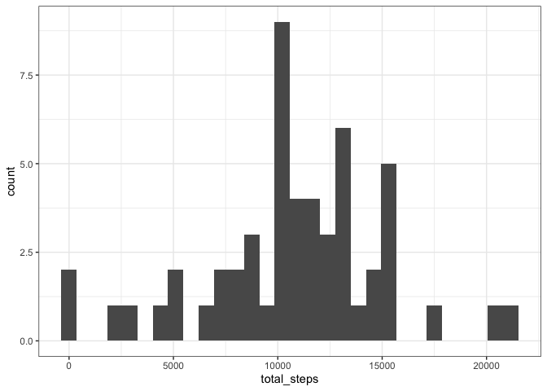
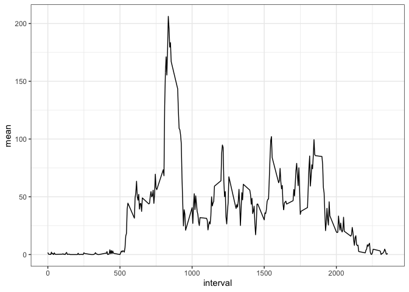
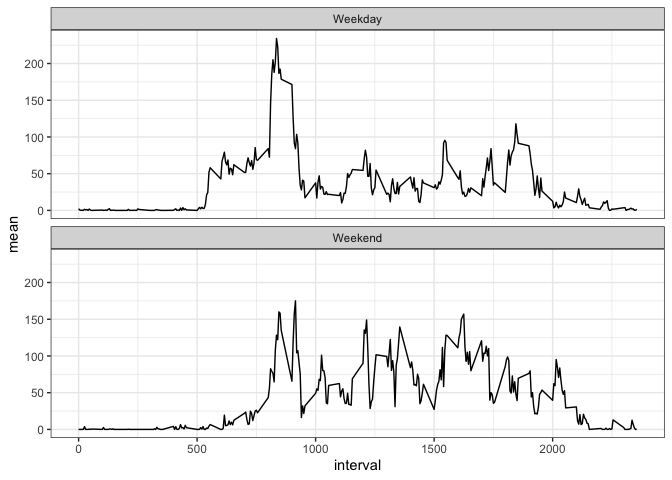

## Loading and preprocessing the data

```r
library(dplyr); library(ggplot2)
```


```r
data <- read.csv("./data/activity.csv")
```


```r
head(data)
```

```
##   steps       date interval
## 1    NA 2012-10-01        0
## 2    NA 2012-10-01        5
## 3    NA 2012-10-01       10
## 4    NA 2012-10-01       15
## 5    NA 2012-10-01       20
## 6    NA 2012-10-01       25
```

## What is mean total number of steps taken per day?
Calculate the total number of steps taken per day


```r
head(data %>% group_by(date) %>% summarise(total_steps = sum(steps)))
```

```
## # A tibble: 6 x 2
##   date       total_steps
##   <fct>            <int>
## 1 2012-10-01          NA
## 2 2012-10-02         126
## 3 2012-10-03       11352
## 4 2012-10-04       12116
## 5 2012-10-05       13294
## 6 2012-10-06       15420
```

Make a histogram of the total number of steps taken each day


```r
data %>% 
    group_by(date) %>% 
    summarise(total_steps = sum(steps)) %>% 
    ggplot(mapping = aes(total_steps)) + 
    geom_histogram() + 
    theme_bw()
```



Calculate and report the mean and median of the total number of steps taken per day


```r
data %>% 
    group_by(date) %>% 
    summarise(total_steps = sum(steps)) %>% 
    summarise(mean = mean(total_steps, na.rm = T),
              median = median(total_steps, na.rm = T))
```

```
## # A tibble: 1 x 2
##     mean median
##    <dbl>  <int>
## 1 10766.  10765
```

## What is the average daily activity pattern?
Make a time series plot (i.e. \color{red}{\verb|type = "l"|}type = "l") of the 5-minute interval (x-axis) and the average number of steps taken, averaged across all days (y-axis)


```r
data %>% 
    group_by(interval) %>% 
    summarise(mean = mean(steps, na.rm = T)) %>% 
    ggplot(mapping = aes(x = interval, y = mean)) + 
    geom_line() +
    theme_bw()
```



Which 5-minute interval, on average across all the days in the dataset, contains the maximum number of steps?


```r
data_summary <- 
    data %>% 
    group_by(interval) %>% 
    summarise(mean = mean(steps, na.rm = T))

data_summary$interval[which.max(data_summary$mean)]
```

```
## [1] 835
```

## Imputing missing values
Calculate and report the total number of missing values in the dataset (i.e. the total number of rows with \color{red}{\verb|NA|}NAs)


```r
colSums(is.na(data))
```

```
##    steps     date interval 
##     2304        0        0
```

Create a new dataset that is equal to the original dataset but with the missing data filled in.


```r
data_complete <- data 

# CREATE A FUNCTION TO RETURN THE MEAN OF A SPECIFIC INTERVAL
intervals <- function(interval) {
    data_summary[data_summary$interval == interval, ]$mean
}

# USE A FOR LOOP TO INPUTE THE MEAN FOR EACH INTERVAL
for (i in 1:nrow(data_complete)) {
    
    if (is.na(data_complete[i, ]$steps)) {
        data_complete[i, ]$steps <- intervals(data_complete[i, ]$interval)
    }
    
}
```


```r
# Checking work
colSums(is.na(data_complete))
```

```
##    steps     date interval 
##        0        0        0
```

Make a histogram of the total number of steps taken each day and Calculate and report the mean and median total number of steps taken per day. 


```r
data %>% 
    group_by(date) %>% 
    summarise(total_steps = sum(steps)) %>% 
    ggplot(mapping = aes(total_steps)) + 
    geom_histogram() + 
    theme_bw()
```


```r
data_complete %>% 
    group_by(date) %>% 
    summarise(total_steps = sum(steps)) %>% 
    summarise(mean = mean(total_steps),
              median = median(total_steps))
```

```
## # A tibble: 1 x 2
##     mean median
##    <dbl>  <dbl>
## 1 10766. 10766.
```

Do these values differ from the estimates from the first part of the assignment? What is the impact of imputing missing data on the estimates of the total daily number of steps?

* No, these values do not differ. The mean and median remained the same.

## Are there differences in activity patterns between weekdays and weekends?
Create a new factor variable in the dataset with two levels – “weekday” and “weekend” indicating whether a given date is a weekday or weekend day.


```r
data$day <- weekdays(as.Date(data$date))
data$day <- as.factor(ifelse(data$day %in% c("Monday",
                                             "Tuesday", 
                                             "Wednesday",
                                             "Thursday", 
                                             "Friday"), 
                                             "Weekday", "Weekend"))
```

Make a panel plot containing a time series plot (i.e. \color{red}{\verb|type = "l"|}type = "l") of the 5-minute interval (x-axis) and the average number of steps taken, averaged across all weekday days or weekend days (y-axis).


```r
data %>% 
    group_by(interval, day) %>% 
    summarise(mean = mean(steps, na.rm = T)) %>% 
    ggplot(mapping = aes(x = interval, y = mean)) +
    geom_line() + 
    facet_wrap(vars(day), nrow = 2) +
    theme_bw()
```


