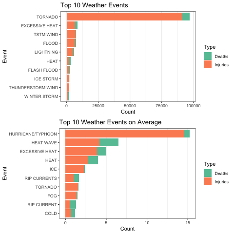
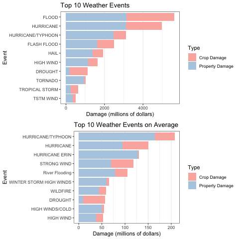

```{r setup, include=FALSE}
knitr::opts_chunk$set(echo=T, fig.align = 'center', message=F, warning=F)
knitr::opts_knit$set(root.dir = './data')
```

```{r echo=FALSE, out.height='50%', out.width='50%'}
setwd("..")

```

# Synopsis 
This RMarkdown file contains a brief analysis of severe weather events. The data was sourced from the U.S. National Oceanic and Atmospheric Administration's (NOAA) storm database ([download link](https://d396qusza40orc.cloudfront.net/repdata%2Fdata%2FStormData.csv.bz2)). This assignment is a partial fulfillment requirement for completing Cousera's [Reproducibe Research](https://www.coursera.org/learn/reproducible-research) course. In this assignment, two primary questions were asked: 

1. Across the United States, which types of events are most harmful with respect to population health?

2. Across the United States, which types of events have the greatest economic consequences?

# Data Processing
Three packages are needed to replicate the following code: `ggplot2`, `dplyr`, and `tidyr`. 

```{r}
library(ggplot2); library(dplyr); library(tidyr)
```

The storm data was downloaded as a zipped file. I unzipped the file and then imported the dataset with the `read.csv()` function.

```{r cache=TRUE}
data <- read.csv("repdata_data_StormData.csv",)
```

The `EVTYPE` column, which consists of categorical variables naming the type of sever weather event, was then converted to a factor. 

```{r}
head(data$EVTYPE)
class(data$EVTYPE)
```

```{r}
data$EVTYPE <- as.factor(data$EVTYPE)
```

#### Q1: Across the US, which types of events are most harmful with respect to population health?

To answer this question, I grouped the data by the event type and summed the deaths and injuries for each event; this dataframe was then assigned to the object `harmful_sum`. 

```{r cache=TRUE}
harmful_sum <- 
  data %>% 
    group_by(EVTYPE) %>% 
    summarise(EVTYPE_count = n(),
              Deaths =   sum(FATALITIES),
              Injuries = sum(INJURIES),
              Total = Deaths + Injuries) %>% 
    arrange(desc(Total)) %>% 
    pivot_longer(c("Deaths", "Injuries"), names_to = c("Type"))

# Pivot_longer() used to put the data in long format which will make plotting easier.
```

Summarizing the data in this way doesn't tell the full story, though. Some events occurred much more frequently than others, and so it would make sense to normalize the data by frequency. This can be accomplished by taking the average or median of deaths and injuries. 

```{r cache=TRUE}
harmful_avg <- 
  data %>% 
    group_by(EVTYPE) %>% 
    summarise(EVTYPE_count = n(),
              Deaths =   sum(FATALITIES) / EVTYPE_count,
              Injuries = sum(INJURIES) / EVTYPE_count,
              Total = Deaths + Injuries) %>% 
    arrange(desc(Total)) %>% 
    filter(EVTYPE_count > 50) %>% 
    pivot_longer(c("Deaths", "Injuries"), names_to = c("Type"))
```

Initially the median was used because it's more resistant to outliers, but the median was roughly zero for all events (which doesn't make for a very interesting plot), so the average was used; the data was then assigned to the object `harmful_avg`.

#### Q2: Across the US, which types of events have the greatest economic consequences?

This is the same question as the last, but with different variables. The `PROPDMG` and `CROPDMG` variables contain the numeric value of the property and crop damage, respectively, and the `CROPDMGEXP` and `PROPDMGEXT` variables indicate if the damage is in thousands (`K`) or millions `(M)`. There are a few other values than `K` and `M`, which is likely due to data entry errors. 

```{r}
  summary(data$PROPDMG)
  summary(data$CROPDMG)
  summary(as.factor(data$PROPDMGEXP))
  summary(as.factor(data$CROPDMGEXP))
```

I filtered the data to only include damages in the millions, then grouped the data by the event type and summed the crop damage and property damage for each event; this dataframe was then assigned to the object `harmful_sum`.

```{r cache=TRUE}
eco_sum <-
    data %>% 
    group_by(EVTYPE) %>% 
    filter(as.factor(PROPDMGEXP) == "M", as.factor(CROPDMGEXP) == "M") %>% 
    summarise(EVTYPE_count = n(),
              `Property Damage` = sum(PROPDMG),
              `Crop Damage`     = sum(CROPDMG),
              Total = `Property Damage` + `Crop Damage`) %>% 
    arrange(desc(Total)) %>% 
    pivot_longer(c("Property Damage", "Crop Damage"), names_to = c("Type"))
```

Once again, summarizing the data in this way doesn't capture the full story Some events occurred much more frequently than others, and so it would make sense to normalize the data by frequency.

```{r cache=TRUE}
eco_avg <- 
    data %>% 
      group_by(EVTYPE) %>% 
      filter(as.factor(PROPDMGEXP) == "M", as.factor(CROPDMGEXP) == "M") %>% 
      summarise(EVTYPE_count = n(),
                `Property Damage` = sum(PROPDMG) / EVTYPE_count,
                `Crop Damage`     = sum(CROPDMG) / EVTYPE_count,
                Total = `Property Damage` + `Crop Damage`) %>% 
      arrange(desc(Total)) %>% 
      pivot_longer(c("Property Damage", "Crop Damage"), names_to = c("Type"))
```

# Results 
Below are the results of the filtered dataframes.

```{r eval=FALSE}
p1 <- 
  ggplot(harmful_sum[1:20,], aes(value, reorder(EVTYPE, value), fill = Type)) +
    geom_col() +
    theme_bw() + 
    labs(title = "Top 10 Weather Events") + 
    xlab("Count") +
    ylab("Event") + 
    scale_fill_brewer(palette = "Set2") + 
    theme(panel.grid.major.y = element_blank())

p2 <-
  ggplot(harmful_avg[1:20,], aes(value, reorder(EVTYPE, value), fill = Type)) +
    geom_col() +
    theme_bw() + 
    labs(title = "Top 10 Weather Events on Average") + 
    xlab("Count") +
    ylab("Event") + 
    scale_fill_brewer(palette = "Set2") + 
    theme(panel.grid.major.y = element_blank())

gridExtra::grid.arrange(p1, p2)
```

```{r echo=FALSE, out.width="80%", out.height="80%"}
setwd("..")

```

When summing the data, tornadoes are most harmful with respect to population health. When averaging, hurricane/typhoons are.

```{r eval=FALSE}
p3 <-
  ggplot(eco_sum[1:20,], aes(value, reorder(EVTYPE, value), fill = Type)) +
    geom_col() +
    theme_bw() + 
    labs(title = "Top 10 Weather Events") + 
    xlab("Damage (millions of dollars)") +
    ylab("Event") + 
    scale_fill_brewer(palette = "Pastel1") + 
    theme(panel.grid.major.y = element_blank())

p4 <-
  ggplot(eco_avg[1:20,], aes(value, reorder(EVTYPE, value), fill = Type)) +
    geom_col() +
    theme_bw() + 
    labs(title = "Top 10 Weather Events on Average") + 
    xlab("Damage (millions of dollars)") +
    ylab("Event") + 
    scale_fill_brewer(palette = "Pastel1") + 
    theme(panel.grid.major.y = element_blank())

gridExtra::grid.arrange(p3, p4)

```

```{r echo=FALSE, out.width="80%", out.height="80%"}
setwd("..")

```

When summing the data, floods have the greatest economic consequence. When averaging, hurricane/typhoons do.