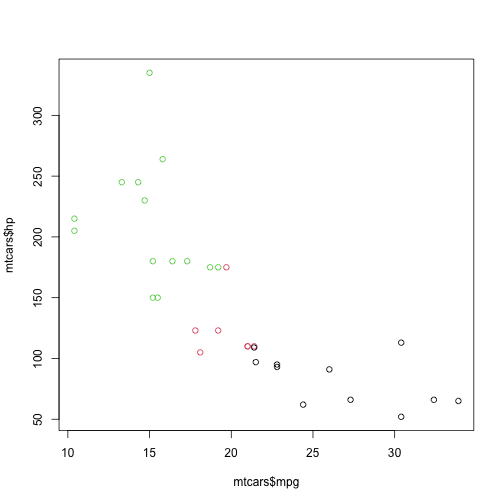

Shiny App Presentation
========================================================
author: 
date: 
autosize: true

Shiny App Rationale
========================================================
- There are many variables to explore in the Weight Lifting Classification dataset which was used for the Practical Machine Learning course

- If you're not an engineer, it's difficult to know which accelerometer variables are most important 

- If you tried to explore all of the relationships with different graphs, it would be very time-consuming

- Having a shiny app to visualize many variables and relationships is a great idea!

Example
========================================================

- In the example below, you can see that the plot shows information about mpg, horsepower, and cyclinder.



- But what if this dataset had 50 other variables that could be just as important?

Look at All Those Variables
========================================================


```r
str(read.csv("./data/pml-testing.csv"))
```

```
'data.frame':	20 obs. of  160 variables:
 $ X                       : int  1 2 3 4 5 6 7 8 9 10 ...
 $ user_name               : chr  "pedro" "jeremy" "jeremy" "adelmo" ...
 $ raw_timestamp_part_1    : int  1323095002 1322673067 1322673075 1322832789 1322489635 1322673149 1322673128 1322673076 1323084240 1322837822 ...
 $ raw_timestamp_part_2    : int  868349 778725 342967 560311 814776 510661 766645 54671 916313 384285 ...
 $ cvtd_timestamp          : chr  "05/12/2011 14:23" "30/11/2011 17:11" "30/11/2011 17:11" "02/12/2011 13:33" ...
 $ new_window              : chr  "no" "no" "no" "no" ...
 $ num_window              : int  74 431 439 194 235 504 485 440 323 664 ...
 $ roll_belt               : num  123 1.02 0.87 125 1.35 -5.92 1.2 0.43 0.93 114 ...
 $ pitch_belt              : num  27 4.87 1.82 -41.6 3.33 1.59 4.44 4.15 6.72 22.4 ...
 $ yaw_belt                : num  -4.75 -88.9 -88.5 162 -88.6 -87.7 -87.3 -88.5 -93.7 -13.1 ...
 $ total_accel_belt        : int  20 4 5 17 3 4 4 4 4 18 ...
 $ kurtosis_roll_belt      : logi  NA NA NA NA NA NA ...
 $ kurtosis_picth_belt     : logi  NA NA NA NA NA NA ...
 $ kurtosis_yaw_belt       : logi  NA NA NA NA NA NA ...
 $ skewness_roll_belt      : logi  NA NA NA NA NA NA ...
 $ skewness_roll_belt.1    : logi  NA NA NA NA NA NA ...
 $ skewness_yaw_belt       : logi  NA NA NA NA NA NA ...
 $ max_roll_belt           : logi  NA NA NA NA NA NA ...
 $ max_picth_belt          : logi  NA NA NA NA NA NA ...
 $ max_yaw_belt            : logi  NA NA NA NA NA NA ...
 $ min_roll_belt           : logi  NA NA NA NA NA NA ...
 $ min_pitch_belt          : logi  NA NA NA NA NA NA ...
 $ min_yaw_belt            : logi  NA NA NA NA NA NA ...
 $ amplitude_roll_belt     : logi  NA NA NA NA NA NA ...
 $ amplitude_pitch_belt    : logi  NA NA NA NA NA NA ...
 $ amplitude_yaw_belt      : logi  NA NA NA NA NA NA ...
 $ var_total_accel_belt    : logi  NA NA NA NA NA NA ...
 $ avg_roll_belt           : logi  NA NA NA NA NA NA ...
 $ stddev_roll_belt        : logi  NA NA NA NA NA NA ...
 $ var_roll_belt           : logi  NA NA NA NA NA NA ...
 $ avg_pitch_belt          : logi  NA NA NA NA NA NA ...
 $ stddev_pitch_belt       : logi  NA NA NA NA NA NA ...
 $ var_pitch_belt          : logi  NA NA NA NA NA NA ...
 $ avg_yaw_belt            : logi  NA NA NA NA NA NA ...
 $ stddev_yaw_belt         : logi  NA NA NA NA NA NA ...
 $ var_yaw_belt            : logi  NA NA NA NA NA NA ...
 $ gyros_belt_x            : num  -0.5 -0.06 0.05 0.11 0.03 0.1 -0.06 -0.18 0.1 0.14 ...
 $ gyros_belt_y            : num  -0.02 -0.02 0.02 0.11 0.02 0.05 0 -0.02 0 0.11 ...
 $ gyros_belt_z            : num  -0.46 -0.07 0.03 -0.16 0 -0.13 0 -0.03 -0.02 -0.16 ...
 $ accel_belt_x            : int  -38 -13 1 46 -8 -11 -14 -10 -15 -25 ...
 $ accel_belt_y            : int  69 11 -1 45 4 -16 2 -2 1 63 ...
 $ accel_belt_z            : int  -179 39 49 -156 27 38 35 42 32 -158 ...
 $ magnet_belt_x           : int  -13 43 29 169 33 31 50 39 -6 10 ...
 $ magnet_belt_y           : int  581 636 631 608 566 638 622 635 600 601 ...
 $ magnet_belt_z           : int  -382 -309 -312 -304 -418 -291 -315 -305 -302 -330 ...
 $ roll_arm                : num  40.7 0 0 -109 76.1 0 0 0 -137 -82.4 ...
 $ pitch_arm               : num  -27.8 0 0 55 2.76 0 0 0 11.2 -63.8 ...
 $ yaw_arm                 : num  178 0 0 -142 102 0 0 0 -167 -75.3 ...
 $ total_accel_arm         : int  10 38 44 25 29 14 15 22 34 32 ...
 $ var_accel_arm           : logi  NA NA NA NA NA NA ...
 $ avg_roll_arm            : logi  NA NA NA NA NA NA ...
 $ stddev_roll_arm         : logi  NA NA NA NA NA NA ...
 $ var_roll_arm            : logi  NA NA NA NA NA NA ...
 $ avg_pitch_arm           : logi  NA NA NA NA NA NA ...
 $ stddev_pitch_arm        : logi  NA NA NA NA NA NA ...
 $ var_pitch_arm           : logi  NA NA NA NA NA NA ...
 $ avg_yaw_arm             : logi  NA NA NA NA NA NA ...
 $ stddev_yaw_arm          : logi  NA NA NA NA NA NA ...
 $ var_yaw_arm             : logi  NA NA NA NA NA NA ...
 $ gyros_arm_x             : num  -1.65 -1.17 2.1 0.22 -1.96 0.02 2.36 -3.71 0.03 0.26 ...
 $ gyros_arm_y             : num  0.48 0.85 -1.36 -0.51 0.79 0.05 -1.01 1.85 -0.02 -0.5 ...
 $ gyros_arm_z             : num  -0.18 -0.43 1.13 0.92 -0.54 -0.07 0.89 -0.69 -0.02 0.79 ...
 $ accel_arm_x             : int  16 -290 -341 -238 -197 -26 99 -98 -287 -301 ...
 $ accel_arm_y             : int  38 215 245 -57 200 130 79 175 111 -42 ...
 $ accel_arm_z             : int  93 -90 -87 6 -30 -19 -67 -78 -122 -80 ...
 $ magnet_arm_x            : int  -326 -325 -264 -173 -170 396 702 535 -367 -420 ...
 $ magnet_arm_y            : int  385 447 474 257 275 176 15 215 335 294 ...
 $ magnet_arm_z            : int  481 434 413 633 617 516 217 385 520 493 ...
 $ kurtosis_roll_arm       : logi  NA NA NA NA NA NA ...
 $ kurtosis_picth_arm      : logi  NA NA NA NA NA NA ...
 $ kurtosis_yaw_arm        : logi  NA NA NA NA NA NA ...
 $ skewness_roll_arm       : logi  NA NA NA NA NA NA ...
 $ skewness_pitch_arm      : logi  NA NA NA NA NA NA ...
 $ skewness_yaw_arm        : logi  NA NA NA NA NA NA ...
 $ max_roll_arm            : logi  NA NA NA NA NA NA ...
 $ max_picth_arm           : logi  NA NA NA NA NA NA ...
 $ max_yaw_arm             : logi  NA NA NA NA NA NA ...
 $ min_roll_arm            : logi  NA NA NA NA NA NA ...
 $ min_pitch_arm           : logi  NA NA NA NA NA NA ...
 $ min_yaw_arm             : logi  NA NA NA NA NA NA ...
 $ amplitude_roll_arm      : logi  NA NA NA NA NA NA ...
 $ amplitude_pitch_arm     : logi  NA NA NA NA NA NA ...
 $ amplitude_yaw_arm       : logi  NA NA NA NA NA NA ...
 $ roll_dumbbell           : num  -17.7 54.5 57.1 43.1 -101.4 ...
 $ pitch_dumbbell          : num  25 -53.7 -51.4 -30 -53.4 ...
 $ yaw_dumbbell            : num  126.2 -75.5 -75.2 -103.3 -14.2 ...
 $ kurtosis_roll_dumbbell  : logi  NA NA NA NA NA NA ...
 $ kurtosis_picth_dumbbell : logi  NA NA NA NA NA NA ...
 $ kurtosis_yaw_dumbbell   : logi  NA NA NA NA NA NA ...
 $ skewness_roll_dumbbell  : logi  NA NA NA NA NA NA ...
 $ skewness_pitch_dumbbell : logi  NA NA NA NA NA NA ...
 $ skewness_yaw_dumbbell   : logi  NA NA NA NA NA NA ...
 $ max_roll_dumbbell       : logi  NA NA NA NA NA NA ...
 $ max_picth_dumbbell      : logi  NA NA NA NA NA NA ...
 $ max_yaw_dumbbell        : logi  NA NA NA NA NA NA ...
 $ min_roll_dumbbell       : logi  NA NA NA NA NA NA ...
 $ min_pitch_dumbbell      : logi  NA NA NA NA NA NA ...
 $ min_yaw_dumbbell        : logi  NA NA NA NA NA NA ...
 $ amplitude_roll_dumbbell : logi  NA NA NA NA NA NA ...
  [list output truncated]
```

There's Only One Solution (not really)
========================================================

- Make a shiny app!

